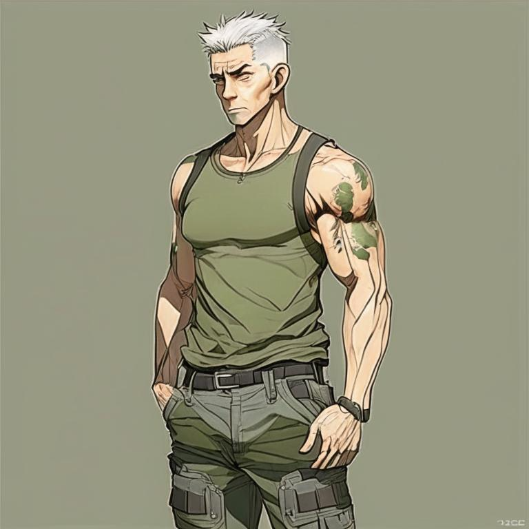

# Sarge Moran

Сержант Моран *(sarge Moran)* - бывший спецназовец "Дельта". 
Рота А (Дельта).

Дивизион Специальных Действий (*Special Activities Division*), совершенно секретное подразделение Центрального Разведывательного Управления (*Central Intelligence Agency*) и 
особое его элитное подразделение Группа Специальных операций (*Special Operations Group*) часто отбирают бойцов из отряда Дельта.

На период [`TIM_BRC`] - работает в отделе "Феникс", ЦРУ (*Phoenix dept, CIA*), подручный Кранца. 40 лет (`TIM_BRC`).

^Моран (TIM_BRC), нейросеть Kandinsky 2.1^

Характеристики Морана в разработке.