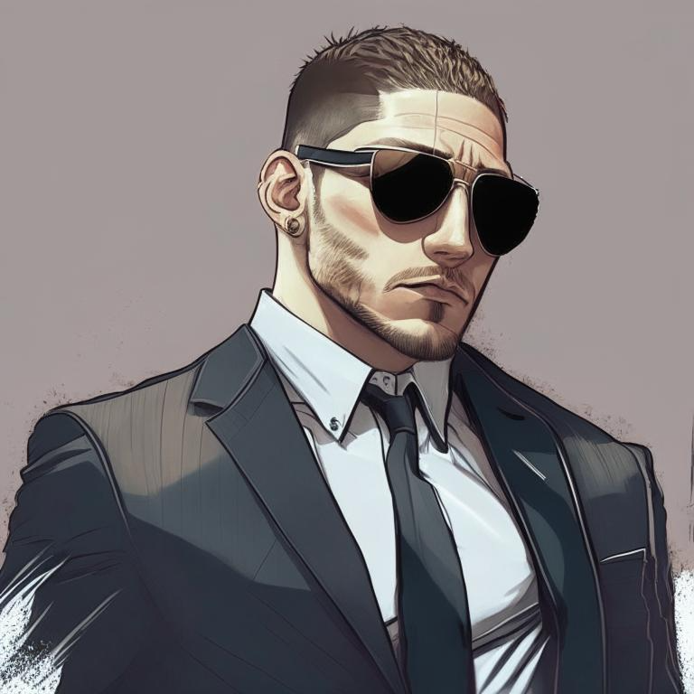

# Phoenix team (CIA)

* [Дэвид Кранц (David Krantz)](./krantz.md)
* [Сержант Моран (sarge Moran)](./moran.md)
* Рид (Reed)
* Скаут (Scout)
* Билли Бёрнс (Billy Burns)

## Reed

Рид *(Reed)* - агент "Феникс", ЦРУ.

^Рид (TIM_BRC) (нейросеть Kandinsky 2.1)^

## Scout

Скаут *(Scout)* - агент "Феникс", ЦРУ.

^Скаут (TIM_BRC) (нейросеть Kandinsky 2.1)^

## Billy Burns

Билли Бёрнс *(Billy Burns)* - агент "Феникс", ЦРУ.

^Бёрнс (TIM_BRC) (нейросеть Kandinsky 2.1)^