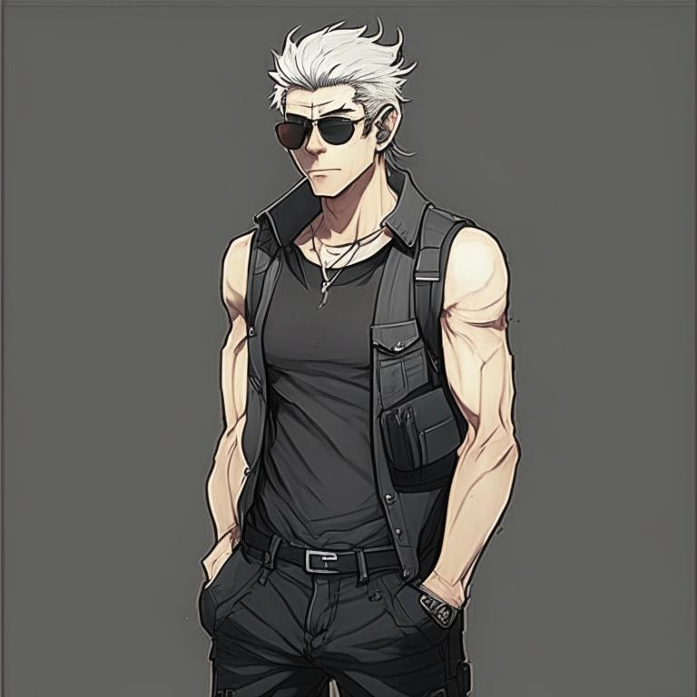

# Полковник

*Полковник* (прозвище). Имя неизвестно.

^Полковник (TIM_OCN), нейросеть Kandinsky 2.1^

Факты:
* На самом деле не полковник, звание его не известно, как и род войск, в которых он служил. Вообще, не известно, служил ли он, 
но в оружии и тактике он разбирается хорошо, что говорит о наличии у него армейских навыков, полученных, например, в ЧВК.
* Имеет на руке татуировку, выжженую лазером - штрих-код, соответсвующий номеру контейнера на складе в Касабланке. Эту
татуировку Тим скопирует себе, чтобы получить доступ к завещенному ему контейнеру Полковника.
* До терракта 11 сентября работал на ЦРУ, однако провал спецоперации поставил крест на его карьере. Тем не менее, его связи в мире позволили использовать его Пентагоном для выполнения нелегальных задач, связанных с транспортировкой оружия.
