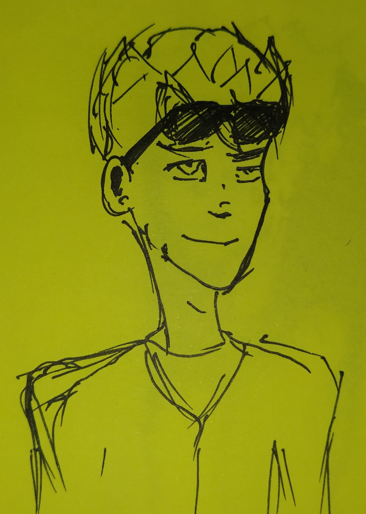

# Sam

Семирс - друг [Тима](./tim.md), с которым они приехали в Барселону (`TIM_BRC`). С Тимом они подружились в Санкт-Петербурге. 

^Сэм (TIM_BRC), набросок автора^

Факты:  
* Латыш (Рига, Сигулда), Сэмом его называет Тим, в дальнейшем и [Ньевес Гасиа](./nives.md);
* Учился в Петербурге;
* Вместе с Тимом участвовал в олимпиаде Международного фонда развития искусственного интеллекта ("Сириус"), где занял первое место.
* Собирался поступать в UPC (Политехнический университет Каталонии) и жить в Барселоне
* Рост 195см.

Дружба с Сэмом оказала на Тима большое влияние. В финале барселонской арки Сэм, зная, что Тим выкрал накопитель у Сальвиа, намеренно скрывает это, прикрывая Тима, в результате чего по прибытии в Ригу его арестовывают спецслужбы Латвии по наводке отдела "Феникс". Позже Сэм расскажет Шалфею, что его пытали, но он не выдал друга.

Сэм был единственным другом Тима, и после возвращения, Шалфей искал Сэма, и нашёл его работающим владельцем забегаловки "Ну, погоди!", который бладхаунды сделали своим притоном. Впоследствии бар "Ну, погоди!" становится для Шалфея базой, а бармен Штопор - связным H.E.A.L. В процессе поиска Шалфея, "Феникс" выходит на Штопора, в результате чего в баре начинается бой между ЦРУ и бладхаундами, и Штопор погибает. Трагическая гибель Сэма оставит глубокий эмоциональный след в душе Шалфея.
