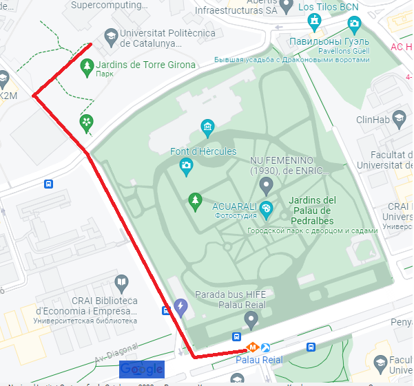
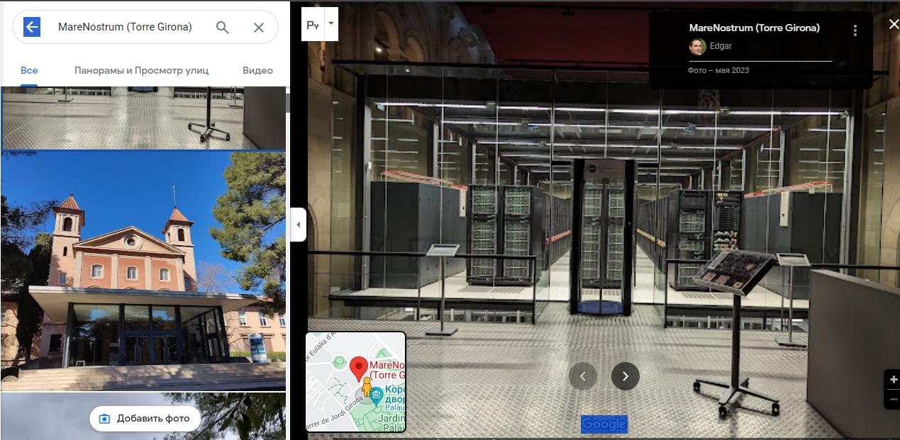

# UPC - IDEAI

## Преамбула

В ходе создания части TIM_BRC меня интересовал, прежде всего, факультет вычислительных систем. В своей работе я опирался на источники в Интернете. В частности, на официальные данные, опубликованные на сайте www.upc.edu. Прежде всего меня заинтересовала максимально подходящая по сюжету группа IDEAI-UPC, занимающаяся нейросетями,
машинным обучением и искусственным интеллектом. Поэтому, за основу была взята уже существующая в реальности
научная группа Политехнического университета Каталонии. Всё, что происходит в сюжете части TIM_BRC, т.е. разработка H.E.A.L. - авторский вымысел, который я попытался построить на реальной основе. Для этого мне пришось изучить сферу деятельности этой группы, чтобы подогнать её под сюжет, а сюжет, в свою очередь - под неё.

Я очень хотел, чтобы события, описывающие создание H.E.A.L. Тимом, происходили именно в Барселоне. Барселона стала для меня каким-то сакральным и недостижимым городом, в котором я то ли был, то ли не был. В который мне так хотелось попасть ещё раз. Город мечты, грубо прерванной сначала "ковидом", а затем - свинским поведением европейских продажных политиков. Я очень хотел, чтобы мой главный герой пожил там немного и вдохнул этой самой европейской "свободы", чтобы сделать правильные выводы в дальнейшем. Поэтому я стал изучать направления работы UPC, где, конечно же, велись работы с машинным обучением и AI. Поэтому исследовательская группа IDEAI оказалась наиболее подходящей для сюжета.

Замечу, что сам по себе UPC очень большой и разнесён в пространстве. Есть кампус, административные и учебные здания, которые разнесены между собой на небольшой территории, и всё-таки достаточно удалённо друг от друга.

## Факты

Реально существующая группа [Universitat Politechica de Catalunya](https://www.upc.edu/en), которая называется [Intelligent Data Science and Artificial Intelligence (IDEAI-UPC)](https://ideai.upc.edu/en).

[About](https://ideai.upc.edu/en)

По сюжету, руководит группой профессор [Алехандро Сальвиа](../items/characters/salvia.md), его ассистент - [Ньевес Гарсия](../items/characters/nives.md). Отдел имеет доступ к мощному вычислительному центру UPC и суперкомпьютеру [MareNostrum5](https://eurohpc-ju.europa.eu/marenostrum5-new-eurohpc-world-class-supercomputer-spain-2022-06-16_en), который финансируется американскими и европейскими корпорациями (Microsoft, Nvidia)

Изначально я планировал взять группу KEMLg, но IDEAI оказалась более подходящей, к тому же, в ней действительно ведутся разработки AI в области медицины. В тексте произведения аббревиатура "IDEAI" заменена на "IDEA".

Станция метро "Palau Reial".

Суперкомпьютер MareNostrum расположен в здании Torre Girona (UPC campus North, северный кампус):

Собственно с этого здания начинается знакомство героев с UPC. В Торре-Жирона также находится резиденция Университета.

В дальнейшем Тим и Сэм будут обучаться по программе бакалавра в Barcelona School of Informatics (FIB) "master degree in Artificial Intelligence" (https://www.upc.edu/en/masters/artificial-intelligence).

Сама группа является научно-исследовательской.

IDEAI

Позиция в структуре UPC, адрес: https://futur.upc.edu/IDEAI-UPC  
Проекты, связанные со здоровьем: https://ideai.upc.edu/en/areas/health_wellness_inclusion

