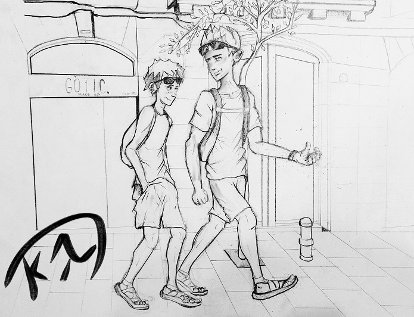

# TIM_BRC_001

**Глава 1. Hola, Barcelona!**

*\- Очень коротко о себе и Сэме \- Привет, Барселона! \- Налаживаем свой быт.*

---

\- А это Саграда Фамилья… Он прекрасен! Даже круче, чем Дом в Кёльне!  
\- Не знаю, я не был в Кёльне...  
\- Ты много потерял!  
\- Я не могу потерять то, чего ещё не находил!

Сэм заворожённо смотрел в иллюминатор A320-го. Лайнер делал разворот над городом, предоставив своим пассажирам  возможность насладиться его видом с левого борта. На безоблачном небе Каталонии ярко светило солнце, его лучи заливали салон самолёта. Солнце - мой лучезарный друг, которого так не хватает мне в сером Петербурге!

\- Сколько раз я сюда приезжаю - уже чувствую себя как дома! – приговаривал Сэм, улыбаясь, - А вот и башня-фаллос!  
\- Вечно у тебя какой-нибудь... фаллос! - бурчал я и тоже глядел в иллюминатор, слева от Сэма. Мне досталось кресло посередине.

Под нами, на фоне лазурного моря, медленно проплывала загадочная и манящая Барселона. Чужой, незнакомый мне город. Возможно, через пару недель он станет для меня родным. Я изучу в нём каждую улочку, отмечу на карте все точки интереса. Но сейчас... Сейчас это был для меня чужой, огромный, незнакомый город. Он молча обозначал мне, с высоты полёта нашего лайнера, доступные локации, в общем плане, ещё не ответив пока ни на один вопрос. Все вопросы - потом. А пока... Пока я заворожённо смотрел на него в иллюминатор.

\- Ты чего напрягся? - Сэм толкнул меня в плечо, - Сейчас будем садиться, и всё, прилетели! У меня ужасно болят ноги! Кстати, твоя маска упала на пол!

История да умолчит о том, какими усилиями ему удалось втиснуть свои долговязые ходули между сидениями, а главное - как он в таком положении летел. Сэм попытался вытянуть их, ударившись, уже который раз, о кресло соседа спереди. Полёт занял четыре с лишним часа. Четыре с лишним часа надоедливой болтовни Сэма и скуки! Нет, у меня, конечно, была закачана на смартфон куча нескучного контента, а на ушах сидел ди-джейский "Техникс" с моей стандартной долбёжкой для таких дальних путешествий. Но из-за постоянной трескотни Сэма, который не мог сидеть на пятой точке ровно, мне не удавалось расслабиться. Я постоянно отвлекался, и, в конце концов, отдался неиссякаемому потоку информации с сомнительной ценностью, которая, хочешь ты или нет, подобно волнам Средиземного моря, будет омывать твои бедные уши.

У каждого из нас есть такой болтливый друг. У меня это - Сэм. Вообще-то его зовут Семирс, но я зову его Сэм. Так - короче и прикольнее. Он - латыш, родом из Сигулды, но шпарит по-русски не хуже меня. Как и я, он тоже учился в Питере, так что я его считаю нашим до мозга костей. И вообще, он отличный парень! Мы с ним познакомились весной на федеральных соревнованиях по программированию в сочинском "Сириусе", он тогда взял первое место, а я третье. Но ему уже восемнадцать, а мне только четырнадцать, поэтому я не обижаюсь. Сэм - мне полная противоположность. Он успешный, талантливый, высокий, умный, болтает без умолку, и девчонки за ним бегают таким табуном, что пыль стоит на много километров. У него всё здорово получается, он всегда знает ответ на любой вопрос, а если не знает - выдумает. Он... Ну что говорить? Я по сравнению с ним - полнейший косноязычный лузер, мне до него - как до Китая на роликах. Он блондин, с ровными зубами, от природы и без брекетов. А я? Зашквар [^зашквар], особенно по утрам. С непослушными волосами, которые просто невозможно уложить нормально, и этими идиотскими веснушками вокруг носа. Они незаметные, но они есть!

Самолёт шёл на посадку вдоль берега Средиземного моря. Мы пялились в иллюминатор на работу механизации крыла: как там всё это выезжает, опускается, как работают элероны во время крена...

Я не люблю рассказывать о себе, но, к сожалению, придётся. В возрасте трёх лет я уже бывал в Испании, но вот в Барселоне - ни разу. Хотя, за мои четырнадцать с хвостом, я, действительно, много где успел побывать: в Турции, в Тайланде, в странах Европы. Ну, где обычно дети летом отдыхают с родителями. Мои предки не любят пляжный отдых, они постоянно куда-то мотаются, открывают что-то новое, поэтому я не могу пожаловаться на скуку с ними. Но в этот раз меня всё-таки отпустили одного в другую страну, и это оказалось очень непросто сделать. Нет, мои родители искренне радовались, что мне удалось одержать победу в "Сириусе" на олимпиаде Международного фонда развития искусственного интеллекта, где соревновались лучшие школьники и студенты России. И они не возражали, что я в таком возрасте поеду один в чужую страну. Ну, почти чужую. Мать знала немного испанский, и я тоже его изучал. Пришлось оформлять всякие разрешения и согласия с юридической стороны. И так сложилось с этим клятым "ковидом", что к весне проведение очной олимпиады вообще ставилось под вопрос, а уж тем более выезд за границу. Сэм убедил моих предков, что присмотрит за мной, за что я ему благодарен. В общем, я ехал учиться в Каталонский "политех", или, как он сокращённо называется, UPC. Как студент, по студенческой визе, участвовать в каком-то проекте по разработке искусственного интеллекта. Я, ещё не закончивший обычную среднюю школу Питера! Аж дух захватывает! А если меня не вышвырнут отсюда, то останусь тут надолго, буду дистанционно учиться в своей школе, а здесь работать. Даже зарабатывать! Перспектива у меня вырисовывалась просто потрясающая! У Сэма она вырисовывалась ещё круче: он собирался поступать в UPC и в дальнейшем работать в Барселоне. Он находился в более выигрышном положении в сравнении со мной: будучи совершеннолетним и гражданином Евросоюза, Сэм мог делать тут что хотел, чем вызывал у меня неподдельную чёрную зависть.

Земля приблизилась, самолёт ударился шасси о взлётно-посадочную полосу, на его крыльях, как перья, вспорхнули воздушные тормоза, в салоне все захлопали (Сэм, как обычно, весело крикнул "Бис!"), взревел реверс. Раздался приятный голос командира:  
\- Уважаемые пассажиры, наш самолёт благополучно приземлился в аэропорту Эль Прат города Барселона, температура воздуха...

Начинался июль 2021-го года. Года второй волны "ковида", или, если называть его правильно, `SARS-COV-2`. Мы явились в Барселону в самое пекло, когда улицы раскалились до тридцати градусов и остывать не собирались. В Питере перед вылетом стоял собачий холод: шестнадцать градусов, дожди и ветер. Короткое импульсное лето, раздразнившее питерцев, захлёбывалось циклоном и ветрами с Арктики. Я любил свой город, его архитектуру, его ритм, его размеры и особую, уникальную атмосферу. Санкт-Петербург воспевали поэты и писатели. Все они были или остаются гораздо более достойными певцами моего города, чем я. Но вот что я бы воспел со всей своей ненавистью - это его климат. Я, конечно, понимаю Петра Великого, которому необходим был город с выходом к Балтике, и здесь сыграла куча факторов, в котором фактор болота стоял на последнем месте. Тем не менее, Питер стоит на болоте, и климат тут - болотный. Для меня, по крайней мере. Лето - не лето, зима - не зима. Ветер всё время в лицо, летает по кругу, независимо от того, куда я иду или еду. Ветер злой, холодный. Справедливости ради отмечу, что буквально после нашего с Сэмом вылета, в Питер пришла долгожданная жара, и стояла она достаточно долго, но это считается "аномальной жарой". Считается всеми, кроме меня - любителя пожариться на солнышке. Напялив обязательные маски, мы вышли в первый терминал Эль Прата через телетрап. Затем постояли в очереди на пограничном контроле. Несмотря на "ковидные" ограничения, самолёт летел полный. Вместе с нами прибыло ещё несколько ребят из Питера, отметившихся, как и мы, на олимпиаде, и также приглашённых в UPC. Это приглашение означало лишь то, что мы поприсутствуем и послушаем интересные лекции, проведём каникулы в Барселоне, а потом - суп с котом. Мы зарегистрировались у специальной стойки, где сдали справки с ПЦР, без проблем получили наши чемоданы, после чего выбежали на улицу. И тут мне в лицо ударил тот самый пьянящий, горячий и влажный воздух Каталонии!

И я "поплыл". Это чувство, как будто ты понюхал крышечку с водкой, и тебе "хорошо" просто от одного запаха спирта. Сердце забилось: сразу захотелось, скинув с себя мешковатый худи и джинсы, рвануть купаться! Взлететь на те горы, виднеющиеся вдали. И - бежать! Бежать, вдыхая горячий, морской воздух!

<!-- Историческая справка: в Петербурге июль 2021 года был довольно жаркий, и жара стояла достаточно долго. Тем не менее, мне пришлось немного "охладить" погоду в Питере, чтобы сыграть на контрасте с погодой в Барселоне. -->

Сэм жёстко выдернул меня из этого состояния.

\- Мы на такси поедем или на автобусе, Тим? - крикнул он, толкая меня в плечо. Я дико на него посмотрел, а потом засмеялся:  
\- Пешком пойдём!   
\- Ты прикалываешься? У нас хата в Орта-Гуинардо, туда пешком два дня идти будешь со своим чемоданом на колёсиках! Удачи!  
\- Ты сейчас в сложенном состоянии сидел четыре часа. Я бы на твоём месте пробежал километров десять, с чемоданом на плечах!  
\- Я б с радостью, но обещал хозяйке заселиться до вечера. А уже полдень!

Такси мы вызвали через приложение. Оно подъехало на удивление быстро. Сэм заранее выучил адрес и выдал таксисту на таком чистом испанском, что мне стало завидно. Таксист (одетый, не в пример нашим, достаточно стильно: чёрные брюки, белая рубашка, чёрный галстук) что-то ответил по-испански, что именно - я не расслышал, но они забавно закивали друг другу, как свои люди. Внутри салона присутствовала божественная фича [^фича] всех автомобилей и помещений в летней Испании - кондиционер. Наше такси выехало с территории терминала на шоссе, и помчалось по трассе "B-20", мимо парков, в район Орта-Гуинардо, расположенный далеко от побережья, на возвышенности, ближе к горам. Конечно, мы не могли с Сэмом найти квартиру в районе, например, Барселонеты или Готического квартала, или рядом с UPC (в кампус нас не пустили жить), потому что искали жильё подешевле. Сколько точно здесь пробуду - я не знал, но Сэм собирался поступать в UPC, а потому серьёзно рассчитывал обосноваться в городе, и считал каждый евроцент.

Таксист подвёз нас на улицу Орта - очень узенькую, тихую улочку, где с одной стороны стояли припаркованные машины и мотобайки, а с другой - оставалась всего одна полоса для проезда машин, и повсюду висели знаки "стоянка запрещена". С обеих сторон возвышались небольшие жилые дома в три или пять этажей, с балкончиками, воротами, гаражами, маленькими магазинчиками на первом этаже, а вдоль тротуара, вымощенного плиткой, росли вишнёвые деревья. Мы выгрузились и направились к кирпичному трёхэтажному домику, тарахтя колёсиками чемоданов по плитке. Слева от входной двери располагался домофон с двенадцатью кнопками, напротив каждой висела дощечка с фамилией жильца. Всего таких кнопок я насчитал двенадцать. Сэм нажал на кнопку с табличкой, на которой было напечатано "Торрес".

\- Вот будет смешно, если никого нет, - задумчиво пробормотал он. Домофон щёлкнул, Сэм поздоровался и сказал что мы - арендаторы. Дверь открылась, впустив нас в прохладный и чистый подъезд. Наша квартира располагалась на последнем, третьем этаже, куда нас и доставил небольшой лифт. 

Дверь открыла хозяйка - высокая, стройная и смуглая женщина в медицинской маске (которую она периодически снимала из-за жары; да и мы тоже не особо соблюдали меры, хотя по Испании, говорят, ещё прокатывались волны "ковида"), лет сорока. Она представилась Еленой. Общаться с нами она начала по-английский, но, узнав, что мы немного знаем испанский, стала подмешивать в свою речь испанские слова. Елена провела экскурсию по своей двухкомнатной квартире, которую я бы назвал "евро-однушкой": небольшая спальня и большая светлая гостиная с белыми стенами, совмещённая с кухней. Впрочем, места в квартире было очень много. Для меня, выросшего в тесноте моей питерской комнатёнки, даже кладовка квартиры Елены была как полноценное жилище. Смутило только то, что кровать одна и диван не разбирался. Но эти бытовые трудности можно было решить. Договорившись об оплате, уборке и прочих житейских мелочах, Елена ещё раз недоверчиво оглядела нас. Ей, видимо, не очень хотелось сдавать квартиру студентам, но Сэм, со своей лучезарной улыбкой, на английском убедил её, что мы - чистоплотные русские богачи-ботаники, будем платить вовремя, никаких девок и в помине не будет, спиртного на балконе - тоже. Мы не были похожи на раздолбаев. Впрочем, по людям внешне и не скажешь, что они - раздолбаи. Да и потом, теперь я впервые жил один. Ну, почти один. Я сам не знал, чего от себя ожидать в этом городе соблазнов!

\- Зря ты ей наобещал! - усмехнулся я, когда Елена ушла, а мы принялись разбирать вещи, - Теперь нам придётся держать слово, которое ты дал!  
\- Вот ты не слышал, что я ей сказал, Тим! - возмутился Сэм, - Я ей обещал, что она никогда не услышит, что мы водили девок или бухали! Я не обещал, что сам факт как таковой будет отсутствовать. Поэтому всё делаем тихо и чистенько!

Он со значительным видом приложил указательный палец к своему рту.

\- Угу, - кивнул головой я, вытаскивая из рюкзака свой рабочий инструмент - ноутбук. Единственная досада, мучившая меня - невозможность взять с собой мой домашний компьютер с "i7" и мощной игровой видеокартой. Но Сэм предложил дельный совет - продать его и на эти деньги купить "печку" тут, в Барселоне. Поэтому, скрипя сердце, я продал собранное мной вручную "железо" и перевёл деньги в евро. Теперь мне предстояло снова собирать его, уже тут. 

Из спальни раздался голос Сэма:  
\- Ты не возражаешь, если я буду спать в спальне, а ты - на диване?  
\- Пофиг, - флегматично ответил я, раскладывая ноутбук на замызганном журнальном столике, - мне кажется, я долго тут не проживу... Не верю я, что меня оставят в проекте. Так, погреюсь на солнышке - и домой! И, ты всё равно не поместишься на диване!

Сэм представлял собой двухметровую шпалу. Мой рост составлял почти сто семьдесят. И, хотя я понимал, что ещё вырасту немного, и что мой рост не самый маленький, тем не менее, эта разница меня убивала. На контрасте между нами это было заметно, а со стороны - смешно. Но больше всего меня бесило то, что он - совершеннолетний. Поэтому я старался не обращать на его подколы никакого внимания.

\- Сэм, давай сразу договоримся. Серьёзно! Баб не водить! И не пьянствовать тут! 

Сэм стиснул зубы, как от боли.

\- Н-ну... ты... зануда! - процедил он, выпятив нижнюю челюсть. - Вот тебе-то какое дело? Сиди, ковыряйся в своём ноуте! Ну тебя, зануда!  
\- Тогда можешь всю комнату себе забирать, а я буду тут спать. Договорились?

Сэм пожевал что-то во рту, долго пялился на кондиционер, пытаясь его настроить, а потом повернулся ко мне и серьёзно так ответил:  
\- Оке. Договорились. Гулять идёшь? Или тут сидеть будешь, со своей восьмиядерной подружкой?

Приехать в Барселону и тут же сесть за ноутбук мог, конечно, только полный дебил, коим я себя не считал. Я тут же выпрыгнул из своего чёрного питерского худи и безразмерных штанов в абсолютно соответствующие местной погоде шорты, чёрную майку и сандалии, взглянул мельком на себя в зеркало (Зашквар! Опять волосы торчком, и не успеваешь причесать даже!), а потом бросился за Сэмом, который (тоже приодевшись в нечто похожее, только белого цвета) уже возился в замке входной двери единственным ключом, вручённым ему хозяйкой. На ходу я схватил опустошённый рюкзак, швырнув в него бутылку воды, загранпаспорт и мобилу. Банковская карта всегда лежала в кармане, а солнцезащитные очки восседали на моём лбу.

\- Твой "рейбен" - паль [^паль]! - съязвил Сэм, внимательно посмотрев на мой лоб.  
\- Это не "рейбен",  - ответил я.  
\- Там написано: "рейбен".  
\- Там написано "бейрен". И вообще, на заборе тоже написано!

Доставать меня - любимое занятие моего друга. Впрочем, он любил троллить всех, а не только меня. А очки у меня действительно были с "алика" [^алик]. Да, паль, да, дешёвка. Но они ничем не были хуже дорогих "бенов" или "полароидов". И вообще, мои предки привили мне немного иное, нежели у остальных подростков, отношение к вещам. Не дешёвое, но практичное. Не паль, но с разумной ценой. Они давали мне возможность выбирать, но критиковали вид и даже откровенно смеялись иногда, когда я пытался сменить причёску на химию с бритым затылком, или нацепить нелепый, но модный прикид. Мои родители - милленалы, выросшие в мутные 90-е, и они на себе испытали все пертурбации моды того периода. Отец - рейвер, мать - рокерша. Наелись они этим всем. И, хотя они познакомились уже в зрелом возрасте, когда сменили прикиды на платья, костюмы и рубашечки, всё равно носили что хотели - батя - программист, летом ездил на работу в шортах и сандалиях, а мать в повседневной жизни любила спортивный стиль. Свобода и комфорт - вот что легло в основу моего представления о шмотках, поэтому я всегда советовался с ними по поводу чего-то нового. И получал дельный совет, который всегда оказывался справедливым. И так получилось, что я - зануда и ботаник - одевался в классе лучше и стильней всех. А то, что это всё было - паль, мне вообще плевать. В каждом классе, наверное, существует такое ядро из ребят, типа "полиции моды", которые сразу скажут, зашквар это, паль или база. У меня такое ощущение, что бренды платят им за то, что они развращают дорогущим барахлом детей и разводят их родителей на бабки. Они стали моими непримиримыми врагами. А когда есть непримиримый враг, все твои поступки начинают наполняться особым смыслом. Я стал противовесом им, и ко мне примкнула половина класса. Не бедные семьи, но кто хочет переплачивать за вещь втридорога только за бренд? Это - сложная тема и предмет наших с Сэмом бесконечных споров. Семирс был единственный в своей семье, воспитанный в достатке и на дорогих, качественных вещах. Ему было принципиально, что это "ориг". Что "крокодил" на его "лакостовском" поло - это действительно крокодил, а не неизвестный науке звероящер. Он хвастался сандалиями, купленными за пятнадцать косарей. И хотя сандалии, действительно, были классные, спортивные, с амортизацией, с рельефом стельки и защитой пальцев, отдать за такие пятнадцать честно заработанных потом и кровью косарей для меня было просто верхом мозговой ущербности. Я сказал это Сэму, а он стандартно обозвал меня нищебродом. Тогда я достал свои сандалии и сравнил их с его лыжами. Ну да, немного проще, но зато три с половиной косаря! Сэм, конечно же, нашёл в них стопятьсот недостатков и завершил спор как обычно, дескать, "Ну и носи свои нищебродские!". И так далее. В итоге мы с ним шагали по улице Орта и нам было одинаково зашибись: мне в своих за три с половиной, ему в своих - за пятнадцать.

<!-- 
Улица Орта (Carrer d'Horta).
181 Carrer d'Horta
-->

Барселона! Куда может пойти турист, только что приехавший в Барселону? Да куда угодно! Если, конечно, у него есть деньги!

Куда пойдут два парня, приехавшие только что из холодного Петербурга в жаркую Каталонию? Конечно же, на пляж! Но, так как из Орта-Гуинардо до Барселонеты добираться оказалось далековато, а на такси быстро разоришься, мы решили начать изучать специфику местного общественного транспорта. Я твёрдо решил добыть себе велосипед, чтобы не мариноваться в жарких и дорогих автобусах. Сэм не очень любил вел, предпочитая электросамокаты. С его ростом, ему сложно было подобрать для себя подходящий байк, особенно в прокате. Цены на городской транспорт кусались. Предстояло постоянно посещать, как минимум, UPC, да и перемещаться хотелось свободно, поэтому тут светил только проездной на триместр почти за сто евро. Я не готов был сейчас запросто вынуть и положить сотню евро, поэтому, по совету Елены, мы взяли пока по "T-Casual"[^casual] на десять поездок в метро и на автобусах. К тому же, я не верил, что долго здесь задержусь, тогда зачем тратить деньги?

Мы пошли пешком по улице дельс Фонтанет, через небольшой парк, до площади дель Эстатут. Там мы сели на автобус. Наш путь пролегал через весь центр города, и в какой-то момент, проезжая по узкой де Лепан, я увидел-таки этот Храм Святого Семейства! 

\- Сэм, смотри! - закричал я. Сэм важно взглянул на меня с высоты и заявил, что мы ещё увидем его. Обязательно. И сегодня.

В ту самую секунду, когда я мельком увидел Храм, я почувствовал зудящую в области диафрагмы потребность лицезреть это чудо вблизи и без временных ограничений. На моём котором веку существовало всего несколько сооружений, приводящих меня всегда в щенячий восторг: Московский Кремль, Выборгский замок, Смольный собор и, похоже, что Саграда Фамилья!

Наконец, выйдя на Мартим, мы потопали пешком до Барселонеты, знаменитого туристического района с пляжами, клубами, ресторанами и толпами туристов. Да, именно с толпами туристов! Масочный режим никто не отменял, но туристы были везде! Пляж Сант-Микель кишел любителями пляжного волейбола и повисеть на турнике в тридцать градусов, пляж де ля Барселонета - любителями пожариться на солнце и охладиться в высоких пенных волнах Средиземного моря. Закусочные и ресторанчики окрестностей пляжа, с выставленными на улицах столиками, под навесами, приятно манили своими шейками co смузи и неприятно отталкивали ценой. Ни я, ни Сэм, не могли похвастать неограниченным бюджетом для развлечений. У меня в кармане лежал "мастеркард", на который родители закинули пару штук евро на бытовые расходы. Конечно, и на развлечения тоже. Я решил хотя бы в первые дни своего путешествия ни в чём себе не отказывать, а потом уже сориентироваться по расходам.

Сказать по правде, я не привык тратить деньги. Неверно думать, что подростки моего возраста их не считают. Считают, ещё как. Я почти не тратил их, за исключением питания в школьной столовке и покупки разных инструментов и материалов для конструирования различных девайсов. В основном брал их на "алике", там дешевле, и не без помощи отца. Вообще, если мне нужны были деньги - я шёл к родителям. Правда, не всегда их получал. В большинстве случаев - да, но всегда хочется большего. Приходилось зарабатывать на примочки или запчасти к велосипеду, аккаунты игровых платформ и на тьюнинг компьютера. Погоняв на велике с кубическим коробом за спиной, я понял обречённость этой затеи и переключился на фриланс. Правда, из-за недостатка опыта, фриланс мне тоже денег не принёс. Помог отец, давая подзаработать у него в офисе, занимаясь абсолютно всем подряд, от вёрстки каких-то шаблонов до переноса мебели. Короче, мальчиком на побегушках. Батя платил мне из своего кармана, так что шмотьём, спортивными секциями и учёбой я был вполне обеспечен. Тем не менее, я не шлялся по ресторанам и закусочным, и не тратил деньги на всякие платные подписки и на то, что можно было скачать бесплатно. Из-за того, что мне приходилось каждый раз доказывать родителям необходимость той или иной траты, я считал каждую копейку и старался на всём экономить. Родители никогда не говорили мне, что денег нет. Но они дотошно интересовались каждой монеткой, и была ли у меня возможность избежать трат. Это наложило отпечаток на моё отношение к финансовому вопросу: я жался как мог. С другой стороны, я никогда не давал родителям повода стыдиться за меня, поэтому очень гордился высоким доверием, которое они мне оказывали. Зная о моей интроверсии, мать даже сказала мне на дорогу: "Не забывай отдыхать и расслабляться!" Она была права: я не умел расслабляться. 

Весь этот учебный год был объявлен лично мной годом ада, и мною же проклят. Мало того, что в моей математической школе стали поднимать уровень сложности алгебры и геометрии, плюс - добавили факультативов и кружков, на которые мне нужно было ходить, так ещё пришлось записаться на курсы "Rust" и "Go" [^langs], потому что без них уже мало что создаётся в современной программной индустрии. Это помимо того, что я сам учил "пайтон"[^python], а батя помогал "шарпЫ"[^csharp] учить и "юнити"[^unity]. У меня в голове творилось чёрти-что! Я просмотрел видеокурсы индусов про нейросети и deep learning[^dl] и пришёл заниматься на школьную программу Политеха, но разочаровался: курс оказался откровенно слабый. Я решил изучать сразу несколько дисциплин, в итоге с утра до вечера мой мозг был забит видеокурсами, электронными учебниками, википедией и сообществами различных экспертов. В году у меня было запланировано несколько олимпиад, школьных и районных, но, если честно, математика в чистом виде меня переставала интересовать: я с головой ушёл в программирование. Возможно, на это повлияло моё увлечение видеоиграми, а может быть - природное любопытство. Всегда хотелось узнать, как всё устроено. Особенно нейросети, по которым я дочитывал сложнейшую книгу одного индуса из MIT[^mit]. Моя кукуха медленно отчаливала. Я уже плюнул на русский язык и литературу, в результате чего у меня появился жёсткий перекос в учёбе; историю тоже не жаловал. Если в точных науках я шёл на "отлично", по истории и русскому хватал "тройки", кое-как учил стихи, терпеть не мог экономику с её "птичьим" языком. Это не позволяло считать меня отличником. Было очень стыдно за "тройки" и "двойки" перед родителями, даже если я приносил пачку "пятёрок" по геометрии или физике. Меня бесили девочки-отличницы со стерильными пятёрочными дневниками и пустыми головами. Учителя про меня лишь качали головой: я был очень неровен в учёбе. Вызывали мать в школу. Помимо всего прочего, я, как и все мы, очень любил много чего, что не относилось к учёбе: читать приключения, слушать громкую музыку, танцевать, пока никто не видит, петь в душе... Ну и, разумеется, я обожал собранный своими руками горный велосипед, так что в любой сезон я мог всё бросить и умчаться рассекать. В воскресенье, под вечер, приехав в грязи по уши, с изодранными ногами, я вспоминал про тонну домашки, и засыпал в час ночи над очередным параграфом об Макиавелли, который, естественно, пролетал мимо меня. С утра я получал, в лучшем случае, "тройбан". Но я не расстраивался. Если была возможность исправить - исправлял. Самое главное - у меня был интерес и увлечения, которыми я жил и которые помогали мне безболезненно принимать окружающую действительность. Я никогда не пробовал курить. Алкоголь... С ним сложнее. Не буду врать. Я стыдится каких-то пристрастий, кроме тех, которые загружают мои мышцы или мой мозг. Кто-то скажет, что я - тепличный огурец, пока не увидит мои сожжённые паяльником руки, изодранные в кровь на даунхилле колени или треснутый шлем, который я умудрился "обновить" на стоянке при помощи выезжающего фургона, не заметившего меня. Просто у меня, действительно, были интересы, интересов было много, и они, действительно, были для меня интересны.  

Как я уже говорил о себе, я - интроверт. А ещё, как правильно заметил Сэм, я - зануда. Последний факт я ни за что не соглашался принимать: мне не хотелось быть занудой. Я делал всё, чтобы им не быть. Но от себя не скрыться. Самая сложная битва - это битва с самим собой. И эту битву я пока что проигрывал. Описывая себя и свою жизнь, я неизбежно скачусь в занудство, чего мне не хочется. 

Итак. Ласковое море, волны, смузи, толпы девушек, и мы - два белых обормота в плавках... Первый пляж, который мы посетили - это, конечно же, плайя Барселонета. Да, несмотря на не снятый ещё запрет, в разгар сезона пляж был забит народом. Люди всех возрастов жарились на Cолнце и бродили по песку (хотя был будний день) без масок. И ничего бы здесь не выдало пандемию, если бы не белые палатки для тестов и прививок, периодически мелькавшие то тут, то там, на улице. Такие палатки встречались мне, в дальнейшем, по всему городу. Что касается прививки, то я, не раздумывая, пошёл и вколол себе два компонента "Спутника" ещё в Питере, перед поездкой. Никаких последствий не было. Вакцин я не боялся ("Я уколов не боюсь, если надо - уколюсь..." - ну, типа того, да!) и считал, что чем больше их в себя загоню, тем мощнее будет моя антивирусная система. А потому смело прививался и от гриппа, и по плану, и вне плана. Мне даже нравилось ощущение, когда игла входит под кожу, или, когда брали кровь из вены. Что касается Сэма, то он наотрез отказался прививаться от "ковида", хотя я подозреваю, что он тайком всё-таки укололся, просто не хочет мне говорить. Нам обоим повезло, "ковид" нас не зацепил. Не знаю, кололись ли своим "пфайзером" испанцы и туристы, но выглядели они весьма бодро и здорово. И только немного позже, разговорившись с русскоязычной официанткой в кафе на пляже, мы узнали, что больницы Барселоны переполнены.

Мы, как два дикаря, сиганули в это солёное, тёплое море! В эту бурлящую стихию, в эти волны и пену! И на тот момент никто не способен был вытащить нас на берег, позвать, погнать домой делать уроки или какую-то работу! Быть самостоятельным - это пьянящий аромат свободы, когда тебя ещё не припёрли к стенке бытовые проблемы, и ты можешь ещё порезвиться, как ребёнок, наесться этой свободы досыта! Ты понимаешь, что вечером придётся думать, что поесть или где постирать трусы... Но сейчас этого всего нет, а есть солнце, море, песок, и... Сэм, пытающийся меня утопить! Ну, не без этого, да! Крем от загара, конечно, не взяли. Сгорели к чёртвой матери! По нам сразу было заметно, что мы - северные, не местные люди. Мы валялись на песке, без каких-то подстилок, ели эскимо, и, вообще, вели себя, наверное, смешно, если смотреть со стороны. Мне казалось, у меня впереди целая вечность, и я могу неторопливо наслаждаться видом Барселоны: скруглёнными зданиями отелей, пальмами... Она мне нравилась всё больше и больше. Как-то всё сошлось воедино в этом географическом месте: и море, и климат, и архитектура, и люди... И моя юность. Перед собой я видел море, бескрайнее, голубое, сходящееся с небом на горизонте, и мне казалось, что где-то там, вдали - и есть моё будущее.

Ни кабинок для переодевания, ни туалетов... Эта проблема, конечно, решалась за счёт соседних ресторанчиков. Высохнув под жарким солнцем, мы пошли гулять. С моря дул сильный и тёплый ветер. На моих губах застывала приятная морская соль. Мы обошли гавань, утыканную лесом яхтенных мачт и снастей. К Рамбла пешком идти оказалось далековато, но я с удовольствием прошёл по набережной с виадуками и автомобильными аркадными туннелями. Мы прошмыгнули мимо статуи Колумба (во внутренностях которой, как муравьи, копошились туристы) и направились по Рамбла, чтобы нырнуть направо, в Готический квартал. Сэму непременно хотелось побывать везде: и в парке Гуэля, и в Саграда Фамилья, и на Рамбла. 

Мы отправились бродить по непривычно узким для нас улицам потрясающего воображение Готического квартала. Таким узким, что от одного дома до другого можно было доплюнуть. Бесконечные лабиринты улиц, улочек и переулков, с великолепными фонарями, уникальными причудливыми фасадами, украшенными неповторимыми балкончиками, с арками и галереями. Со снующими повсюду прохожими, велосипедистами, самокатчиками... Барри Готик - это не район. В моих глазах разворачивалась целая Вселенная, как результат Большого Взрыва в моём маленьком мозгу. Готический собор святого Креста, потрясающая Королевская площадь, гигантские мыльные пузыри уличных артистов, и всё кафешки, кафешки... Музыка, аромат капучино и корицы. Маленькие ресторанчики, большие рестораны. Столики на улице, где местные пожилые испанцы и туристы неторопливо тянули своё "Эстрелла Дамм" из красных банок. Молодёжь в Барселоне дожидалась своего часа. Её не было незаметно, а то, что было заметно - кучковалось у фонтанов. Всюду втиснутые сувенирные лавочки, каждая в своём стиле, где на стендах красовались красно-жёлтые майки с Месси, "FC Barcelona", кепки с вышиваемыми на заказ роботами-машинами надписями, флагами и гербами Барселоны и Каталонии, а также обязательные мозаичные принты и мёрчи из "Бумажного дома", соседствовали с обезображенными графити стенами и дверьми, ведущими неизвестно куда. В какой-то иной мир, недоступный для нашего взора.

\- Тим, смотри, какие шикарные трусы с быком, - толкнул меня в бок Сэм, - Купи себе!  
\- Сам купи себе! - засмеялся я, - Как раз твой размер!  
\- Пять евро? Однако!  
\- Ну, так, тут же не "алик", а Готик! Хотя, полотенце с ящеркой я бы взял. Полотенцев у нас нет!  
\- Полотенец!  
\- Ты напоминаешь мою училку русского! Не твОрог, а творОг!  
\- Тебя надо розгами лупить, тогда научишься правильно говорить!  

Каждый раз, когда мы проходили мимо какого-нибудь тату-салона, Сэм страдальчески вздыхал:  
\- Я всё-таки решусь. И сделаю себе татуху.  
\- На ягодицах?  
\- Да почему на ягодицах? - возмущался Сэм, - Что, других мест нет?  
\- Ну, делай, делай, посмотрим, где сделаешь. Уравнение Шреденгера себе сделай, на ж...

Сэм яростно толкал хохочущего меня в спину, я отлетал вперёд, пугая прохожих, возвращался на свою траекторию, и так мы, подкалывая друг друга, дрейфовали по лабиринтам квартала. Фоном играла какая-то лёгкая музыка, и эта музыка... Музыка преследовала меня. Она, как инъекция наркотика, медленно обволакивала мой мозг, погружая его в состояние, недоступное ему до этого момента. И тут вдруг оно стало доступным! И это ощущение, ощущение чего-то нового, необычного, манящего за собой и увлекающего вперёд... Вот оно! Теперь - только вперёд!

Квартал оказался для меня каким-то бесконечным. Я понял, что обязательно ещё вернусь сюда. С Сэмом или один - не важно. Мы прошли мимо дворца правительства Каталонии по улице де Ферран, и снова вышли на Рамбла. Если вы когда-нибудь посетите этот город, то, пожалуй, что только Рамбла даст вам исчерпывающее представление об уникальной архитектуре Барселоны! Мы с Сэмом - искушённые до архитектуры люди. Мы оба выросли в городах, где в архитектуре исторически присутствовали самые разнообразные направления - от готического до современного. Согласись, Питерца сложно удивить разнообразием фасадов, стилей и направлений архитектуры. Но если ты, петербуржец, окажешься в Барселоне, и, конечно же, на Рамбла, то обязательно увидишь нечто новое, что тебя поразит. Потому что здесь намешано всего! Архитектура Барселоны расширяет воображение до космических пределов! С каждым шагом, пройденным по Рамбла, я понимал, что влюбляюсь в этот город всё больше и больше. Там было всё - и причудливые фасады домов с уникальными и неповторимыми ажурными решётками балконов, и, казалось бы, вылепленные из чего-то аппетитно-кондитерского башенки дворца Гуэля работы Антонио Гауди в Эль Равале! Это смесь арабской архитектуры и европейской готической, барокко и... Да, я там даже и не знаю, что ещё там намешано. Был бы я гуманитарий - так описал бы Барселону во всей красе! Но я - технарь, и мог только издавать разные звуки восторга и, с открытым ртом, крутить башкой во все стороны. У меня даже шея заболела. Длинноногий страус по имени Сэм шёл быстро, как будто опаздывал туда, где съедят всё вкусненькое. Я за ним не успевал и злился. В какой-то момент я, засмотревшись, со звоном врезался в столб, вызвав смех проходящих мимо туристов. Мы миновали огромные крытые рынки, китайские рестораны, соборы, освежающие фонтаны с бриллиантовыми брызгами, скульптуры. Но, самое главное, там был тропический зной и какое-то пьянящее ощущение свободы!

Топая так бодрым шагом, мы вышли к площади Каталонии, центру города. Здесь можно было наблюдать медленно дрейфующие по площади группы туристов, увлекаемых гидами от одной достопримечательности до другой. Побродив тут и послушав пару экскурсий, мы отправились дальше, к Храму. До него пришлось идти по де лес Корс Каталанес, потом пересечь проспект Диагональ. Идти оказалось далековато. Всё таки большой город, пешкодралом тут никуда не попасть.

\- Ты не знаешь, где поселились те парни, из Питера? - спросил я Сэма. Он сбавил темп: видимо, немного устал.  
\- В Гарсия, вроде бы, - ответил он лениво, - а что?  
\- Интересно, сколько вообще народу в UPC приедут из России? Приглашали всех желающих.  
\- Во-первых, не просто всех, а всех победителей. А, во вторых, не каждый отважится в ковиндемию полететь в Европу, сюда. Когда тут такая жесть была. Это мы - бесстрашные. А остальные... Я-то, ты знаешь. Душу отдам за то, чтобы тут остаться жить и работать! И тебе понравится, уверен!  

Я молчал, и, улыбаясь, шёл вперёд.

\- Ты пойми, - продолжал он, - это шанс - один раз в жизни! И он тебе выпал! Ты сидел в своей зачуханной комнатёнке дома, учился в зачуханной школе, и тут - хопа! Тебя приглашают в один из лучших технических университетов Европы, где стоит мощнейший суперкомпьютерный кластер! И предлагают на нём научиться писать нейросети! Причём, такие, какие ещё никто не писал! Будешь работать бок о бок с веущими дата-сайентистами мира! Это тебе не чертей рисовать в своём "юнити!"  
\- А чего тебе мой "юнити" не нравится?

Я даже игру свою начинал делать. Трёхмерный движок на "Unity", виртуальные камеры, освещение, шейдеры. Короче всё, как говорится, с блэк-джеком и шлюхами... Только шлюх не успел сделать...

\- Так со шлюх и надо было начинать! - засмеялся Сэм.  
\- Кто о чём, а вшивый - о бане! - проворчал я.  
\- Чел, я уважаю твои петы[^pet] и публикации на "хабре", это всё, конечно, круто...  

После слов о публикации на "хабре" я покраснел и опустил глаза. Это был довольно кринжовый опыт моей первой публикации на этом IT-ресурсе. И статья, вроде бы, была интересная, про применение искусственного интеллекта в игровых ботах. Но налетели дядечки с конским опытом работы, обложившие мою статью таким навозом на букву "г", что я потом долго обтекал и сушился. Сэм орнул над комментариями и сказал, что я, в общем-то, получил за дело. Я очень обиделся. И хотя отец всегда учил меня быть спокойным и думать трезвой, холодной головой, эта ситуация меня очень сильно разозлила и выбила из колеи. Руки дрожали и порывались в ответ написать какую-нибудь гадость личного характера. Но Сэм предложил мне офигенный вариант - пойти на днюху одного его знакомого, где я... Ну, в общем, там я понял, что всё это фигня и совершенно охладел к этой статье. После того, как папа притащил меня домой и я проспался, я уже не хотел ничего: так сильно болела бошка. Батя прокомментировал моё состояние словами "Странно, почему болит.. Болеть-то нечему!" Первый блин комом, зато опыта набрался. Всегда есть плюсы.

Улочками, по навигатору, мы, наконец, вышли на площадь ла Саграда Фамилия. И я увидел это, своими глазами! 

Фразой "я обалдел" не передать и десятой доли тех эмоций, которые захлестнули меня в этот момент! Меня всегда приводила в восторг готическая архитектура. Не знаю, почему, но вот эти вот сочетания остроконечных шпилей, резных башенок, порталов, арок, черепичных крыш, узких высоких окон - они вызывали во мне какое-то щемящее чувство. Видимо, я вырос среди всего этого, и они просто будили во мне приятные воспоминания детства. Но шедевр Гауди сейчас явил мне нечто совершенно неземное! Будто добрый великан заботливой рукой вылепил стены из песка, отшлифовал их и придал им неповторимую, природную форму, лишённую человеческой выверенной, евклидовой геометрии. Именно рукой, а не каким-либо инструментом! Рядом с ним мне казалось, что здесь, собственно, геометрия, которую я знал из школьной программы, заканчивалась, и начиналось путешествие в какую-то параллельную Вселенную, как в "Докторе Стрендже", где пространство скомкано и вывернуто наизнанку. Собор стоял незавершённым. На одной из его сторон всё ещё возвышались леса и башенные краны, виднелись голые бетонные стены, из которых торчала арматура. Но там, где работа завершилась, можно было любоваться каждым сантиметром фасада! Особенно меня поразил фасад Страстей, с его потрясающими наклонёнными колоннами, напоминающими мне клей между двумя деталями, которые ты пытаешься отклеить, и кучей маленьких круглых окошек, как будто соты в улье. Все фигуры портала - угловатые, как словно рубленные топором. Я не знаю, задумывал ли так Гауди или это просто недоделка. Мы, как самые ушлые, прицепились к русскоговорящему гиду и прошлялись вокруг Храма вместе с его группой полчаса. Безусловно, мы наделали на смартфоны кучу фоток на фоне этого чуда, рядом с прудиком грязно-зелёного цвета, на фоне изрисованных графити каменных бортиков. Рядом с Саграда Фамилья у меня захватывало дух, когда я глядел вверх: настолько подавляла меня его высота! Я задрал голову и, наверное, минут пятнадцать изучал фасад Страстей. Сэм меня дёрнул. Он уже видел Храм раньше, снаружи и внутри. Ему было достаточно.

\- Гауди - прям как ты, - заметил мне Сэм, - тоже начинает какой-нибудь интересный проект и бросает недоделанным. Сколько ты начинал своих игрушек? Пока мы с тобой знакомы, ты три механики придумал, и хоть бы одну довёл до ума!  
\- Гауди всю жизнь на него угробил. Я пока не готов к такому, мне кажется...  
\- Тебе кажется, что ты ещё не нашёл и вот-вот найдёшь то, на что потратишь всю свою жизнь? Ну-ну, ищи. Только помни, что жизнь летит очень быстро!

Сэм так говорил потому, что сам редко что-то разрабатывал. Он прекрасно разбирался в математике и информационных технологиях, но старался не тратить своё время на разработки всякой фигни, как я, и не упарывался по ночам, как я. Сэм, хороший теоретик в науках о данных и вычмате, не имел пет-проектов. По крайней мере, мне он их не показывал. Он не стремился что-то создать, его цель была - понять. А у меня вечно горело под пятой точкой и руки сами тянулись что-нибудь нафаршмачить.

\- А вовнутрь пускают? - робко спросил я.  
\- Пускают, пускают. Давай потом, у нас полно времени! Ещё успеет надоесть! - небрежно ответил Сэм. Не понимаю, как это может надоесть? Я решил обязательно посвятить один день изучению Храма внутри и снаружи. Мне вдруг захотелось перенести его в 3-D модель, в свой движок. Сделать что-то типа "Assassin's Creed", или хотя бы пофантазировать, как это могло бы быть. Большинство моих идей так и оставались мечтами или фантазиями. И я нисколько не жалел о том, что не смог их воплотить в жизнь. Мне казалось, что впереди у меня целая вечность, и я всё успею.

С площади не хотелось уходить, но Сэм уже тянул меня в метро, на станцию имени Храма. Метро Барселоны меня не впечатлило. По сравнению с метро Петербурга, прорытого глубоко под землёй, большинство тоннелей метро Европы пролегает практически под самой улицей, под бетонной плитой и асфальтом, и иногда проходящие поезда можно увидеть через решётку в тротуаре. Примерно то же самое я уже видел в Германии и Бельгии. Метро Барселоны не являлось исключением. Иногда поезда выходили на улицу, исчезая затем в изрисованных граффити бетонных тонелях. Иногда тоннели не имели верхних перекрытий, шли как желоба, освещаясь солнечным светом, но все станции метро, прохладные и мрачные, располагались под землёй. Мы поехали домой, потому что нам обоим напекло, особенно мне. Я спалил шею, плечи. Жгло ноги. По пути на квартиру, ставшую на ближайшее время для нас новым домом, мы зашли в аптеку и взяли крем от загара, для загара и после загара.

По пути домой я заметил стоянку прокатных велосипедов. Выкрашенные в унылый зелёный цвет, они больше походили на инвалидные коляски. На таких велосипедах, спокойно и неторопливо, мимо проезжали старички и старушки, пузатенькие дядечки и девушки в юбочках. Я не мог себя представить на таком убожестве. А тем более гонять на нём через половину Барселоны в UPC и обратно. Я грустно выругался.

\- Чем тебе не устраивает прокатный велосипед, а? - проворчал Сэм.  
\- Ты хочешь на этом кататься? - возразил я, указывая на это, - Я - нет. Пойду найду прокат с нормальными "эм-ти-би" [^mtb]!  
\- Пошли пожрём сначала!  
\- Я сейчас приду! Я видел!.. Иди домой жди меня, я приду!  

И я быстро зашагал один по нашей улице. Сэм никогда в жизни не поймёт, что для меня означал велосипед! Когда я вставал на педали, я чувствовал, как срастаюсь с ним, как мы становимся единым целым и летим вперёд! Это ощущение, когда ты срываешься вниз с горы, когда твой взгляд скользит по ямам и ухабам, когда ты подлетаешь на пригорках и отрываешься обоими колёсами, а потом приземляешься, отдаваясь физике и в то же самое время сопротивляясь ей! Кто жил этим - тот меня поймёт, остальные - и не пытайтесь! Я презирал электросамокаты и всегда катался только на механике, только ногами! Как я уже говорил, я собрал свой собственный "эм-ти-би", изодрал руки гаечными ключами, но сделал из байка свой шедевр и гордость! Самое главное - он был под меня, под моё тело! Он был моей частью, с ним мы прошли огонь и воду, и даже Мичуринский веломарафон!

Когда я проходил в офис велопроката, расположенный на соседней улице Кампоамор (я уже давно его там присмотрел), то не мог не заметить красивый белый горный велосипед "Author", стоявший на велопарковке, напротив открытого гаража. Я зашёл в небольшое помещение, располагавшееся на первом этаже. Звякнул звоночек на двери. За столом в офисе сидела молодая смуглая женщина и что-то читала. Я уверенно решил начать практиковаться в испанском и рискнул.

\- Hola! – начал я, но дальше запнулся. Разговор как-бы стартовал, а я ясно дал понять, что говорить буду на испанском. - Me gusta…ria… bicicleta. Montaña… [^dialog1] MTB. 

Это я уже произнёс как "эм ти би", на английский манер.

Женщина подняла голову и посмотрела на меня. Она была загорелая, симпатичная, но не похожая на испанок. Она так меня разглядывала, что я смутился.

\- For rent… [^for_rent] - завершил я свой испанский ~~стыд~~ диалог, переключившись на английский и кашлянув, - ¿Cuánto cuesta… por dia? ¿Comprendo? [^dialog2]

Воцарилась неловкая тишина. "Сказал какую-нибудь ересь?" - подумал я. Наконец, женщина кивнула, и я, ободрившись, улыбнулся. Она ответила улыбкой, протянув мне лист формата A4.

\- Todo está escrito aquí, precio y reglas. [^dialog3] - объяснила мне она. Я не понял, что она сказала, но, увидев числа со значком "евро" понял, что это прайс.

\- Gracias, - поблагодарил я и принялся изучать его. Женщина смотрела на меня и улыбалась.

В этот момент в помещение зашёл какой-то парень.

\- Света, ты не видела тетрадь с запчастями? – на чистом русском спросил он.  
\- На стеллаже посмотри, - небрежно ответила женщина, на таком же чистом русском.

Я поднял на неё глаза. В течении минуты я неспособен был что-либо сказать: я просто ушёл в перезагрузку. Появилось характерное жжение на щеках. 
Что делать дальше? Какая-то идиотская ситуация! Продолжать валять «ваньку» или…

\- Почему вы… не сказали… что знаете русский? – медленно выдавил я, наконец, по-русски.  
\- Ты так мило пытался говорить на испанском, - улыбнулась Света, пристально глядя мне в глаза. Я долго подбирал, что сказать в ответ. Но не нашёл.  
\- Вот, блин! - всё что смог сказать я, потом не выдержал и прыснул. Через минуту все, кто находился в офисе, уже покатывались со смеху.

\- Я думал, вы испанка!  
\- Испанка - это болезнь! - со смехом отвечала мне она.

Просмеявшись и согласовав окончательно языковые настройки нашего диалога, я продолжил.

\- Скажите, а вот этот байк в гараже, красивый. "Атор"... Его можно взять в прокат? - робко спросил я.  
\- Этот... Это - хозяина. Сейчас он подойдёт, и мы спросим. Но вряд ли он даст, он сам на нём ездит.

В офис зашёл загорелый мужчина, в белой рубашке и таких же белых брюках, внешне - испанец, невысокого роста, но стройный и поджарый. Света обратилась к нему по-испански, прожужжала что-то про "бисиклету" и тыкнула в меня пальцем. Мужчина посмотрел на меня и заулыбался ровными белыми зубами.

\- Ты аккуратно ездить? - спросил он у меня по-русски с акцентом, а потом быстро что-то передал Свете, и та перевела:  
\- Он спросил, будешь ли ты прыгать на нём с поребрика? Чтобы ни одной царапины!  
\- Я - как свой собственный! - замахал руками я, лукавя: мой бедный собственный нуждался в замене тормозных колодок и вилки, - Готов в залог оставить свою душу!  
\- Это не обязательно! Давай паспорт, ты где живёшь?  
\- На Орта, недалеко! Мы квартиру снимаем!  
\- Студент? Что-то ты маловат для студента. Скорее - школьник. Давай, адрес запишу на всякий случай.

Я хотел сказать, что я и вправду школьник, но почему-то застыдился этого.  

\- Я студент, - нахмурился я. Света посмотрела на меня, улыбнулась, приняла деньги в залог, штуку евро, сделала копию заграна и отдала его мне. 

\- Бери "Атор", - сказала она, - и чтобы ни царапины! И ещё, шлем купи и жилет. Без них тебе штраф влепят, у нас тут полиция строго следит за правилами.  
\- Gracias! - крикнул я из двери и побежал отцеплять велик. Но в дверях я остановился, повернулся и спросил Свету:

\- Вы ещё и из Петербурга?  
\- Как догадался?  
\- По поребрику! - я со смехом выбежал на улицу. 

Света посмотрела мне вслед, и произнесла с улыбкой:  
\- Мне кажется, Диего, ты свой велосипед больше не увидишь!  
\- ¿Es todo tan malo? [^es_todo_tan_malo] - Диего подошёл к окну и посмотрел в него, - ¿Por qué entonces se lo di?[^por_que_entonces_se_lo_di]  
\- Сам знаешь, почему.

Отцепив велик, я вскочил на него - он оказался как раз по моему росту! И привычными движениями втопил по переулкам к нашему дому. Шимановские шифтеры легко и точно переключали скорости, гидравлика хватала колёса надёжно, позволяя тормозить на грани блокировки. Мир стал чуточку светлее, каждая улица теперь бросала мне вызов. То что я не могу обойти на своих коротких ногах - теперь пролечу на двух колёсах! У меня захватило дух, мне сразу захотелось рвануть куда-нибудь за город, по шоссе, вдоль гор, пляжей, отелей и маленьких городков. Куда-то туда, по побережью Коста Дорады, в бесконечность.

Когда я вернулся в квартиру, увидал Сэма, валявшегося на моём диване. Его голые грязные пятки смотрели на входную дверь.  

\- Я такой себе байк отхватил! - похвастался я, - Теперь всю Барселону объеду! Пошли жрать!

Сэм лениво поднялся и посмотрел на меня.

\- Ты в зеркало на себя посмотри, байкер! - медленно сказал он. Я подошёл к зеркалу. Потом схватил купленный крем и стал втирать себе в лицо, шею и плечи.

\- Поздняк, чувак, - посочувствовал мне Сэм, - к вечеру тебе будет плохо. Это уж поверь мне!  

Сэм как в воду глядел, но он ошибся: плохо мне настало уже через час. Тело горело. Мы забежали в какую-то кафешку с бешеными ценами, где решили сегодня вечером обязательно закупить еды в ближайшем гипермаркете, ибо питаться в общепите вылетало в гигантское евроцентище. Аппетит пропал, но очень хотелось пить. После нашей прогулки жгло пятки. Я сидел мокрый, мне было отвратительно. Придя домой, я упал на диван и проспал так до вечера. Мне снился какой-то идиотский сон, содержимое которого стыдно рассказывать. И главное, я не мог отделаться от этого сна, из-за чего переутомился и даже вспотел.

Вечером меня разбудил Сэм, собиравшийся сходить в ближайший супермаркет, затариться на неделю. У меня жутко болела голова, как обычно, после дневного сна. Я заполз в свой чемодан и принялся искать среди лекарств ибупрофен. Нашёл только парацетамол и пачку шалфея.

Пока мы шли по улице к магазину, я ему со смехом рассказывал о случае в офисе велопроката. Сэм покачал головой и сказал, что никогда в жизни бы не поверил, что я - испанец, даже если бы я шпарил на каталанском. С такой-то красной рожей!

\- Тут, кстати, парк Гуэля недалеко... Чё-то ты как-то выглядишь... Так себе. - задумчиво добавил Сэм.  
\- Акклиматизация, наверное, - ответил я и потёр глаза, но они стали зудеть ещё сильнее.  
\- Перегрелся! Я - тоже. Погуглил, кстати, насчёт клубешника на сегодня, но разочарую тебя: везде восемнадцать плюс, и будут проверять документы. Паспорт или ISIC [^isic]. В "Паче" - точно.

"Pacha" - знаменитый клуб-ресторан Барселоны, куда Сэм мечтал попасть с того момента, как узнал, что поедет сюда. Огромные танцполы, электронная музыка... Но, конечно же, его мечта - Ибица, куда меня даже на пушечный выстрел не пустят. Поехать-то я поеду, но тусоваться под забором меня вообще не улыбало. Я обожал электронную музыку, быструю и мощную. Но к танцполам и клубам относился равнодушно: как и все интроверты-зануды, я там терялся. Поэтому я не сильно расстроился от того, что в клуб меня не пустят.

\- Сэм, завтра сложный день. Я бы на твоём месте не шароёжился по клубам, а отдохнул. Вспомнил бы задачи с олимпиады, теорию по deep learning...  

Сэм заулыбался.

\- Какой же ты зануда, Тим, кошмар какой-то! Да отдохни ты от этой программерской мутотени, в самом деле! Не пойдём в клуб - тогда пошли бродить! Ты поспал, я тоже вздремнул. Завтра будет завтра. А сейчас надо успеть насладиться прекрасным уходящим днём, и...

Вдруг раздался звонок с моей мобилы. Предки! Как я мог забыть о них?!

Я судорожно выхватил мобилу потной ладонью, она выскользнула из рук и упала на асфальт. Нагнулся, поднял её. По стеклу шла трещина. Я грустно сморщил нос и принял вызов с "телеги" по громкой связи.

\- Ты спятил, почему не звонишь? - кричала мать, - Самолёт прилетел шесть часов назад, какого чёрта ты ни звонишь, ни принимаешь звонки? Что там с тобой, включи видео! И звук включи! 

На меня из Питера глядели мать с отцом, трансляция шла с нашей кухни. Слабая связь фризила картинку фрагментами.  

\- Гуляете что ли? - раздался бодрый голос отца, - Ого, у вас уже темень! Как Барселона, понравилась?  
\- Понравилась, пап, - грустно ответил я, глядя не на него, а на мерзкую трещину через весь экран.  
\- Саграду видел?  
\- Видел, пап...  
\- Впечатлила? Устал, что ли? Почему голос не весёлый?  
\- Устал, пап... Мы погуляем и спать пойдём. Завтра в университет поедем. Надо выспаться.  
\- Добрались, это самое главное. Как квартира?  
\- Мам, я запишу видосик и скину, завтра уже. Сейчас темно и мы не дома. Мы в магаз идём...

Мне было стыдно перед Сэмом, что я отчитываюсь перед предками, как школьник. А они не понимают, что я тут уже как бы сам по себе, и... Хочу немного освоиться самостоятельно, без их помощи. Ну почти без их помощи, конечно. Не считая карточки!

\- Давай, сын, удачи! - подбодрил меня отец, - Жарко там?  
\- Жарко, пап! Очень!  

Я замолчал. Трещина меня убивала. 

\- Будь умницей, удачи! - повторил отец, - Семирс, привет!  

Сэм помахал рукой в камеру, улыбаясь.  

\- Семирс, - сказал отец, - проследи, чтобы этот шкет не сильно нервничал. Что-то он какой-то вялый.  

\- Всё в порядке, он просто устал! - весело ответил Сэм.  
\- Мы любим тебя, милый, отдыхай! - помахала мне рукой мама. Я выдавил из себя "пока-пока" и потянул за красный круг. Связь оборвалась. С минуту мы шли по улице молча.

\- Дерьмо собачье. - пробормотал я.  
\- Круто ты его, конечно, хлопнул! Не переживай! Я тебе свой "айфон" старый подарю.  
\- Да не нужен мне твой "айфон"! - с горечью ответил я, глядя вперёд. Восторг от города сменился какой-то печалью: жалко было смартфон, привык я к нему. Казалось бы, ерунда, а вот так вымораживает.  

Мы зашли в местный супермаркет, недалеко от каррер д`Орта и загрузились пакетами с едой. Продукты на витринах совсем не походили на продукты в "Окее", и это напрягало. Я понял, что придётся изучать местные продукты и блюда, которые можно из них приготовить. Сэм готовил неплохо. Я мог бы ему помочь. Не то, чтобы я плохо готовил, у меня просто опыта не было. Взяли яйца, молоко, йогуртов кучу, сосисок, фуэта, хамона, сыров всяких, ну и прочей травы, хлеба, хлопьев... Я любил овсянку на завтрак, а тут продавались только гадкие мюсли. Сэм прихватил ещё бутылку красного.

\- Гляди, - сказал он, - это Риоха, Denominación de Origen Calificada [^dialog4]. Crianza[^crianza], полгода выдержки. Всего два с половиной евро, это очень дёшево! Тебя научу разбираться в вине! Эх! За вином и хамоном надо ехать в Испанию! Ты знаешь, где находится Риоха? Это...

Мы потащили пакеты по тёмной улице, освещенной фонарями. Я слушал лекцию Сэма о бодегас, о том как он был на экскурсии и попробовал виноград с лозы, и как потом плевался: виноград сорта "темпранильо" жёсткий и не вкусный. Стояла прекрасная тёплая погода, дул приятный, обволакивающий тело, морской ветер. Нежное тепло от нагретого асфальта сквозь подошвы сандалий уходило прямо в босые пятки. Закинув продукты домой и разогрев в микроволновке пару горячих бутербродов, мы пошли просто бродить по кварталу. Шли по нашей узкой каррер д'Орта, мимо припаркованных машин, мотоциклов и рядов разноцветных мусорных баков. Нам часто попадалась молодёжь небольшими группами, и вообще, несмотря на вечер, улицы квартала казались оживлёнными. По односторонней улице, навстречу нам, то и дело, проезжал какой-нибудь транспорт, велосипедисты или самокатчики. Я вдохнул остывающий и густой воздух.

\- Что вздыхаешь? Опять о своём думаешь?  
\- Да нет, - задумчиво ответил я, - мне немножко страшно. Вдруг меня возьмут в проект? Я-то рассчитывал просто здесь отдохнуть. А вдруг возьмут?  
\- Тогда это будет самый счастливый день в твоей жизни! - улыбнулся он и посмотрел на меня с высоты своего роста.  
\- Я не готов к такому счастью...  
\- Для начала, Тим, давай просто туда съездим и послушаем. Для меня это всё очень ново, для тебя тоже. Все вот эти олимпиадные задачи по глубокому обучению и нейросетям, байесовские сети и тому подобное - это всё - школьная чепуха.  
\- Я на эту чепуху потратил целый год, - ответил я монотонно и медленно, - целый год я это пытался засунуть в свой мозг...  
\- Просто твой мозг забит чёрти-чем. В этом твоя проблема, тебе только четырнадцать - а ты уже перегружен. Скоро начнутся мигрени, бессонница...  
\- Уже начались.  
\- Вот видишь, а потом велкам к психиатру! Ты не сможешь изучить всё. Это невозможно!  

Мы свернули к площади д`Ивиса. Началась симпатичная пешеходная зона, наполненная гуляющими. Уютная площадь образовывала неровный пятигранник, окружённый со всех сторон домами. Везде стояли столики летних кафе, где сидело много отдыхающих. Мы тоже прыгнули за освободившийся столик и заказали пару пива и тапас. При этом официант подозрительно покосился на меня и спросил, есть ли мне восемнадцать, на что Сэм ответил, что есть и махнул ISIC перед его носом. Официант ушёл и вскоре принёс два бокала светлого и какие-то сухари. 

Из кафешки неслась электронная музыка, вроде бы "прогрессив". Молодёжи вокруг сидело много, небольшими группами. Они шумели, периодически выбрасывая взрывы хохота. В основном слышно было испанскую речь, иногда - английскую. Мимо прошли немцы.

\- Пиво тут так себе, - признался Сэм, - местные пивоварни известны на всю Европу, та же "эстрела", но по вкусу - гонят ширпотреб. Не интересный совершенно. Кстати, площадь Ибица. Ивиса - по каталански. Сам Бог велел зайти сюда.

Я отхлебнул и почувствовал, как побежали мурашки по спине от приятного вкуса и прохлады во рту. Сочетание музыки, напитков, тепла и уличного освещения мне нравилось всё больше и больше. И, хотя, я уже отдыхал так на море, то было с родителями. А это...

\- Вон, кстати, ресторан русской кухни. Это если пельмех захочешь со сметаной. Так вот. Насчёт психиатра, - продолжил Сэм, - пойми! Надо под **себя** мир подстраивать! Знать, что **ты** от него хочешь, играть с ним. Представь, что вся твоя жизнь - это одно большое приключение. Что ты - автор этих приключений, и лишь от тебя зависит, куда пойдёт твой герой в следующем абзаце - направо или налево. Только тогда ты сможешь наслаждаться своим существованием, а не угнетаться им. Какой смысл в страданиях, скажи мне? Манипулируя окружающим миром, можно добиться гораздо большего блага для всех. Это я так считаю. Ты можешь прочесть туеву хучу книг по IT, и превратить свой мозг в кровоточащий фарш. Ты не будешь счастлив, потому что тебе потребуется оправдание той жертвы, которую ты принёс во имя своих знаний. Ты ссутулишься, скукожишься, нацепишь очки а-ля Гарри Поттер и будешь говорить на птичьем языке. А все будут от тебя шарахаться, как от бомжа. Ради чего?  
\- Сэм, что-то ты в крайности какие-то уходишь. Я не собираюсь читать туеву хучу книг по IT.  
\- Но ты уже превращаешь себя в старого деда! Я понимаю, что байесовские сети и кватернионы в "юнити" - чертовски интересны, но ты подумай, как будешь жить дальше? У тебя есть девушка?  

Я вспыхнул. Сэм беспощадно лупил в мою самую больную точку. И я знал, что это будет не один удар, а серия болезненных и точных ударов, из-под которых так просто не уйти. Я решил самортизировать эти удары, хотя бы немного погасить их разрушительный импульс.

\- Ты сам знаешь, - с безразличием в голосе ответил я и стал крутить на столе холодный, запотевший бокал.  
\- Я знаю, почему.  
\- Ты у нас всё знаешь, профессор! - нервно засмеялся я, - Только не надо говорить мне эту причину, и как её преодолеть! Без тебя разберусь!  
\- Не разберёшься! Ты мне ещё спасибо скажешь! Если б у меня был такой друг, как у тебя я, я бы не натворил в своей жизни столько глупостей!  
\- Интересно, что за глупости ты натворил?  
\- Да вот не скажу, чтобы и ты не натворил. Это касается отношений с людьми. И у тебя в этом плане всё очень плохо. Ты застенчивый, и с этим надо что-то делать.  

Я уставился на бокал. Очередной удар в больное место.  

\- Я работаю над собой.  
\- Да не работать надо, Тим, а наслаждаться жизнью! Жить этим, понимаешь. А не превращать это в очередную задачу, которую ты должен закрыть в трекере. Ты должен лететь! Ты же на своём байке летишь, и не думаешь, что это работа ногами? Ты просто наслаждаешься этим процессом, ведь так? Вот в коммуникации так же. Иди и познакомься с той девушкой!  

Он махнул рукой куда-то. Я обернулся. За мной, за соседним столиком, сидели две симпатичные испаночки. Я повернулся к Сэму. Заговорить с девушкой? Я ненавидел свой ломающийся голос, способный дать "петуха" в любой момент, особенно в такой волнительный.

\- Самому слабо? - ехидно спросил я.  
\- Учись, чел, у дяди Семирса! - Сэм встал и решительным шагом направился к столику. Я смущённо пялился на бокал, боясь повернуться. Мне было заранее кринжово за моего друга. Я слышал сзади его голос, а потом зазвучал приятный женский смех. Мне стало любопытно, я развернулся. Сэм стоял и о чём-то смеялся с теми двумя девушками. После чего он направился ко мне и сел на своё место.  

\- Одну зовут Сильвиа, вторую - Нурия, и они ждут своих парней. Нам не повезло, чувак! Но! Я добыл эту информацию. Ты можешь просто смотреть на них, вздыхать и фантазировать бог весть что в своей айтишной голове. Но никогда не добудешь этой информации! Если бы они были свободны - у нас мог бы быть шикарный первый вечер в Барселоне! Благодаря мне. А ты не можешь так.  

Этот последний удар из серии ударов оказался таким сильным, что у меня от него разболелись зубы - настолько сильно я их стиснул. Появилось жжение в носу, а глаза наполнились влагой. Пришлось отвернуться.  

\- Могу, - сказал я сквозь зубы, глядя куда-то в стену дома.  
\- Посмотрим, - засмеялся Сэм, - я верю в тебя! Уверен, что парни этих симпатяжек и мизинца твоего не стоят! Я тебя научу. Кроме шуток!  
\- Спасибо, - искренне ответил я и замолчал, допивая бокал. Хмель меня добил, больше уже не хотелось. Я завидовал Сэму, и было чему завидовать. Он был уравновешенным, спокойным и жизнерадостным парнем, на сто процентов уверенным в себе. Я же - неуравновешенный и нервный. Да, я старался походить на него, но очень сложно бороться со своей химией внутри. Я ненавидел себя, своё тело и то, как я выгляжу на фоне других. Мне нужны были какие-то внешние успокоители, типа музыки или хобби. Паять, пилить, кодить. Или спорт - пробежка, например, или райд. Но не пойду же я знакомиться с девушками после пробежки, потный и запыхавшийся? Чушь какая-то! Способность Сэма сохранять спокойствие в любой ситуации и уверенность в себе больше всего вызывали во мне зависть.  

\- Ладно, не переживай! Сейчас лето, подобных вечеров у нас будет куча, Барселона нас пока не выгоняет, погода шикарная, и местечки тут приятные. Так что у тебя будет масса...

В этот момент к кафе подъехали два мотоциклиста, один на "Ямахе", другой на "Кавасаки". Они сняли шлемы и подошли к столику сзади. Это были два здоровых парня-испанца, со смуглыми щетинистыми лицами, крепкого телосложения, в мотоциклетном экипе и в "черепахах". Девчонки побросали свои коктейли. 

\- Adiós Sam! - крикнула одна, когда ребята проходили мимо нас. Сэм помахал ей рукой. Девушки, улыбаясь, откинули длинные волосы назад, надели шлемы и уселись на байки за спинами своих парней, обхватив руками, каждая своего, сзади за торс. Спортивные мотоциклы с рёвом умчали по улице д`Ивиса.

\- ...возможностей. - медленно договорил Сэм, провожая их взглядом.

<!-- Этот эпизод заставит Сэма взять мотоцикл в прокат -->

[^зашквар]: Зашквар (сленг) - кошмар, что-то ужасное.
[^фича]: Фича (сленг) - особенность, то же, что "фишка". Особенность, выделяющая предмет на фоне других.
[^паль]: Паль (сленг) - подделка.
[^алик]: Алик (сленг) - AliExpress.
[^casual]: вид проездного в общественном транспорте Барселоны. 
[^es_todo_tan_malo]: Всё так плохо? (исп.)
[^por_que_entonces_se_lo_di]: Почему тогда я отдал его ему? (исп.)
[^mtb]: MTB (горный велосипед)
[^isic]: ISIC - международная студенческая карта
[^langs]: Языки программирования
[^python]: Язык программирования Python
[^csharp]: Язык программирования C# (си-шарп)
[^unity]: Игровой движок Unity Technologies (программное обеспечение для создания компьютерных игр)
[^pet]: Личный проект (пет-проект), проект, разрабатываемый программистом вне рабочего или учебного времени, для себя
[^dl]: Глубокое обучение (раздел машинного обучения, Machine Learning)
[^mit]: Массачусетский технологический институт (сокр., англ.)
[^dialog1]: Я бы хотел велосипед. Горный. (исп.)
[^for_rent]: В аренду ... (англ.)
[^dialog2]: Сколько это стоит в день? Понимать? (исп.)
[^dialog3]: Здесь всё написано, цена и правила. (исп.)
[^dialog4]: Соответствующее наименование происхождения (исп.) - защищённое наименование региона произрастания винограда и изготовления вина, маркировка на бутылках с вином, где указывается винодельческий регион. Сокращённо DOC (кат. DOQ)
[^crianza]: Молодое выдержанное вино (1 год в бочке и 1 год в бутылке)
