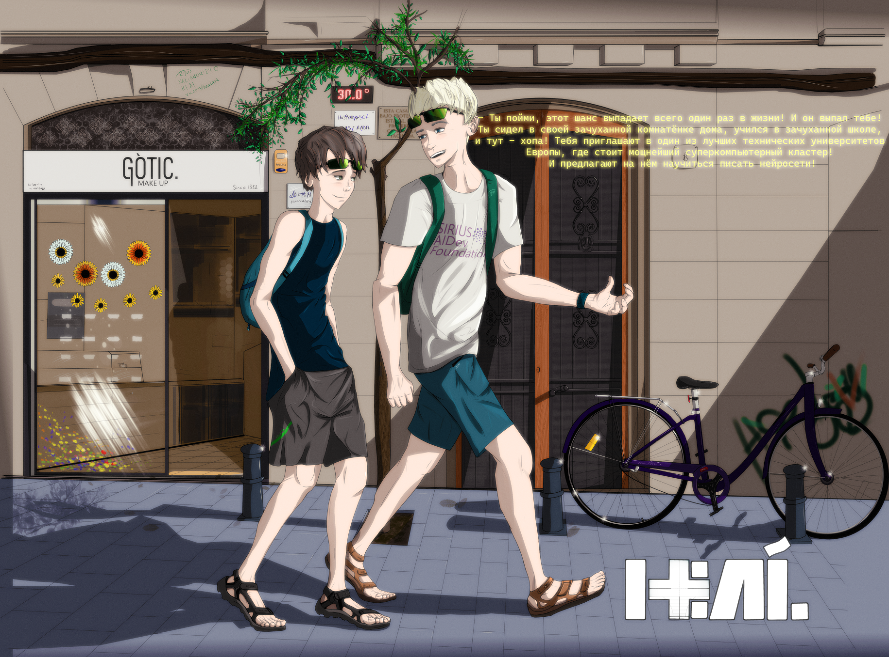

# TIM_BRC_001

*"Дьяволы обладают глубочайшими знаниями обо всём. Ни один богослов не может истолковать Священное Писание лучше их, ни один адвокат не знает законов и установлений, ни один врач или философ лучше них не разбирается в строении человеческого тела или в силе камней и металлов, птиц и рыб, деревьев и трав, земли и небес." (Боден, судья по делам ведьм, 1580 г.)*

---

**Глава 1. Hola, Barcelona!**

*\- Очень коротко о себе и Сэме \- Привет, Барселона! \- Налаживаем свой быт \-*

---

\- Гляди, это - Саграда Фамилья. Храм Святого Семейства. Он прекрасен! Даже круче, чем Дом в Кёльне, уж поверь мне!  
\- Не знаю, я не был в Кёльне.  
\- Ты много потерял!  
\- Я не могу потерять то, чего ещё не находил!

Сэм заворожённо смотрел в иллюминатор A320-го. Лайнер совершал разворот над городом, предоставив своим пассажирам  возможность насладиться его видом с левого борта. На безоблачном небе Каталонии ярко светило солнце, заливая своими лучами салон самолёта. Солнце - мой лучезарный друг, которого так не хватает мне в сером Петербурге!

\- Сколько раз я сюда приезжаю, уже чувствую себя как дома, – приговаривал Сэм, - А вот, гляди, и башня-фаллос! Ну, то есть, башня Агбар, но местные её так называют.  
\- Вечно у тебя какой-нибудь фаллос! - проворчал я и тоже посмотрел в иллюминатор, слева от Сэма. Мне досталось кресло посередине.

Внизу, на фоне лазурного моря, медленно проплывала загадочная и манящая Барселона. Чужой, незнакомый мне город. Возможно, через пару недель он станет для меня родным. Я изучу в нём каждую улочку, отмечу на карте все точки интереса. Но сейчас... Сейчас это был для меня чужой, огромный, незнакомый город. Он молча обозначал мне, с высоты полёта нашего лайнера, доступные локации, в общем плане, ещё не ответив пока ни на один вопрос. Все вопросы - потом. А пока... Пока я просто смотрел на него в иллюминатор.

\- Ты чего напрягся? - Сэм толкнул меня в плечо, - Сейчас будем садиться, и всё, прилетели! У меня ужасно болят ноги! Кстати, твоя маска упала на пол. И... по ней уже кто-то прошёлся.

История да умолчит о том, какими усилиями ему удалось втиснуть свои долговязые ходули между сидениями, а главное - как он в таком положении летел. Сэм попытался вытянуть их, ударившись, уже который раз, о кресло соседа спереди. Полёт занял четыре с лишним часа. Четыре с лишним часа надоедливой болтовни Сэма и скуки! Нет, у меня, конечно, была закачана на смартфон куча нескучного контента, а на ушах сидел ди-джейский "Техникс" с моей стандартной долбёжкой для таких дальних путешествий. Но из-за постоянной трескотни Сэма, который не мог сидеть на пятой точке ровно, мне не удавалось расслабиться. Я постоянно отвлекался, и, в конце концов, отдался неиссякаемому потоку информации с сомнительной ценностью, которая, хочешь ты или нет, подобно волнам Средиземного моря, будет омывать твои бедные уши.

У каждого из нас есть такой болтливый друг. У меня это - Сэм. Вообще-то его зовут Семирс, но я зову его Сэм. Так - короче и прикольнее. Он - латыш, родом из Сигулды, но шпарит по-русски не хуже меня. Как и я, он тоже учился в Питере, так что я его считаю нашим до мозга костей. И вообще, он отличный парень! Мы с ним познакомились весной на федеральных соревнованиях по программированию в сочинском "Сириусе". Он тогда взял первое место, а я третье, в индивидуалке. Но ему уже восемнадцать, а мне только четырнадцать, поэтому я не обижаюсь. Сэм - мне полная противоположность. Он успешный, талантливый, высокий, умный, болтает без умолку, и девчонки за ним бегают таким табуном, что пыль стоит на много километров. У него всё здорово получается, он всегда знает ответ на любой вопрос, а если не знает - выдумает. Он... Ну что говорить? Я по сравнению с ним - косноязычный лузер, мне до него - как до Китая на роликах. Он - блондин, с ровными зубами, от природы и без брекетов. А я? Зашквар [^зашквар], особенно по утрам. С непослушными волосами, которые невозможно уложить нормально, и этими идиотскими точками вокруг носа. Они незаметные, но они есть!

Самолёт шёл на посадку вдоль берега Средиземного моря. Мы пялились в иллюминатор на работу механизации крыла: как там всё это выезжает, опускается, как работают элероны во время крена. В возрасте трёх лет я уже бывал в Испании, но вот в Барселоне - ни разу. Хотя, за мои четырнадцать с хвостом, я, действительно, много где успел побывать: в Турции, в Тайланде (там поел кузнечиков), в странах Европы. Ну, где обычно дети летом отдыхают с родителями. Мои предки не любят пляжный отдых, они постоянно куда-то мотаются, открывают что-то новое, так что я не могу пожаловаться на скуку с ними. Но в этот раз меня всё-таки отпустили одного в другую страну, и это оказалось очень непросто сделать. Нет, мои родители искренне радовались, что мне удалось одержать победу в "Сириусе" на олимпиаде Международного фонда развития искусственного интеллекта, где соревновались лучшие школьники и студенты России. И они не возражали, что я в таком возрасте поеду один в чужую страну. Ну, почти чужую. Мать знала немного испанский, и я тоже его изучал. Пришлось оформлять всякие юридические разрешения и согласия. И так сложилось с этим клятым "ковидом", что к весне проведение очной олимпиады вообще ставилось под вопрос, а уж тем более выезд за границу. Сэм убедил моих предков, что присмотрит за мной, за что я ему благодарен. В общем, я ехал учиться в Каталонский "политех", или, как он сокращённо называется, UPC. Как студент, по студенческой визе, участвовать в каком-то проекте по разработке искусственного интеллекта. Я, ещё не закончивший обычную среднюю школу Питера! Аж дух захватывает! А если меня не вышвырнут отсюда, то останусь тут надолго, буду дистанционно учиться в своей школе, а здесь работать. Даже зарабатывать! Перспектива у меня вырисовывалась потрясающая! У Сэма она вырисовывалась ещё круче: он собирался поступать в UPC и в дальнейшем работать в Барселоне. Он находился в более выигрышном положении в сравнении со мной: будучи совершеннолетним и гражданином Евросоюза, Сэм мог делать тут что хотел, чем вызывал у меня неподдельную чёрную зависть.

Земля приблизилась, самолёт ударился шасси о взлётно-посадочную полосу, на его крыльях, как перья, вспорхнули воздушные тормоза, в салоне все захлопали (Сэм, как обычно, весело крикнул "Бис!"), взревел реверс. Раздался приятный голос командира:  
\- Уважаемые пассажиры, наш самолёт благополучно приземлился в аэропорту Эль Прат города Барселона, температура воздуха...

Начинался июль 2021-го года. Года второй волны "ковида", или, если называть его правильно, `SARS-COV-2`. Мы явились в Барселону в самое пекло, когда улицы раскалились до тридцати градусов и остывать не собирались. В Питере перед вылетом стоял собачий холод: шестнадцать градусов, дожди и ветер. Короткое импульсное лето, раздразнившее питерцев, захлёбывалось циклоном и ветрами с Арктики. Я любил свой город, его архитектуру, его ритм, его размеры и особую, уникальную атмосферу. Санкт-Петербург воспевали поэты и писатели. Все они были или остаются гораздо более достойными певцами моего города, чем я. Но вот что я бы воспел со всей своей ненавистью - это его климат. Я, конечно, понимаю Петра Великого, которому необходим был город с выходом к Балтике, и здесь сыграла куча факторов, в котором фактор болота стоял на последнем месте. Тем не менее, Питер стоит на болоте, и климат тут - болотный. Лето - не лето, зима - не зима. Ветер всё время в лицо, летает по кругу, независимо от того, куда я иду или еду. Ветер злой, холодный. И, хотя, сразу после нашего отлёта, в Питер пришла долгожданная жара, задержавшаяся на достаточно долгое время, считалась она "аномальной жарой". Почему-то аномальной, хотя для меня это была вполне комфортная температура лета. Я любил тепло. Видимо, хорошее кровообращение позволяло мне чувствовать себя комфортно в любую погоду. Напялив обязательные маски, мы вышли в первый терминал Эль Прата через телетрап. Постояли в очереди на пограничном контроле. Самолёт прилетел полный, и это при "ковидных" ограничениях! Вместе с нами прибыло ещё несколько ребят из Питера, тоже с олимпиады, и также, как и мы, приглашённых в Политехнический университет Каталонии. Это приглашение означало лишь то, что мы поприсутствуем там, послушаем интересные лекции, проведём каникулы в Барселоне, а потом - суп с котом. Зарегистрировавшись у специальной стойки, где сдали справки с ПЦР, мы без проблем получили наши чемоданы, после чего выбежали на улицу. И тут мне в лицо ударил тот самый пьянящий, горячий и влажный воздух Каталонии!

И я "поплыл". Это чувство, как будто ты понюхал крышечку с водкой, и тебе "хорошо" от одного запаха спирта. Сердце забилось: сразу захотелось, скинув с себя мешковатый худи и джинсы, рвануть купаться! Взлететь на те горы, виднеющиеся вдали. И - бежать! Бежать, вдыхая горячий, морской воздух!

<!-- Историческая справка: в Петербурге июль 2021 года был довольно жаркий, и жара стояла достаточно долго. Тем не менее, мне пришлось немного "охладить" погоду в Питере, чтобы сыграть на контрасте с погодой в Барселоне. -->

Сэм жёстко, как он умеет это делать, выдернул меня из этого состояния.

\- Мы на такси поедем или на автобусе, Тим? - крикнул он, толкая меня в плечо. Я дико на него посмотрел, а потом засмеялся:  
\- Пешком пойдём!   
\- Ты прикалываешься? У нас хата в Орта-Гинардо, туда пешком два дня идти будешь со своим чемоданом на колёсиках! Удачи!  
\- Ты сейчас в сложенном состоянии сидел четыре часа. Я бы на твоём месте пробежал километров десять, с чемоданом на плечах!  
\- Я б с радостью, но обещал хозяйке заселиться до вечера. А уже полдень!

Такси мы вызвали через приложение. Оно подъехало на удивление быстро. Сэм заранее выучил адрес и выдал таксисту на таком чистом испанском, что мне стало завидно. Таксист (одетый, не в пример нашим, достаточно стильно: чёрные брюки, белая рубашка, чёрный галстук) что-то ответил по-испански, что именно - я не расслышал, но они забавно закивали друг другу, как свои люди. Внутри салона присутствовала божественная фича [^фича] всех автомобилей и помещений в летней Испании - кондиционер. Наше такси выехало с территории терминала на шоссе, и помчалось по трассе "B-20" в район Орта-Гинардо, расположенный на северо-востоке города, довольно далеко от побережья, на возвышенности, у подножья горной цепи Кольсерола. Понятное дело, что чем дальше от моря, тем жильё дешевле. Мы бы, конечно, взяли квартиру в Барселонетте, если бы у нас были деньги. Но даже в Лес Кортс, рядом с Университетом, цены кусались, как голодные акулы. Сколько точно здесь пробуду - я не знал. Сэм же собирался поступать сюда, в Университет, а потому серьёзно рассчитывал обосноваться в городе, и считал каждый евроцент.

Таксист подвёз нас на улицу Орта - очень узенькую, тихую улочку, где с одной стороны стояли припаркованные машины и мотобайки, а с другой - оставалась всего одна полоса для проезда машин, и повсюду висели знаки "стоянка запрещена". С обеих сторон возвышались небольшие жилые дома в три или пять этажей, с балкончиками, воротами, гаражами, маленькими магазинчиками на первом этаже, а вдоль тротуара, вымощенного плиткой, росли вишнёвые деревья. Мы выгрузились и направились к кирпичному трёхэтажному домику, тарахтя колёсиками чемоданов по тротуарной плитке. Слева от входной двери располагался домофон с двенадцатью кнопками, напротив каждой висела дощечка с фамилией жильца. Всего таких кнопок я насчитал двенадцать. Сэм нажал на кнопку с табличкой, на которой было написано от руки "Торрес".

\- Вот будет смешно, если никого нет, - задумчиво пробормотал он. Домофон щёлкнул, Сэм поздоровался и сказал, что мы - арендаторы. Дверь открылась, впустив нас в прохладный и чистый подъезд. Наша квартира располагалась на последнем, третьем этаже, куда нас и доставил небольшой лифт, похожий, скорее, на подъёмник. 

Дверь открыла хозяйка - высокая, стройная и смуглая женщина в медицинской маске (которую она периодически снимала из-за жары; да и мы тоже не особо соблюдали противовирусные меры, хотя по Испании, говорят, ещё прокатывались волны), лет сорока. Она представилась Еленой. Общаться с нами она начала по-английски, но, узнав, что мы немного знаем испанский, стала подмешивать в свою речь испанские слова. Елена провела экскурсию по своей двухкомнатной квартире, которую я бы назвал "евро-однушкой": небольшая спальня и большая светлая гостиная с белыми стенами, совмещённая с кухней. Квартира оказалась достаточно просторна для двоих. Для меня, выросшего в тесноте моей питерской комнатёнки, даже кладовка квартиры Елены была как полноценное жилище. Смутило только то, что кровать одна и диван не разбирался. Но эти бытовые трудности можно было решить. Договорившись об оплате, уборке и прочих житейских мелочах, Елена ещё раз недоверчиво оглядела нас. Ей, видимо, не очень хотелось сдавать квартиру студентам, но Сэм, со своей лучезарной улыбкой, на английском убедил её, что мы - чистоплотные русские богачи-ботаники, будем платить вовремя, никаких девок не будет и в помине, спиртного на балконе - тоже. Мы не были похожи на раздолбаев. Впрочем, по людям внешне и не скажешь, что они - раздолбаи. Да и потом, теперь я впервые жил один. Ну, почти один. Я сам не знал, чего от себя ожидать в этом городе соблазнов!

\- Зря ты ей наобещал! - усмехнулся я, когда Елена ушла, а мы принялись разбирать вещи, - Теперь нам придётся держать слово, которое ты дал!  
\- Вот ты не слышал, что я ей сказал, Тим! - возмутился Сэм, - Я ей обещал, что она никогда не услышит, что мы водили девок или бухали! Я не обещал, что сам факт как таковой будет отсутствовать. И вообще... Мне кажется, она приняла нас за... *Этих*.  
\- Мне кажется, твой кастильяно ещё далёк от совершенства, - вздохнул я, вытаскивая из рюкзака свой рабочий инструмент - ноутбук. Единственная досада, мучившая меня - невозможность взять с собой мой домашний компьютер с "i7"[^i7] и мощной игровой видеокартой "сапфир". Но Сэм предложил дельный совет - продать его и на эти деньги купить "печку"[^pk] тут, в Барселоне. Поэтому, скрипя сердце, я продал собранное мной вручную "железо" и перевёл деньги в евро. Теперь мне предстояло снова собирать его, уже тут. 

Из спальни раздался голос Сэма:  
\- Ты не возражаешь, если я буду спать в спальне, а ты - на диване?  
\- Пофиг, - флегматично ответил я, раскладывая ноутбук на замызганном журнальном столике, - мне кажется, я долго тут не проживу. Не верю, что меня оставят в проекте. Так, погреюсь на солнышке - и домой! Да и ты всё равно не поместишься на диване!

Сэм представлял собой двухметровую шпалу. Мой рост составлял чуть больше метра семьдесяти. Хоть я и понимал, что ещё вырасту немного, и что мой рост не самый маленький, тем не менее, эта разница меня расстраивала. На контрасте между нами это было заметно, а со стороны выглядело забавным. Но больше всего меня бесило то, что он - совершеннолетний, и ему, типа, всё можно. Поэтому я старался не обращать на его подколы никакого внимания.

\- Сэм, давай сразу договоримся, - сказал я ему, настраивая вай-фай, - серьёзно. Баб не водить. И не пьянствовать тут. Если родаки узнают, мой батя лично приедет сюда с ремнём.

Сэм стиснул зубы, как от боли.

\- Вот ты зануда, - процедил он, выпятив нижнюю челюсть, - сиди, ковыряйся в своём ноуте! Ну тебя, зануда! Я в няньки к тебе не нанимался и перед твоими родителями не собираюсь отчитываться. Хоть я и обещал им присматривать за тобой, но лишь присматривать, а не участвовать в твоём воспитании. Так что, собери свои мозги в кучу и реши сам, что тебе нужно.  
\- Тогда можешь всю комнату себе забирать, а я буду тут спать. Договорились?

Сэм пожевал что-то во рту, долго пялился на кондиционер, пытаясь его настроить, а потом повернулся ко мне и серьёзно так ответил:  
\- Оке. Договорились. Гулять идёшь? Или тут сидеть будешь, со своей восьмиядерной подружкой?

Приехать в Барселону и тут же сесть за ноутбук мог, конечно, только полный дебил, коим я себя не считал. Я тут же выпрыгнул из своего чёрного худи и безразмерных штанов в абсолютно соответствующие местной погоде шорты, чёрную майку и сандалии, взглянул мельком на себя в зеркало (Лучше б я не смотрел! Опять волосы в разные стороны!), а потом бросился за Сэмом, который, приодевшись в нечто похожее, только белого цвета, уже возился в замке входной двери единственным ключом, вручённым ему хозяйкой. На ходу я схватил опустошённый рюкзак, швырнув в него бутылку воды, загранпаспорт и мобилу. Банковская карта всегда лежала в кармане, а солнцезащитные очки восседали на моём лбу.

\- Твой "рейбен" - паль [^паль]! - съязвил Сэм, внимательно посмотрев на мой лоб.  
\- Это не "рейбен",  - ответил я.  
\- Там написано: "рейбен".  
\- Там написано "бейрен".  

Доставать меня - любимое занятие моего друга. Впрочем, он троллит всех, а не только меня. А очки у меня, действительно, с "алика" [^алик]. Да, паль, да, дешёвка. Но они ничем не хуже дорогих "бенов" или "полароидов". И вообще, мои предки привили мне немного иное, нежели у остальных подростков, отношение к вещам. Не дешёвое, но практичное. Не паль, но с разумной ценой. Они давали мне возможность выбирать, но критиковали вид и даже откровенно смеялись иногда, когда я пытался сменить причёску на химию с бритым затылком, или нацепить нелепый, но модный прикид. Мои родители - милленалы, выросшие в мутные 90-е, испытавшие на себе все пертурбации моды того периода. Отец - рейвер, мать - рокерша, они насытились этим уже давно. И, хотя они познакомились уже в зрелом возрасте, когда сменили прикиды на платья, костюмы и рубашечки, всё равно носили что хотели - батя - программист, летом ездил на работу в шортах и сандалиях, а мать в повседневной жизни любила спортивный стиль. Свобода и комфорт - вот что легло в основу моего представления о шмотках, поэтому я всегда советовался с ними по поводу чего-то нового. И получал дельный совет, который всегда оказывался справедливым. И так получилось, что я - зануда и ботаник - одевался в классе лучше и стильнее всех. А то, что это всё было - ноу-нейм-паль, мне вообще наплевать. В каждом классе, наверное, существует такое ядро из ребят, типа "полиции моды", которые сразу скажут, кринж это, паль или база. У меня такое ощущение, что бренды платят им за то, что они развращают дорогим барахлом детей и разводят их родителей на бабки. Мы враждовали. А когда есть непримиримый враг, все твои поступки начинают наполняться особым смыслом. Я стал противовесом им, и ко мне примкнула половина класса. Та половина, которая не могла себе позволить закупать кроссы за тридцать тысяч в бутиках американских брендов в какой-нибудь "галерее" на Лиговском. Не бедные семьи, но кто хочет переплачивать за вещь втридорога только ради бренда? Это - сложная тема и предмет наших с Сэмом бесконечных споров. Семирс, единственный в своей семье, воспитанный в достатке и на дорогих, качественных вещах, доказывал принципиальность орига. Что "крокодил" на его "лакостовском" поло - это действительно крокодил, а не неизвестный науке мутант-рептилоид. Он хвастался сандалиями, купленными за пятнадцать косарей. И хотя сандалии, действительно, были классные, спортивные, с амортизацией, с рельефом стельки и защитой пальцев, отдать за такие пятнадцать честно заработанных потом и кровью косарей для меня было просто верхом мозговой ущербности. Я сказал это Сэму, а он стандартно обозвал меня нищебродом. Тогда я достал свои сандалии и сравнил их с его лыжами. Ну да, немного проще, но зато три с половиной косаря! Сэм, конечно же, нашёл в них стопятьсот недостатков и завершил спор как обычно, дескать, "Ну и носи свои нищебродские!". И так далее. В итоге мы с ним шагали по улице Орта и нам было одинаково зашибись: мне в своих за три с половиной, ему в своих - за пятнадцать.

<!-- 
Улица Орта (Carrer d'Horta).
181 Carrer d'Horta
-->

Барселона! Куда может пойти турист, только что приехавший в Барселону? Парки? Клубы? Да куда угодно! Если, конечно, у него есть деньги!

Куда пойдут два парня, приехавшие только что из холодного Петербурга на жаркое побережье Средиземного моря? Конечно же, на пляж! Но, так как из Орта-Гинардо до Барселонеты добираться далековато, а на такси - разорительно, то мы решили разобраться в специфики местного общественного транспорта. Я твёрдо решил добыть себе велосипед, чтобы не мариноваться в жарких и дорогих автобусах. Сэм не очень любил вел, предпочитая электросамокаты. С таким ростом, ему сложно было подобрать для себя подходящий байк, особенно в прокате. Цены на городской транспорт кусались. Метро - два двадцать евро. Предстояло постоянно посещать, как минимум, Университет, да и перемещаться хотелось свободно, поэтому тут светил только проездной на триместр почти за сто евро. Я не готов был сейчас запросто вынуть и положить сотню евро, поэтому, по совету Елены, мы взяли пока по "T-Casual"[^casual] на десять поездок в метро и на автобусах. К тому же, я не верил, что долго здесь задержусь, тогда зачем тратить деньги?

Мы отправились пешком по улице дельс Фонтанет, через небольшой парк, до площади дель Эстатут, где сели на автобус. Наш путь пролегал через центр города. В какой-то момент, проезжая по узкой де Лепан, я увидел Храм!

\- Смотри! - закричал я, как маленький. Мой друг важно взглянул на меня с высоты, заявив, что мы ещё увидим его. Обязательно. И сегодня. В ту самую секунду, увидев его, я почувствовал зудящую в области диафрагмы потребность лицезреть это чудо вблизи и без временных ограничений.

Выйдя на бульвар Мартим, мы потопали до Барселонеты, знаменитого туристического района с пляжами, клубами, ресторанами и толпами туристов. Да, именно с толпами туристов! Масочный режим никто не отменял, но туристы были везде! Пляж Сант-Микель кишел любителями пляжного волейбола и повисеть на турнике в тридцать градусов, пляж де ля Барселонета - любителями жариться на солнце и охлаждаться в высоких пенных волнах Средиземного моря. Закусочные и ресторанчики окрестностей пляжа, с выставленными на улицах столиками, под навесами, приятно манили своими шейками со смузи и неприятно отталкивали ценой. Ни я, ни Сэм, не могли похвастать неограниченным бюджетом для развлечений. У меня в кармане лежала карта "Мастеркард" (который мы между собой называли "макакой"), куда родители закинули пару штук евро на бытовые расходы. Конечно, и на развлечения тоже. Я решил хотя бы в первые дни своего путешествия ни в чём себе не отказывать, а потом уже скорректироваться. Неверно думать, что подростки не считают деньги. Считают, ещё как. Я почти не тратил их, за исключением питания в школьной столовке и покупки разных инструментов и материалов для конструирования различных электронных штукенций. В основном брал их на "алике", там дешевле, и не без помощи отца. Вообще, если мне нужны были деньги - я шёл к родителям. Правда, не всегда их получал. В большинстве случаев - да, но всегда хочется большего. Приходилось зарабатывать на примочки или запчасти к велосипеду, аккаунты игровых платформ, тьюнинг компьютера. Погоняв на велосипеде с кубическим коробом за спиной, я понял обречённость этой затеи и переключился на фриланс. Правда, из-за недостатка опыта, фриланс мне тоже денег не принёс. Помог отец, давая подзаработать в своём офисе, где я занимался абсолютно всем подряд, от вёрстки каких-то шаблонов до переноса мебели и разматывания витой пары для админов. Короче, мальчиком на побегушках. Батя платил мне из своего кармана, так что шмотьём, спортивными секциями и учёбой вполне обеспечивал. Тем не менее, я не шлялся по ресторанам и закусочным, и не тратил деньги на всякие платные подписки и на то, что можно было скачать бесплатно (йо-хо хо!). Из-за того, что мне приходилось каждый раз доказывать родителям необходимость той или иной траты, я считал каждую копейку и старался на всём экономить. Родители никогда не говорили мне, что денег нет. Но они дотошно интересовались каждой монеткой, и была ли у меня возможность избежать таких немыслимых расходов. Это наложило отпечаток на моё отношение к финансовому вопросу: я жался как мог. С другой стороны, я никогда не давал родителям повода стыдиться за меня, поэтому очень гордился высоким доверием, которое они мне оказывали. Зная о моей интроверсии, мать даже сказала мне на дорогу: "Не забывай отдыхать и расслабляться!" Она была права: я не умел расслабляться. 

Весь этот учебный год был объявлен лично мной годом ада, и мною же проклят. Я учился в школе с математическим уклоном, потому из года в год уровень сложности математических предметов, ясное дело, возрастал. Добавили факультативов и кружков, на которые мне нужно было ходить, а ещё пришлось записаться на курсы "Rust" и "Go" [^langs], потому что без них уже мало что создаётся в современной программной индустрии. Это не говоря уже об изучении "пайтона"[^python], да батя помогал "шарпЫ"[^csharp] изучать и "юнити"[^unity]. В голове у меня образовалась такая каша, что я иногда забывал, что именно изучаю. Я просмотрел видеокурсы индусов про нейросети и deep learning[^dl], даже записался на школьную программу Политеха, но разочаровался: курс оказался слабым. В году у меня было запланировано несколько олимпиад, школьных и районных, но, если честно, математика в чистом виде меня переставала интересовать: я с головой ушёл в программирование. Возможно, на это повлияло моё увлечение видеоиграми, поддержка отца, а может быть - природное любопытство. Всегда хотелось узнать, как всё там устроено. Особенно нейросети, по которым я дочитывал сложнейшую книгу одного индуса из MIT[^mit]. Моя кукуха медленно отчаливала. Я уже плюнул на русский язык и литературу, в результате чего у меня появился жёсткий перекос в учёбе; историю тоже не жаловал. Если в точных науках я шёл на "отлично", по истории и русскому хватал "тройки", кое-как учил стихи. Было очень стыдно за "тройки" и "двойки" перед родителями, даже если я приносил пачку "пятёрок" по геометрии или физике. Меня бесили девочки-отличницы со стерильными пятёрочными дневниками и пустыми головами, не способные рассчитать цепь мультивибратора, а затем спаять его. Учителя про меня лишь качали головой: я был очень неровен в учёбе. Вызывали мать в школу. Помимо всего прочего, я, как и все мы, очень любил много чего, что не относилось к учёбе: читать книги про приключения, слушать громкую музыку, танцевать, пока никто не видит, петь в душе... Ну и, разумеется, я обожал собранный своими руками горный велосипед, так что в любой сезон я мог всё бросить и умчаться рассекать. В воскресенье, под вечер, приехав в грязи по уши, с изодранными ногами, я вспоминал про тонну домашки, и засыпал в час ночи над очередным параграфом про Макиавелли. С утра я получал, в лучшем случае, "тройбан". Если была возможность исправить - исправлял. Самое главное - у меня был интерес и увлечения, которыми я жил и которые помогали мне безболезненно принимать окружающую действительность. Курить никогда не пробовал, считая эту привычку мерзостью. Кто-то скажет, что я - тепличный огурец, пока не увидит мои сожжённые паяльником руки, изодранные в кровь на даунхилле[^downhill] колени или треснутый шлем, который я умудрился "обновить" на стоянке при помощи выезжающего фургона, не заметившего меня.   

Ласковое море, волны, смузи, толпы девушек, и мы - два белых обормота в плавках. Первый пляж, который мы посетили - это, конечно же, плайя Барселонета. Пляж оказался забит, несмотря на "ковидные" ограничения. Люди всех возрастов жарились на солнышке и бродили по песку без масок. И ничего бы здесь не выдало пандемию, если бы не белые палатки для тестов и прививок, периодически мелькавшие то тут, то там, на улице. Такие палатки встречались мне, в дальнейшем, по всему городу. Что касается прививки, то я, не раздумывая, вколол себе два компонента "Спутника" ещё в Питере, перед поездкой, без каких-либо последсвтй для организма. Я считал, что чем больше в себя загоню этих вакцин, тем мощнее будет моя антивирусная система. А потому смело прививался и от гриппа, и по плану, и вне плана. Мне даже нравилось ощущение, когда игла входит под кожу, или, когда брали кровь из вены. Что касается Сэма, то он наотрез отказался прививаться от "ковида", хотя я подозреваю, что тайком он всё же укололся, но не говорит. Нам обоим повезло, "ковид" прошёл мимо нас. Не знаю, кололись ли своим "пфайзером" испанцы и туристы, но выглядели они весьма бодро и здорово. И только немного позже, разговорившись с русскоязычной официанткой в кафе на пляже, мы узнали, что больницы Барселоны переполнены.

Мы, как два дикаря, сиганули в это солёное, тёплое море! В эту бурлящую стихию, в эти волны и пену! И на тот момент не было силы, способной вытащить нас на берег, позвать, погнать домой делать уроки или какую-то работу! Пьянящий аромат свободы, когда тебя ещё не припёрли к стенке бытовые проблемы, и ты можешь ещё порезвиться, как ребёнок, наесться этой свободы досыта! Ты понимаешь, что вечером придётся думать, что поесть или где постирать трусы... Но сейчас этого всего нет, а есть солнце, море, песок, и... Сэм, пытающийся меня утопить! Ну, не без этого, да! Крем от загара, конечно, никто не взял. Мы валялись на песке, без каких-то подстилок, ели эскимо. Мне казалось, у меня впереди целая вечность, и я могу неторопливо наслаждаться видом Барселоны: скруглёнными зданиями отелей, пальмами. Она мне нравилась всё больше и больше. Как-то всё сошлось воедино в этом географическом месте: и море, и климат, и архитектура, и люди... И моя юность. Перед собой я видел море, бескрайнее, голубое, сходящееся с небом на горизонте, и мне казалось, что где-то там, вдали, за этой линией горизонта и есть - моё будущее. С моря дул сильный и тёплый ветер. На моих губах застыла приятная морская соль. Мы обошли гавань, утыканную лесом яхтенных мачт и снастей, пошли к Рамбла, по набережной с виадуками и автомобильными туннелями. Мы прошмыгнули мимо статуи Колумба (во внутренностях которой, как муравьи, копошились туристы), пошли по Рамбла, чтобы нырнуть направо, в Готический квартал.

Баррио Готико. Место, о котором ты думаешь, когда говоришь о Барселоне. По его лабиринтам узких улиц, разжигающих воображение, можно бродить бесконечно. Непривычны для нас такие узкие улицы шириной в два шага, разве что в старом центре Питера можно отыскать нечто подобное, если постараться. Аутентичные фонари, причудливые фасады, украшенные уникальными балкончиками, с арками и галереями. Со снующими повсюду прохожими, велосипедистами, самокатчиками... Баррио Готико - это не район. В моих глазах разворачивалась целая Вселенная, как результат Большого Взрыва моего маленького мозга. Готический собор святого Креста, Королевская площадь, гигантские мыльные пузыри уличных артистов, и всё кафешки, кафешки... Музыка, аромат капучино и корицы. Маленькие ресторанчики, большие рестораны. Столики на улице, где местные пожилые испанцы и туристы неторопливо тянули "Эстрелла Дамм" из красных банок. Молодёжь в Барселоне дожидалась своего часа. Её не было незаметно, а то, что было заметно - кучковалось у фонтанов. Сувенирные лавочки, каждая в своём стиле, обвешенные красно-жёлтыми майками с Месси, "FC Barcelona", кепками с вышиваемыми на заказ роботами-машинами надписями, флагами и гербами Барселоны и Каталонии, а также обязательные мозаичными принтами и мёрчами из "Бумажного дома", соседствовали с обезображенными графити стенами и дверьми, ведущими неизвестно куда. В некий иной мир, недоступный для нашего взора.

\- Тим, смотри, какие шикарные трусы с быком, - толкнул меня в бок Сэм, - Купи себе!  
\- Сам купи себе! - засмеялся я, - Как раз твой размер!  
\- Пять евро? Однако!  
\- Ну, так, тут же не "алик", а Готик! Хотя, полотенце с ящеркой я бы взял. Полотенцев у нас нет!  
\- Полотенец!  
\- Ты напоминаешь мою училку русского! Не твОрог, а творОг!  
\- Тебя надо розгами лупить, тогда научишься правильно говорить!  

Каждый раз, когда мы проходили мимо какого-нибудь тату-салона, Сэм страдальчески вздыхал:  
\- Я всё-таки решусь. И сделаю себе татуху.  
\- На ягодицах?  
\- Да почему на ягодицах? - возмущался Сэм, - Что, других мест нет?  
\- Ну, делай, делай, посмотрим, где сделаешь. Уравнение Шреденгера себе сделай, на ж...

Сэм яростно толкал хохочущего меня в спину, я отлетал вперёд, пугая прохожих, возвращался на свою траекторию, и так мы, подкалывая друг друга, дрейфовали по улицам квартала. Фоном играла какая-то лёгкая музыка, и эта музыка... Музыка преследовала меня. Она, как инъекция наркотика, медленно обволакивала мой мозг, погружая его в состояние, недоступное ему до этого момента. И тут вдруг оно стало доступным! И это ощущение, ощущение чего-то нового, необычного, манящего за собой и увлекающего вперёд... Вот оно! Теперь - только вперёд!

Готический квартал казался для меня бесконечным. Но, как и всё хорошее, он закончился. Мысленно я попрощался с ним, обещая себе, что вернусь в него снова, обязательно погуляю подольше. Мы прошли мимо дворца правительства Каталонии по улице де Ферран, и снова вышли на Рамбла. Я думаю, не будет лишним напомнить об этой улице и культурной роли, которую она играет для города. Скажу так: эта улица - как Невский проспект для Петербурга. С неё начинаются экскурсии и знакомство с Барселоной. Идя по ней, вы обязательно столкнётесь, если не со всеми цветами Барсы, то с её основными оттенками - точно! Здесь вы повстречаетесь с типичной архитектурой Испании, ибо Барселона - город старый, со своей интереснейшей историей. Многочисленные народы, проживавшие здесь, начиная с античности, и заканчивая нашими днями, отпечатали свою культуру в камне, оставив после себя (и всё ещё оставляя) интереснейшие её явления. Античность, вестготы, средневековье - чего здесь только не намешано! Мы с Сэмом - искушённые до архитектуры люди. Не так, чтобы мы разбираемся, но мы оба выросли в городах с весьма разнообразной и интересной архитектурой. Жителя петербурга сложно удивить разнообразием фасадов и стилей. Но, шагая по Рамбла, ты влюбляешься в этот город всё больше и больше. Причудливые фасады домов с уникальными и неповторимыми ажурными решётками балконов, и, казалось бы, вылепленные из чего-то аппетитно-кондитерского башенки дворца Гуэля работы Антонио Гауди в Эль Равале! Это - сочетание несочетаемого, и хочется остановиться, разглядеть как следует. Но Сэм тащил вперёд. Я за ним не поспевал и злился, а в какой-то момент, засмотревшись, со звоном врезался в столб, вызвав смех проходящих мимо туристов. Мы миновали огромные крытые рынки, китайские рестораны, соборы, освежающие фонтаны с бриллиантовыми брызгами, скульптуры. Топая так бодрым шагом, мы вышли к площади Каталонии, вокруг которой медленно дрейфовали группы туристов, увлекаемых гидами от одной достопримечательности до другой. Побродив тут и послушав пару экскурсий, мы отправились дальше, к храму. До него пришлось идти по де лес Корс Каталанес, потом пересечь проспект Диагональ.

\- Ты не знаешь, где поселились те парни, из Питера? - спросил я Сэма. Он сбавил темп: видимо, немного устал.  
\- Очкарики? В Грасиа, вроде бы, - ответил он лениво, - а что?  
\- Интересно, сколько наших приедут сюда? Приглашали всех желающих, из "Сириуса".  
\- Во-первых, не просто всех, а всех победителей. А во-вторых, не каждый отважится полететь сюда в *ковиндемию*. Тут ведь такая жесть была, слышал же, наверное? Это мы - бесстрашные. А остальные... Я-то, ты знаешь, душу отдам за то, чтобы тут остаться жить и работать в Барселоне! И тебе понравится, уверен!  

Я молчал, и, улыбаясь, шёл вперёд.

\- Ты пойми, - продолжал он, - этот шанс выпадает всего один раз в жизни! И он выпал тебе! Ты сидел в своей зачуханной комнатёнке дома, учился в зачуханной школе, и тут - хопа! Тебя приглашают в один из лучших технических университетов Европы, где стоит мощнейший суперкомпьютерный кластер! И предлагают на нём научиться писать нейросети! Причём, такие, какие ещё никто не писал! Будешь работать бок о бок с ведущими дата-сайентистами мира! Это тебе не чертей рисовать в своём "юнити!"  
\- А чего тебе мой "юнити" не нравится?

Я даже игру свою начинал делать. Трёхмерный движок на "Unity", виртуальные камеры, освещение, шейдеры. Короче всё, как говорится, с блэк-джеком и шлюхами... Только шлюх не успел сделать...

\- Так со шлюх и надо было начинать! - засмеялся Сэм.  
\- Кто о чём... - обиженно проворчал я.  
\- Чел, я уважаю твои петы[^pet] и публикации на "хабре", это всё, конечно, круто...  

После слов о публикации на "хабре" я покраснел и опустил глаза. Это был довольно кринжовый опыт первой публикации на этом информационном ресурсе для айтишников. И статья, вроде бы, интересная, про применение искусственного интеллекта в игровых ботах. Но налетели дядечки с конским опытом работы, обложившие мою статью таким навозом, что я потом долго обтекал и сушился. Сэм орнул с комментов и сказал, что я, в общем-то, получил за дело. Я обиделся. И хотя отец всегда учил меня быть спокойным и думать трезвой, холодной головой, эта ситуация меня сильно разозлила. Руки дрожали и порывались в ответ написать этим дядечкам какую-нибудь гадость. Но Сэм предложил мне офигенный вариант - пойти на днюху одного его знакомого, где я... Ну, в общем, там я понял, что всё это фигня и совершенно охладел к этой статье. После того, как папа притащил меня домой, и я проспался, я уже не хотел ничего: так сильно болела бошка. Батя прокомментировал моё состояние словами "Странно, почему болит.. Болеть-то нечему!" Первый блин комом, зато опыта набрался. Всегда есть плюсы.

Улочками, по навигатору, мы, наконец, вышли на площадь ла Саграда Фамилия. И я увидел *его*! Первой мыслью любого человека, впервые увидевшего храм Святого Семейства, будет - "Это сотворил человек?" Он - не просто готика. Готикой меня не удивишь. Я обожал её. Сочетания остроконечных шпилей, резных башенок, порталов, арок, черепичных крыш, узких высоких окон - вызывали во мне некое щемящее чувство. Но шедевр Гауди явил мне нечто совершенно неземное, инопланетное! Это как гигеровские творения "чужих", вытравленные кислотой. Или, нет! Будто добрый великан заботливой рукой вылепил стены из песка, отшлифовал их и придал им неповторимую, природную форму, лишённую человеческой выверенности и евклидовой геометрии. Именно рукой, а не инструментом. Рядом с ним чудилось, словно геометрия, которую раньше я знал из школьной программы, закончилась, и начиналось путешествие в какую-то параллельную Вселенную, как в "Докторе Стрендже", где пространство скомкано, вывернуто наизнанку и представляет собой фрактал. На одной из его сторон всё ещё возвышались леса и башенные краны, виднелись голые бетонные стены, из которых торчала арматура. Но там, где работа завершилась, можно было любоваться каждым сантиметром фасада! Особенно - фасада Страстей, с его наклонёнными колоннами, напоминающими мне клей между двумя деталями, которые ты пытаешься отклеить, и кучей маленьких круглых окошек - сот в улье. Все фигуры портала - угловатые, как словно рубленные топором. Я не знаю, задумывал ли так Гауди или это просто недоделка. Мы, как самые ушлые, прицепились к русскоговорящему гиду и прошлялись вокруг храма вместе с его группой полчаса. Нафоткались на фоне этого чуда, рядом с прудиком грязно-зелёного цвета, у изрисованных графити каменных бортиков. Высота храма подавляла. Я задрал голову и долго изучал фасад Страстей, приглядываясь к каждой детали. Сэм меня дёрнул. Он уже видел храм раньше, снаружи и внутри. Ему было достаточно.

\- Гауди - прям как ты, - заметил мне Сэм, - тоже начинает какой-нибудь интересный проект и бросает недоделанным. Сколько ты начинал своих игрушек? Пока мы с тобой знакомы, ты три механики придумал, и хоть бы одну довёл до ума!  
\- Гауди всю жизнь на него угробил. Я пока не готов к такому, мне кажется...  
\- Тебе кажется, что ты ещё не нашёл и вот-вот найдёшь то, на что потратишь всю свою жизнь? Ну-ну, ищи. Только помни, что жизнь летит очень быстро!

Сэм так говорил, потому что сам редко что-то разрабатывал. Он прекрасно разбирался в матанализе и информационных технологиях, но старался не тратить своё время на разработку всякой фигни, как я, и не упарывался по ночам, как я. Сэм, хороший теоретик в науках о данных и вычмате, не имел пет-проектов. По крайней мере, мне он их не показывал. Он не стремился что-то создать, его цель была - понять. А у меня вечно горело под пятой точкой и руки сами тянулись что-нибудь намонстрячить. Мне всегда нужна была цель.  

А Сэм считал, что чем меньше ты пишешь кода - тем меньше создаёшь проблем.

\- Внутрь пускают? - робко спросил я.  
\- Пускают, пускают. Давай потом, у нас полно времени! Ещё успеет надоесть! - небрежно ответил Сэм. Как это может надоесть? Мне вдруг захотелось перенести храм в трёхмерную модель, в свой движок. Сделать что-то типа "Assassin's Creed", или хотя бы пофантазировать, как это могло бы быть. Большинство моих идей так и оставались мечтами или фантазиями. И я нисколько не жалел о том, что не смог их воплотить в жизнь. Мне казалось, что впереди у меня целая вечность, и я всё успею.

Мой друг уже тащил меня в метро. Оно меня не впечатлило. Я видел метро в различных городах, и мне есть с чем сравнить. Например, в отличие от Петербургского, прорытого глубоко под землёй, тоннели Европы пролегают практически под самой улицей, под бетонной плитой и асфальтом, и иногда проходящие поезда можно увидеть через решётку в тротуаре. Примерно то же самое я видел в Германии и Бельгии. Так же было и здесь. Иногда поезда выходили на улицу, исчезая затем в покрытых граффити бетонных тоннелях. Иногда тоннели не имели верхних перекрытий, шли как желоба, освещаясь солнечным светом. Оригинальным выглядело решение использовать три платформы, открывая двери вагона с обеих сторон (так называемое барселонское решение). Поезда - красивые, аккуратные, да и сами станции тоже. Но скучные. Как и везде, в Европе. Мы поехали домой, потому что нам обоим уже порядочно напекло. Я спалил шею, плечи. Жгло ноги. По пути к нашему новому дому мы зашли в аптеку за кремом от загара, для загара и после загара.

Недалеко от улицы Орта я заметил стоянку прокатных велосипедов. Выкрашенные в унылый зелёный цвет, они больше походили на инвалидные коляски. На таких велосипедах, спокойно и неторопливо, мимо проезжали старички и старушки, пузатенькие дядечки и девушки в юбочках. Я не мог себя представить на таком убожестве. А тем более гонять на нём через половину Барселоны в UPC и обратно. Я грустно ругнулся.

\- И чем тебя не устраивает прокатный велосипед? - проворчал Сэм.  
\- Ты хочешь на *этом* кататься? - возразил я, указывая на *это*, - Пойду, найду прокат с нормальными "эм-ти-би" [^mtb]!  
\- Пошли пожрём сначала!  
\- Я сейчас приду! Я видел!.. Иди домой жди меня, я приду! И не сжирай всё сам, в одно жало! Я тебя знаю!  

И быстро зашагал один по Орта. Сэм никогда в жизни не поймёт, что для меня означал велосипед! Когда я вставал на "топталки", то чувствовал, как срастаюсь с ним! Как мы становимся единым целым и летим вперёд! Это ощущение, когда ты срываешься вниз с горы, когда твой взгляд скользит по ямам и ухабам, когда ты подлетаешь на пригорках и отрываешься обоими колёсами, а потом приземляешься, отдаваясь физике и в то же самое время сопротивляясь ей! Кто жил этим - тот меня поймёт, остальные - и не пытайтесь! Я презирал электросамокаты и всегда катался только на механике, только ногами! Как я уже говорил, я собрал свой собственный "эм-ти-би", изодрал руки гаечными ключами, но сделал из байка свой шедевр и гордость! Самое главное - он был под меня, под моё тело! Он был моей частью, с ним мы прошли огонь и воду, и даже Мичуринский веломарафон!

Рядом с офисом проката на соседней улице Кампоамор (я уже давно его там присмотрел) мне сразу бросился в глаза красивый белый горный велосипед "Author", пристёгнутый к велопарковке. Я вошёл в небольшое помещение. Звякнул звоночек на двери. За столом офиса сидела молодая смуглая женщина и что-то читала. Я уверенно решил начать практиковаться в испанском.

\- Hola! – начал я, но дальше запнулся. Разговор как-бы стартовал, а я ясно дал понять, что говорить буду на испанском. - Me gusta…ria… bicicleta. Montaña… [^dialog1] MTB.  

Это я уже произнёс как "эм ти би", на английский манер. Девушка подняла голову и посмотрела на меня. Она была загорелая, симпатичная, но не похожая на испанок. Скорее, европейка. Она так меня разглядывала, что я смутился.

\- For rent… [^for_rent] - я перескочил на английский и кашлянул, - ¿Cuánto cuesta… por dia? ¿Comprendo? [^dialog2]

Воцарилась неловкая тишина. "Наговорил белиберды..." - подумал я. Наконец, женщина кивнула, и я, ободрившись, улыбнулся. Она ответила улыбкой, протянув мне лист формата A4.

\- Todo está escrito aquí, precio y reglas. [^dialog3] - объяснила мне она. Я не понял, что она сказала, но, увидев числа со значком "евро" понял, что это прайс.

\- Gracias, - поблагодарил я и принялся изучать его. Женщина смотрела на меня и улыбалась.

В этот момент в помещение зашёл какой-то парень.

\- Света, ты не видела тетрадь с запчастями? – на чистом русском спросил он.  
\- На стеллаже посмотри, - небрежно ответила женщина, на таком же чистом русском.  
\- Вот, какая-то тетрадь лежит, - добавил я, указывая на столик возле входа.

Я поднял на неё глаза. Мы глядели друг на друга с минуту. Потом не выдержали и расхохотались. 

\- Почему вы не сказали, что знаете русский? – поинтересовался я после того, как мы успокоились.  
\- Ты так мило пытался говорить на испанском, - ответила она, пристально глядя мне в глаза и улыбаясь. Я долго подбирал, что сказать в ответ. Но не нашёл.  
\- Да, блин, я только учусь.

Просмеявшись и согласовав окончательно языковые настройки нашего диалога, я продолжил.

\- Скажите, а вот этот байк на парковке, красивый... Его можно взять в прокат? - робко спросил я.  
\- "Атор"? Это - хозяина. Сейчас он подойдёт, и мы спросим. Но вряд ли он даст, он сам на нём катается.

В офис зашёл загорелый мужчина, в белой рубашке и таких же белых брюках, внешне - испанец, невысокого роста, но стройный и поджарый. Света обратилась к нему по-испански, прожужжала что-то про "бисиклету" и тыкнула в меня пальцем. Мужчина посмотрел на меня и заулыбался ровными белыми зубами.

\- Ты аккуратно ездить? - спросил он у меня по-русски с акцентом, а потом быстро что-то передал Свете, и та перевела:  
\- Он спросил, будешь ли ты прыгать на нём с поребрика? Чтобы ни одной царапины!  
\- Я - как свой собственный! - замахал руками я, лукавя: мой бедный собственный нуждался в замене тормозных колодок и вилки, - Готов в залог оставить свою душу!  
\- Не обязательно! Давай паспорт. Где ты живёшь?  
\- На Орта, недалеко! Мы квартиру снимаем!  
\- Студент? Что-то ты маловат для студента. Скорее - школьник. Давай, адрес запишу на всякий случай.

Я хотел сказать, что я и вправду школьник, но почему-то застыдился этого.  

\- Я студент, - нахмурился я. Света посмотрела на меня, улыбнулась, приняла деньги в залог, штуку евро, сделала копию заграна и отдала его мне. 

\- Бери "Атор", - сказала она, - и чтобы ни царапины! И ещё, шлем купи и жилет. Без них тебе штраф влепят, у нас тут полиция строго следит за правилами.  
\- Gracias! - крикнул я из двери и побежал отцеплять велик. Но в дверях я остановился, повернулся и спросил Свету:  
\- Вы ещё и из Петербурга?  
\- Как догадался?  
\- По поребрику! - я со смехом выбежал на улицу. 

Света посмотрела мне вслед, и произнесла, улыбаясь:  
\- Мне кажется, Диего, ты свой велосипед больше не увидишь!  
\- ¿Es todo tan malo? [^es_todo_tan_malo] - Диего подошёл к окну и посмотрел в него, - ¿Por qué entonces se lo di?[^por_que_entonces_se_lo_di]  
\- Сам знаешь, почему.

Отцепив велик, я вскочил на него - он оказался как раз по росту! И втопил по переулкам к нашему дому. Шимановские шифтеры легко и точно переключали скорости, гидравлика хватала колёса надёжно, позволяя тормозить на грани блокировки. Мир стал чуточку светлее, каждая улица теперь бросала мне вызов. То, что я не могу обойти на своих коротких ногах - теперь пролечу на двух колёсах! У меня захватило дух, мне сразу захотелось рвануть куда-нибудь за город, по шоссе, вдоль гор, пляжей, отелей и маленьких городков. Куда-то туда, по побережью Коста Дорады, в бесконечность.

Вернувшись в квартиру, первое, что  увидал Сэма, валявшегося на моём диване. Его голые грязные пятки смотрели на входную дверь.  

\- Я такой себе байк отхватил! - похвастался я, вернувшись в квартиру, - Теперь всю Барселону объеду! Пошли жрать!

Сэм лежал на диване, его грязные голые пятки смотрели на входную дверь. Он лениво поглядел на меня.

\- Ты в зеркало на себя посмотри, байкер, - умирающим голосом произнёс он. Я подошёл к зеркалу. Потом схватил купленный крем и стал втирать себе в лицо, шею и плечи.

\- Поздняк, чувак! - посочувствовал мне Сэм, - К вечеру тебе будет плохо. Это уж поверь мне!  

Сэм ошибся. Плохо мне стало уже через час. Тело горело. Мы забежали в какую-то кафешку с бешеными ценами, где решили сегодня вечером обязательно закупить еды в ближайшем гипермаркете, ибо питаться в общепите вылетало в гигантское евроцентище. Аппетит пропал, но очень хотелось пить. Придя домой, я упал на диван и проспал так до вечера. Мне снился идиотский сон. Вечером меня разбудил Сэм, собиравшийся сходить в ближайший супермаркет, затариться на неделю. У меня жутко болела голова, как обычно, после дневного сна. Я заполз в свой чемодан и принялся искать среди лекарств ибупрофен. Нашёл только парацетамол и пачку шалфея. Пока мы шли по улице к магазину, я рассказал Сэму о случае в офисе велопроката. Сэм покачал головой и сказал, что никогда в жизни бы не поверил, что я - испанец, даже если бы я шпарил на каталанском. Светлана, по его мнению, просто прикололась надо мной.

\- Тут, кстати, парк Гуэля недалеко, надо наведаться. Что-то ты, брат, как-то не так выглядишь, - задумчиво добавил Сэм.  
\- Акклиматизация, наверное, - я потёр глаза, но они стали зудеть ещё сильнее.  
\- Перегрелся. Я - тоже. Погуглил, кстати, насчёт клубешника на сегодня, но разочарую тебя: везде восемнадцать плюс, и будут проверять документы. Паспорт или ISIC [^isic]. В "Паче" - точно.

"Pacha" - знаменитый клуб-ресторан Барселоны, куда Сэм мечтал попасть с того момента, как узнал, что поедет сюда. Огромные танцполы, электронная музыка... Но, конечно же, его мечта - Ибица, куда меня даже на пушечный выстрел не пустят. Поехать-то я поеду, но тусоваться под забором ночного клуба меня вообще не улыбало. Я обожал электронную музыку, быструю и мощную. Но к танцполам и клубам относился равнодушно: как и все интроверты-зануды, я там попросту терялся. И я не сильно расстроился от того, что в клуб меня не пустят.

\- Сэм, завтра сложный день. Я бы на твоём месте не шароёжился по клубам, а отдохнул. Вспомнил бы задачи с олимпиады, теорию по дип лёнинг...  

Сэм заулыбался.

\- Какой же ты зануда, Тим, кошмар какой-то! Да отдохни ты от этой программерской мутотени, в самом деле! Не пойдём в клуб - тогда пошли бродить! Ты поспал, я тоже вздремнул. Завтра будет завтра. А сейчас надо успеть насладиться прекрасным уходящим днём, и...

Вдруг раздался звонок с моей мобилы. Предки! Как я мог забыть о них?! Я судорожно выхватил мобилу потной ладонью, она выскользнула из рук и упала на асфальт. Нагнулся, поднял её. По стеклу шла трещина. Я грустно сморщил нос и принял вызов с "телеги" по громкой связи.

\- Ты спятил, почему не звонишь? - кричала мать, - Самолёт прилетел шесть часов назад, какого чёрта ты ни звонишь, ни принимаешь звонки? Что там с тобой, включи видео! И звук включи! 

На меня из Питера глядели мать с отцом, трансляция шла с нашей кухни. Слабая связь фризила картинку фрагментами.  

\- Гуляете что ли? - раздался бодрый голос отца, - Ого, у вас уже темень! Как Барселона, понравилась?  
\- Понравилась, пап, - грустно ответил я, глядя не на него, а на мерзкую трещину через весь экран.  
\- Саграду видел?  
\- Видел, пап...  
\- Впечатлила? Устал, что ли? Почему голос не весёлый?  
\- Устал, пап... Мы погуляем и спать пойдём. Завтра в университет поедем. Надо выспаться.  
\- Добрались, это самое главное. Как квартира?  
\- Мам, я запишу видосик и скину, завтра уже. Сейчас темно и мы не дома. Мы в магаз идём...

Мне было стыдно перед Сэмом, что я отчитываюсь перед предками, как школьник. А они не понимают, что я тут уже как бы сам по себе, и... Хочу немного освоиться самостоятельно, без их помощи. Ну почти без их помощи, конечно. Не считая карточки!

\- Давай, сын, удачи! - подбодрил меня отец, - Жарко там?  
\- Жарко, пап! Очень!  

Я замолчал. Трещина меня убивала. 

\- Будь умницей, удачи! - повторил отец, - Семирс, привет!  

Сэм помахал рукой в камеру, улыбаясь.  

\- Семирс, - сказал отец, - проследи, чтобы этот шкет не сильно нервничал. Что-то он какой-то вялый.  
\- Всё в порядке, он просто устал! - весело ответил Сэм.  
\- Мы любим тебя, милый, отдыхай! - помахала мне рукой мама. Я выдавил из себя "пока-пока" и потянул за красный круг. Связь оборвалась. С минуту мы шли по улице молча.

\- Дерьмо собачье, - пробормотал я.  
\- Круто ты его, конечно, хлопнул! Не переживай! Я тебе свой "айфон" старый подарю.  
\- Да не нужен мне твой "айфон"! - с горечью ответил я, глядя вперёд. Восторг от города сменился печалью: жалко было смартфон, привык я к нему. Казалось бы, ерунда, а вот так вымораживает.  

Мы зашли в местный супермаркет, недалеко от каррер д`Орта и загрузились пакетами с едой. Продукты на витринах совсем не походили на продукты наших "гиперов", и это напрягало. Я понял, что придётся изучать местные продукты и блюда, которые можно из них приготовить. Сэм готовил неплохо. Я мог бы ему помочь. Не то, чтобы я плохо готовил, у меня просто опыта не было. Взяли яйца, молоко, йогуртов кучу, сосисок, фуэта, хамона, сыров всяких, ну и прочей травы, хлеба, хлопьев... Я любил овсянку на завтрак, а тут продавались только гадкие мюсли с бегемотом на упаковке. Сэм прихватил ещё бутылку красного.

\- Гляди, - сказал он, - это Риоха, деноминасьон де ориген калификада [^dialog4]. Крианза[^crianza], сорт темпранильо, полгода выдержки. Всего два с половиной евро, это очень дёшево! Хотя, говорят, Приорат вкуснее. Тебя научу разбираться в вине! Эх! За вином и хамоном надо ехать в Испанию! Ты знаешь, где находится Риоха? Это...

Мы потащили пакеты по тёмной улице, освещенной фонарями. Я слушал лекцию Сэма о бодегах. О том, как он был на экскурсии и попробовал виноград с лозы, и как потом плевался: виноград темпранильо жёсткий и не вкусный. Стояла прекрасная погода, дул приятный, обволакивающий тело, морской ветер. Нежное тепло от нагретого асфальта сквозь подошвы сандалий уходило прямо в пятки. Закинув продукты домой и разогрев в микроволновке пару горячих бутербродов, мы пошли просто бродить по кварталу. Шли по нашей узкой каррер д'Орта, мимо припаркованных машин, мотоциклов и рядов разноцветных мусорных баков. Нам часто попадалась молодёжь небольшими группами, и вообще, несмотря на вечер, улицы квартала казались оживлёнными. По односторонней улице, навстречу нам, то и дело, проезжал какой-нибудь транспорт, велосипедисты или самокатчики. Я вдохнул остывающий и густой воздух.

\- Что вздыхаешь? Опять о своём думаешь?  
\- Да нет, - задумчиво ответил я, - мне немножко страшно. Вдруг меня возьмут в проект? Я-то рассчитывал просто здесь отдохнуть. А вдруг возьмут?  
\- Тогда это будет самый счастливый день в твоей жизни! - улыбнулся он и посмотрел на меня с высоты своего роста.  
\- Я не готов к такому счастью.  
\- Для начала, Тим, давай просто туда съездим и послушаем. Для меня это всё очень ново, для тебя тоже. Все вот эти олимпиадные задачи по глубокому обучению и нейросетям, байесовские сети и тому подобное - это всё - школьная чепуха.  
\- Я на эту чепуху потратил целый год, - ответил я монотонно и медленно, - целый год я это пытался засунуть в свой мозг...  
\- Просто твой мозг забит чёрти-чем. В этом твоя проблема, тебе только четырнадцать - а ты уже перегружен, как советский шифоньер. Скоро начнутся мигрени, бессонница...  
\- Уже начались.  
\- Вот видишь, а потом - велкам к психиатру! Ты не сможешь изучить всё. Это невозможно!  

Мы свернули к площади д`Ивиса. Началась симпатичная пешеходная зона, наполненная гуляющими. Уютная площадь образовывала неровный пятигранник, окружённый со всех сторон домами. Везде стояли столики летних кафе, занятые отдыхающими. Мы тоже прыгнули за освободившийся столик, заказав сразу пару пива и тапас. При этом официант подозрительно покосился на меня и спросил, есть ли мне восемнадцать, на что Сэм ответил, что есть, махнув ISIC перед его носом. Официант ушёл и вскоре принёс два бокала светлого и какие-то сухари. 

Из кафе неслась электронная музыка, "прогрессив-хаус". Играл приятный, бесконечный ди-джей сет. Молодёжи вокруг сидело много, небольшими группами. Они шумели, периодически выбрасывая взрывы хохота. В основном слышно было испанскую речь, иногда - английскую. Мимо, ругаясь, прошли немцы, оставляя за собой крепкий запах перегара.

\- Пиво тут так себе, - признался Сэм, - местные пивоварни известны на всю Европу. Обычный лагер, ширпотреб. Ничем не лучше "хамовников". Не интересный совершенно. Кстати, площадь Ибица. Ивиса - по-каталански. Сам Бог велел зайти сюда.

Я отхлебнул и почувствовал, как побежали мурашки по спине от терпкого вкуса и прохлады во рту. Сочетание музыки, напитков, тепла и уличного освещения мне нравилось всё больше и больше. И, хотя, я уже отдыхал на море не в первый раз, то было с родителями.

\- Вон, кстати, ресторан русской кухни. Если пельмех захочешь со сметаной. Так вот. Насчёт психиатра, - продолжил Сэм, - пойми! Надо под **себя** мир подстраивать! Знать, что **ты** от него хочешь, играть с ним. Представь, что вся твоя жизнь - одно большое приключение. Что ты - автор этих приключений, и лишь от тебя зависит, куда пойдёт твой герой в следующем абзаце - направо или налево. Только тогда ты сможешь наслаждаться своим существованием, а не угнетаться им. Какой смысл в страданиях, скажи мне? Манипулируя окружающим миром, можно добиться гораздо большего блага для всех. Это я так считаю. Ты можешь прочесть туеву хучу книг по ай-ти. Превратить свой мозг в кровоточащий фарш. Ты не будешь счастлив, ибо тебе требуется оправдание той жертвы, которую ты приносишь во имя своих знаний. Ты ссутулишься, скукожишься, нацепишь очки а-ля Гарри Поттер и будешь говорить на птичьем языке. А все будут от тебя шарахаться, как от бомжа. Ради чего?  
\- Сэм, что-то ты в крайности какие-то уходишь. Я не собираюсь читать туеву хучу книг по информационным технологиям.  
\- Но ты уже превращаешь себя в старого деда! Я понимаю, что байесовские сети и кватернионы в "юнити" - чертовски интересны, но ты подумай, как будешь жить дальше? У тебя есть девушка?  

Мои щёки вспыхнули. Сэм беспощадно лупил в самую больную точку. И я знал, что это будет не один удар, а серия болезненных и точных ударов, из-под которых так просто не уйти. Я решил самортизировать эти удары, хотя бы немного погасить их разрушительный импульс.

\- Ты сам знаешь, - с безразличием в голосе ответил я и стал крутить на столе холодный, запотевший бокал.  
\- Я знаю, почему.  
\- Ты у нас всё знаешь, профессор! - нервно засмеялся я, - Только не надо говорить мне эту причину, и как её преодолеть! Без тебя разберусь!  
\- Не разберёшься! Ты мне ещё спасибо скажешь! Если б у меня был такой друг, как у тебя я, я бы не натворил в своей жизни столько глупостей!  
\- Интересно, что за глупости ты натворил?  
\- Да вот не скажу, чтобы и ты не натворил. Это касается отношений с людьми. И у тебя в этом плане всё очень плохо. Ты застенчивый, и с этим надо что-то делать.  

Я уставился на бокал. Очередной удар в больное место.  

\- Я работаю над собой.  
\- Да не работать надо, Тим, а наслаждаться жизнью! Жить этим, понимаешь. А не превращать это в очередную задачу, которую ты должен закрыть в трекере. Ты должен лететь! Ты же на своём байке летишь, и не думаешь, что это работа ногами? Ты просто наслаждаешься этим процессом, ведь так? Вот в коммуникации так же. Иди и познакомься с той девушкой!  

Он махнул рукой куда-то. Я обернулся. За мной, за соседним столиком, сидели две симпатичные испаночки. Я повернулся к Сэму. Заговорить с девушкой? Я ненавидел свой ломающийся голос, способный дать "петуха" в любой момент, особенно в такой волнительный.

\- Самому слабо? - ехидно спросил я.  
\- Учись, чел, у дяди Семирса! - Сэм встал и решительным шагом направился к столику. Я смущённо пялился на бокал, боясь повернуться. Мне было заранее стыдно за моего друга. Я слышал сзади его голос, а потом зазвучал приятный женский смех. Мне стало любопытно, я развернулся на стуле. Сэм стоял и о чём-то смеялся с теми двумя девушками. После чего, попрощавшись, он направился ко мне и сел на место.  

\- Одну зовут Сильвиа, вторую - Нурия, и они ждут своих парней. Нам не повезло, чувак! Но! Я добыл эту информацию. Ты можешь просто смотреть на них, вздыхать и фантазировать бог весть что в своей жестяной голове. Но никогда не добудешь этой информации! Если бы они были свободны - у нас мог бы быть шикарный первый вечер в Барселоне! Благодаря мне. А ты не можешь так.  

Этот последний удар из серии ударов оказался таким сильным, что у меня от него разболелись зубы - настолько сильно я их стиснул. Появилось жжение в носу, а глаза наполнились влагой. Пришлось отвернуться.  

\- Могу, - сказал я сквозь зубы, глядя куда-то в стену дома.  
\- Посмотрим, - засмеялся Сэм, - я верю в тебя! Уверен, что парни этих симпатяжек и мизинца твоего не стоят! Я тебя научу. Серьёзно! Зови меня Мастер Сэм!  
\- Спасибо, Мастер Сэм, - искренне ответил я и замолчал, допивая бокал. Хмель меня добил, больше уже не хотелось. Я завидовал ему, и было чему завидовать. Он был уравновешенным, спокойным и жизнерадостным парнем, на сто процентов уверенным в себе. Я же - неуравновешенный и нервный. Да, я старался походить на него, но очень сложно бороться со своей химией внутри. Я ненавидел себя, своё тело и то, как я выгляжу на фоне других. Мне нужны были какие-то внешние успокоители, типа музыки или хобби. Паять, пилить, кодить. Или спорт - пробежка, например, или райд. Но не пойду же я знакомиться с девушками после пробежки, потный и запыхавшийся? Способность Сэма сохранять спокойствие в любой ситуации и уверенность в себе больше всего вызывали во мне зависть.  

\- Ладно, не переживай! Сейчас лето, подобных вечеров у нас будет куча, Барселона нас пока не выгоняет, погода шикарная, и местечки тут приятные. Так что у тебя будет масса...

В этот момент к кафе подъехали два мотоциклиста, один на "Ямахе", другой на "Кавасаки". Они сняли шлемы и подошли к столику сзади. Два здоровых парня-латинос, со смуглыми, щетинистыми лицами, крепкого телосложения, в мотоциклетной экипировке и в "черепахах". Девчонки побросали свои коктейли. 

\- Adiós, Sam! - крикнула одна, когда ребята проходили мимо нас. Сэм помахал ей рукой. Девушки, улыбаясь, откинули длинные волосы назад, надели шлемы и уселись на байки за спинами своих парней, обхватив руками, каждая своего, сзади за торс. Спортивные мотоциклы с рёвом умчали по улице д`Ивиса.

\- ...возможностей. - медленно договорил Сэм, провожая их взглядом.

---

[^зашквар]: Кошмар, что-то ужасное (сленг)
[^фича]: Фича - особенность, то же, что "фишка". Особенность, выделяющая предмет на фоне других. (сленг)
[^i7]: Процессор Intel Core i7. (it)
[^pk]: Персональный компьютер, ПК. Он же "пекарня". (сленг)
[^паль]: Подделка. (сленг)
[^алик]: AliExpress. (сленг)
[^casual]: Вид проездного в общественном транспорте Барселоны. 
[^langs]: Языки программирования. (it)
[^python]: Язык программирования Python (пайтон, it)
[^csharp]: Язык программирования C# (си-шарп, "шарпЫ" на сленге, it)
[^unity]: Игровой движок Unity Technologies (программное обеспечение для создания компьютерных игр) (it)
[^dl]: Глубокое обучение (раздел машинного обучения, Machine Learning) (it)
[^mit]: Массачусетский технологический институт (сокр., англ. МТИ)
[^downhill]: Даунхилл, вид велоспорта, скоростной спуск с горы.
[^pet]: Личный проект (пет-проект), проект, разрабатываемый программистом вне рабочего или учебного времени, для себя (it)
[^mtb]: MTB (горный велосипед).
[^dialog1]: Я бы хотел велосипед. Горный. (исп.)
[^for_rent]: В аренду ... (англ.)
[^dialog2]: Сколько это стоит в день? Понимать? (исп.)
[^dialog3]: Здесь всё написано, цена и правила. (исп.)
[^es_todo_tan_malo]: Всё так плохо? (исп.)
[^por_que_entonces_se_lo_di]: Почему тогда я отдал его ему? (исп.)
[^isic]: ISIC - международная студенческая карта.
[^dialog4]: Соответствующее наименование происхождения - защищённое наименование региона произрастания винограда и изготовления вина, маркировка на бутылках с вином, где указывается винодельческий регион. Сокращённо DOC (кат. DOQ)
[^crianza]: Молодое выдержанное вино (1 год в бочке и 1 год в бутылке)
