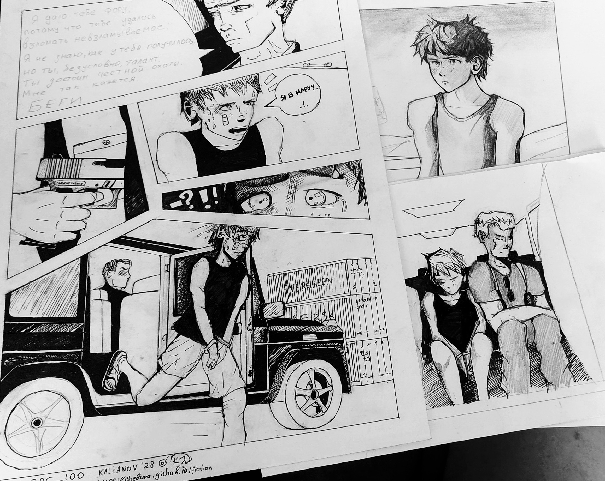
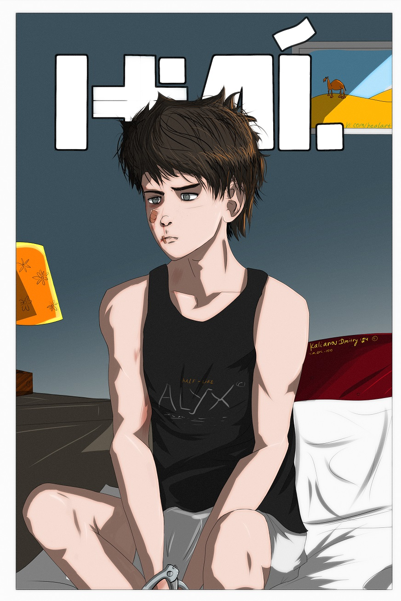

## TIM_BRC_100: Глава 100. Марокко.

*\- Из Испании в Марокко \- Где я? \- Обезболивающее \- Я еду в "гелендвагене" \- Игрушка Кранца \- Цирк приехал \- "Феникс" выпускает из когтей свою добычу.*

---

Мне снилось, будто мой висок *некто* буравит перфоратором. Я пытаюсь отодвинуться, но этот *некто* продолжает своё дело снова и снова. 

Сильная тряска разбудила меня. Я сидел на кресле, в тесном тёмном помещении, глядя в стену с большим квадратным окном, в котором тускло
светилось тёмно-синее небо с двумя едва заметными звездами. Испытывая боль, я всё же повернул голову налево. Во мраке мне удалось разглядеть людей, сидящих в ряд, спинами друг 
к другу, а лицами к стене. Кого-то я узнал - это были люди Кранца. Сидели ещё незнакомые мне мужчины в штатском, да пара военных в кепках. Возле одного из них, у ног, стояла, 
прислоненная к стене, чёрная винтовка, похожая на `AR`, скорее всего `М4A1`. Всего я насчитал с моей стороны человек семь. Столько же человек, по-видимому, сидело и с другой 
стороны.

"Я в вертолёте?"

Вибрация его двигателей передавалась мне от кресла, сквозь щёку, скулу, и весь этот звенящий шум вползал мне прямо в мозг. Я сидел на последнем кресле, в хвосте, 
пристёгнутый ремнями, чтобы не свалиться на пол. Кто-то с кем-то разговаривал. Я не слышал слов, видел лишь шевелящиеся губы людей. Иногда до меня долетали звонкие 
шипящие английской фонетики. Мне было плохо: знобило, нарастала ноющая боль с правой стороны челюсти, как будто сустав зажали в непрерывно сжимающиеся тиски, и крутили,
крутили, крутили их. Сильно болела голова. Во рту я ощущал мерзкий привкус крови. Щека изнутри оказалась разодрана в клочья. Зубы, кажется, были на месте. 
Я попытался открыть рот, но острая боль, пронзившая челюсть, не дала этого сделать. Всё поплыло в глазах, засверкали искрящиеся белые пятна, подступила тошнота. Воняло 
керосином, сигаретами и потом. Я застонал и почувствовал, как по щеке скатилась слеза.  

\- Очнулся, - произнёс сзади кто-то. Я узнал голос Кранца. Он обратился к невидимому мне собеседнику:

\- Представь, вчера Моран вырубил это чучело с первого удара. Даже не интересно! Взял и испортил всё веселье. Да, Моран?! -  закончил он 
громко, перекрикивая шум двигателя.

Никто не ответил. Моран сидел на соседнем от меня кресле и дремал. Кранц продолжил:

\- Я мог бы вчера закончить с этим делом, а теперь придётся взять **его** с собой в Касабланку, потому что у меня уже нет времени с ним возиться. Моран, скажи, чему 
тебя учили в твоей долбанной "Дельте"?

Моран не ответил.

\- Если ты бил, как спецназовец, то должен был снести этому пацану голову. А если ты вёл допрос - то почему, мать твою, ты его сразу отключил?! - 
засмеялся Кранц.  
\- У тебя проблемы? - спросил некий собеседник, - По-моему, это - ребёнок.  
\- Это - кусок дерьма. Не, - спокойно протянул Кранц, - у меня нет никаких проблем. Я решаю задачи по мере их поступления. Просто, иногда, 
поступление идёт слишком быстро. Но ничего. Сделаем все дела сегодня.

\-  Где я? - выдавил я сквозь зубы. 

Кранц развернулся в своём кресле, припал к моему уху, чтобы я лучше слышал сквозь гул вертолёта, и спокойно произнёс:

\- У меня для тебя две новости, малыш: хорошая и плохая. Мы летим в Марокко. Ты же не захотел по-хорошему? Теперь по-хорошему не будет, мы уже не в Испании. Теперь для 
тебя всё будет плохо. Это плохая новость. А хорошая новость в том, что это всё для тебя продлится недолго.

Он больно схватил меня за волосы и сжал их в кулаке, пристально глядя мне в глаза. Я скривился от боли, но не сопротивлялся: каждое движение давалось мне непросто. 
С секунду он смотрел мне в глаза, а потом разжал кулак, развернулся в кресле и замолчал. Никто больше не обращал на меня внимания. Я чувствовал себя, действительно, 
как мешок с дерьмом. С вывихнутой челюстью. От ноющей боли и озноба текли слёзы. Но всем было плевать.

В вертолёте стоял холод. Я так и летел в том, в чём они похитили меня там, в жаркой Барселоне. 

Спустя, наверное, полчаса (мне хорошо было видно огромные "джи-шок" у Морана на руке, часы - мечту моего детства) я увидел в иллюминаторе рассвет. Небо светлело, на нём 
появлялись красно-оранжевые тона. Когда вертолёт стал снижаться и идти на посадку, Солнце уже взошло, освещая пустынный скалистый ландшафт красноватого оттенка. Я его 
хорошо видел, когда вертолёт накренялся, делая виражи. Сразу после посадки открыли дверь (позже я узнал, что это был армейский вертолёт `AS.332 Super Puma` с опознавательными знаками 
Испании), меня отстегнули от кресла, схватили за шкирку и потащили наружу, на свежий утренний воздух. Я стоял на асфальте взлётно-посадочной полосы, онемевшими ногами
пытаясь сохранять равновесие. Неуспешно. Я чуть не упал, но стоявший сзади Моран, уперев мне в спину свой, размером с кирпич, кулак, сильно толкнул вперёд, и мы пошли. Кранца 
я не видел, но за спиной услышал его спокойный бархатный голос:

\- Я пойду проверю, всё ли у них готово, а ты отведи его в медпункт и надень браслеты. На всякий случай. 

Сержант снова небрежно толкнул меня вперёд. Мы вышли на пыльную асфальтированную дорогу, вдоль которой располагались длинные одноэтажные здания цвета хаки, с большими 
окнами, баками и солнечными батареями водонагревателей на крышах. В воздухе ещё чувствовалась ночная прохлада, и даже покалывало нос, но Солнце уже начинало припекать 
мне шею и голые плечи. Безоблачное марокканское небо обещало жаркий и долгий день. На встречу мне попадались военные в солнечных очках, но, даже не видя их глаз, я понимал, что они не обращают 
на меня никакого внимания. Я был даже не винтик, не соринка - а так, пыль на папке с документами Кранца. Только сейчас я осознал, что не вызывает удивления у местных 
служащих факт наличия избитого гражданского в наручниках потому, что это было здесь в порядке вещей. 

Я падал в бездну. 

Как пьяный, я шёл, едва переставляя ноги и постоянно заваливаясь. Наощупь я чувствовал, как моя правая щека и сустав челюсти опухли. Я не мог открыть рот. У меня кружилась 
голова, я часто моргал, но область зрения всё время уплывала куда-то в сторону. Я не выдержал и блеванул у стены. Вы когда-нибудь блевали с закрытым ртом? Такое себе. 
Моран ничего не сказал. Молча подождал, когда я закончу и поднимусь с колен, весь в слезах и блевотине. И, когда я поднялся, он снова ткнул кулаком мне в спину. Я побрёл дальше. 

Мы вошли в медицинский блок (его заметил издали по колыхающемуся от небольшого ветра флагу с красным крестом, и по большой вывеске "Medicine" на стене). Сержант коротенько 
что-то перетёр с фельдшером и вышел. Тот повернулся ко мне и кивком показал на кресло, стоявшее посреди смотрового кабинета. Я молча уселся.

\- Кто это тебя так? - с серьёзным видом, по-английски, спросил он. Это был мужчина далеко за сорок, с европейским бритым лицом, с сединой в волосах, спортивного телосложения. 
Под белым халатом виднелась форма армии США.

\- Вот этот амбал, который только что вышел, - хотел сказать я, но боль в очередной раз пронзила мою челюсть, на лице мгновенно выступил холодный пот, мой взгляд поплыл...

**\- Очнись!** - услышал я сквозь сон. Вонь нашатыря. Фельдшер похлопал меня по щеке. Я заморгал, попытался сесть в кресле. Минуту примерно я так сидел, а когда зрение вернулось, 
поднял руку и указал ему на свою челюсть. Он понял, в чём дело, достал из шкафчика медицинские перчатки и натянул их на свои руки. Сначала он прощупал пальцами сустав, потом 
открыл другой прозрачный шкафчик, достал оттуда ампулы и шприц. Через минуту он ввёл мне инъекцию в район скулы, видимо, обезболивающего. Через пять минут я уже не ощущал ни 
боли, ни челюсти. Своими сильными пальцами в перчатках он стиснул моё лицо, и стал медленно и аккуратно просовывать пальцы в мой рот, неторопливо двигая нижней челюстью. 
Мне казалось, что он мне сейчас её оторвёт. Несмотря на укол, у меня по щекам текли слёзы. Было очень неприятно, я сильно зажмурил глаза... Как вдруг почувствовал, что челюсть 
с хрустом встала на место. Она просто села, как крышка на чайник. Он вынул пальцы из моего рта и принялся стягивать перчатки. Боли я уже не чувствовал, но это, скорее всего, 
действовал наркоз.

\- Так лучше? - спросил он, серьёзно глядя на меня. 

Я осторожно приоткрыл рот, потом закрыл его, и так несколько раз. Да, боль исчезла!

\- Спасибо... - нерешительно промямлил я (получилось что-то типа "шэнкс"), - Что это за место?  
\- Это, конечно, не моё дело. - ответил он, - У тебя рассечена губа, ссадина на щеке, сосуды полопались. И этот запах... Тебе надо умыться.

Он дал мне какую-то банку с прозрачной жидкостью. Я слез с кресла и пошёл за ширму, к раковине. Поначалу я испугался, настолько незнакомым был мне этот человек в зеркале. 
Красные глаза, ссадина на щеке, фингал под правым глазом, рассечённая нижняя губа, опухшая правая половина лица. Лицо измазано спёкшейся кровью. Кровавые подтеки и на шее. Видимо, 
у меня ещё и из носа кровь шла, пока я был в отключке.

\- Кенитра, военная база, - запоздало ответил фельдшер из-за ширмы. Я ничего не понял. 

\- Красота... - глядя на себя в зеркало, пробормотал я по-русски, и принялся мыть своё лицо жидкостью из банки. Похоже, что это была перекись водорода. Когда я закончил умываться, 
плеваться и сморкаться, он протянул мне стакан воды и несколько таблеток. 

\- Это - обезболивающее, довольно сильное, - сказал он, - думаю, на сегодня тебе хватит. 

Он посмотрел на меня. Затем достал какой-то хороший пластырь, приклеил к моей нижней губе. Ещё один пластырь телесного цвета, обыкновенный, прилепил мне на щеку. В полиэтиленовый 
пакетик он насыпал кубики льда из холодильника.

\- Приложи к лицу, отёк пройдёт, - протянул он мне пакетик. Я взял и сделал, как он сказал. Затем он посветил фонариком мне в глаза, задал вопрос насчёт потери сознания, осмотрел
рот и нос. Вздохнул.

\- Это не моё дело, - повторил он, - тебе бы к врачу, в Кенитру. В госпиталь.  
\- Спасибо, - повторил я, - вы можете мне помочь? 

Фельдшер замолчал и сел за стол что-то записывать. 

\- Это было всё, что я мог... Ты знаешь, кто тебя привёл сейчас?  
\- Знаю. ЦРУ.

Он отложил ручку на стол и с прищуром посмотрел мне в глаза.
  
\- Видишь, - спокойно произнёс он, - ты всё понимаешь. Я здесь ничего не решаю. Прости. - он снова опустил глаза и стал что-то писать ручкой в журнале.  
\- Ладно, я сам разберусь. - холодно ответил я, - Спасибо! Прощайте! 

Держа у правой щеки пакетик со льдом, я вышел из кабинета. Сидевший в коридоре Моран поднялся с кресла.

\- Так, иди в уборную! - приказал он. Я молча повернул в туалет. После того, как я вернулся, он снова скомандовал мне, как собаке:

\- Вытяни руки! - и, ловко защёлкнув наручники на моих тощих запястьях, добавил: - Кранц бы предпочёл вести тебя с руками за спиной. В твоём нынешнем состоянии это будет то же самое, 
что пытка. Тебе трудно будет в это поверить, но я - не такая тварь, как он.

Он оказался прав: мне было трудно в это поверить.

Мы направились из медблока. Снова, по пыльной асфальтовой дороге, мимо аналогичных строений, огороженных металлической сеткой, со спиралями колючей ленты, примотанными сверху. 
Я шёл с "браслетами" на руках, это было необычно и очень неприятно. Железо нагрелось и уже жгло запястья. Ветер дул слабый, мне было душно. Мы зашли в ещё один блок. Моран посадил 
меня на стул, стоявший в углу, снял наручник с правой руки, пристегнув меня им к дверной ручке. 

\- Я не убегу, это же военная база! - кисло усмехнулся я.  
\- Конечно, не убежишь, ты даже не сдвинешься с места! - съязвил Моран и куда-то свалил. Я остался сидеть в коридоре этого блока, с прозрачными дверьми и большими окнами, 
завешенными алюминиевым жалюзи, через который полосками бил яркий солнечный свет, оставляя на противоположной белой стене зебровидные узоры. Я всё ещё прижимал к щеке уже почти растаявший
лёд. 

Спустя некоторое время, в коридоре раздались шаги. Ко мне шёл высокий чернокожий военный в форме офицера Марокко, с папкой в руках. Он увидел меня, на его лице появилось изумление. 
Моя рука оказалась прикована к двери, которую ему предстояло открыть. Он что-то громко произнёс мне, на арабском или дариже, не знаю. Кажется, выругался, судя по тону. Увидев, 
что слова не возымели никакого действия, он перешёл на английский. 

\- Ты что здесь делаешь?! Кто ты?! - закричал он.  
\- Меня похитило ЦРУ, я - гражданин России! - честно ответил я ему сквозь зубы, глядя в глаза. 

Он смотрел на меня, как на какое-то чудо. Мне показалось, что он сейчас сорвёт с моей руки оковы, посадит в такси и отправит в ближайшее российское консульство. Но в этот момент 
дверь в коридор распахнулась, вошли Кранц с Мораном. Теперь я мог разглядеть Кранца: как всегда безупречный, с уложенной причёской, в дорогом костюме, с портфелем. Его чёрные 
туфли блестели матовым блеском, несмотря на пыль дорог базы.

\- Вставай, идём! - резко дёрнул мою руку Моран, отстёгивая её от двери.  
\- Вы мне объясните, что всё это значит? - спросил Кранца военный, - Откуда этот ребёнок? 

Кранц молча открыл портфель, вынул лист A4 в "файлике" и протянул военному. Тот пробежался глазами по тексту и отдал лист обратно Кранцу.

\- Террорист? Вот это? - военный ткнул в меня пальцем (он сказал обо мне *Is this*, как о вещи) и захохотал, - Вы серьёзно? Ещё и русский? Мистер Кранц, это будет большущий 
международный скандал! Ну вы даёте! Нашли время играть! Если пресса об этом...  
\- Я меньше всего переживаю насчёт скандала, полковник. - сухо ответил Кранц, - Здесь речь идёт о национальной безопасности. А это, извините, не смешно.  
\- На каком основании?  
\- Там всё изложено, полковник Раух, - Кранц ткнул в лист пальцем, - "US Patriot Act" позволяет считать террористом человека, укрывающего данные о биологическом оружии. Параграф
2339. Читайте!

Полковник снова посмотрел на меня, потом на лист.

\- Какое, к чёрту, биологическое оружие, Кранц? - медленно произнёс он, - У вас там от кокаина крыша поехала?

Он сунул лист обратно Кранцу в руки.

\- Я вам не нянька, господа! - крикнул полковник, открыл дверь, и с хохотом вышел наружу.

\- Тупая обезьяна! - сквозь зубы прошипел Кранц. Мы вышли следом за полковником. Пакет с водой пришлось выкинуть. 

Снаружи, перед блоком, уже стояли два чёрных "гелендвагена" с тонированными стёклами. Меня посадили во второй "гелик" (всю жизнь мечтал на нём покататься, но не в таком 
упоротом виде, как сейчас), на заднее сиденье из дорогой кожи, рядом с Мораном. Сержант нацепил на себя какие-то дикие карго - брюки цвета дохлой жабы, военные ботинки, а также 
оливкового цвета футболку с военным жетоном на шее (пистолет у него находился в поясной кобуре). От него всё время воняло дешёвыми сигаретами и паршиво-сладким дезодорантом. 
Сидя рядом с ним, я ощущал всю его вонь, и не знал, от чего сильнее меня мутит - от моего состояния, от дороги, или этого запаха. Скаут, просидевший всё время, пока мы болтались 
по базе, под кондиционером автомобиля, обрядился поинтереснее: стильная чёрная армейская куртка с короткими рукавами, с какими-то нашивочками на плечах, с кучей разных 
кармашков, сумочек и карабинчиков. Под курткой белела "тишка", изрезанная чёрными ремнями оперативной кобуры. На руках Скаута красовались чёрные тактические перчатки 
без пальцев, неплохо сочетавшиеся с сочными трайблами на его мощных загорелых предплечьях. Штаны у Скаута попадали в цвет куртки, но штаны стильные, армейского покроя, 
с карманами. Поинтереснее, чем у Морана. Может быть, они ему просто шли; в отличие от сержанта, Скаут был молод, без седины, с красиво уложенной причёской, а на его наглых 
глазах сидели модные "рей-бэны". Вёл машину Рид, облачённый в классический тёмно-серый костюм: при галстуке, в пиджаке, из-под которого чернела массивная рукоять пистолета 
с пластиковыми накладками. Рид тоже сидел в солнечных очках, но со спины я не видел, в каких именно, да мне было на это плевать, в общем-то. Бёрнс, Кранц (и ещё кто-то) 
сели в первую, головную машину. 

Мы плавно покатили сквозь Кенитру - небольшой городок в сорока километрах к северу от Рабата. Выехав с авиабазы, мы ускорились, пролетели красивый исторический центр, затем 
свернули на узкое шоссе в столицу. Всем в салоне было скучно. Солнце палило сквозь тонировку. Моран пытался уснуть, прислонившись головой о стекло левой задней двери. 
Скаут дремал, сидя ровно, но низко опустив голову. Я поднял обе руки (по-другому было уже никак) и потрогал своё лицо - его правая верхняя часть как будто онемела, развивался такой 
хороший отёк. Мы ехали мягко, но чувство тошноты и головокружение никак не проходили. Меня рубило, но уснуть я не мог из-за боли.

\- Зачем мне наручники в машине? - спросил я Морана. Я не знал, как будет "наручники" по-английски, поэтому поднял руки вместо слова. Моран повернулся ко мне с равнодушным, 
скучающим лицом, посмотрел на меня. 

\- Cuff, - буркнул он, - Кранц сказал - я сделал. - он снова отвернулся к двери.  
\- Хороший солдат, - произнёс я. 

Моран резко обернулся и уставился на меня своими прищуренными глазами. 

\- Заткнись! - рявкнул он, - Или поедешь в багажнике!

Я, вспомнив молниеносный удар в правую скулу, отвернулся, уставившись в затылок смеющегося Скаута, разбуженного нашим коротким диалогом.

\- Пацан умыл тебя, сардж! - весело крикнул он. Рид за рулём хмыкнул. Сержант снова прислонился к двери и задремал. 

Марокканский пейзаж трассы N1 (как гласили дорожные указатели) меня не впечатлял. Я впервые ехал по Африке, и предостаточно насмотрелся на подобные пейзажи, путешествуя по 
Испании с севера на юг, от Барселоны до Малаги. В Марокко преобладал такой же грунт, такая же скудная растительность: низкие высушенные деревья, сухие и душистые сосны, 
жжёные агавы. Это всё не вызывало во мне эмоций. Конечно, я не видел тут ни верблюдов, ни барханов, ни какой другой африканской атрибутики. И лишь проезжая населённые пункты, 
я понимал, что это уже не Европа. Нечто похожее по архитектуре можно было встретить в Андалусии, с той лишь разницей, что мечети здесь встречались гораздо чаще, чем католические
кирхи. Позже, недалеко от Рабата, я заметил даже золотые купола православного храма. Мы ехали через зелёную зону, напоминавшую лесопосадки посреди песчаной пустоты. Я вспомнил, 
как ехал по настоящему лесу, под Питером, на своём горном велосипеде. По одной из трасс, через болото, где я набрал воды в обувь, и после чего здорово простыл. Это был 
настоящий лес карельского перешейка: огромные ели до неба, с корнями, переплетёнными так, словно удавы решили повторить все упражнения из книжки про вязание морских узлов 
(её мне дед читал, когда я был маленьким). Огромные гранитные валуны создавали непроходимые препятствия и бросали мне вызов... Мне не хватало этого леса сейчас. Прохлада в 
машине была искусственная. Я сейчас отдал бы половину жизни, только чтобы вдохнуть тот настоящий прохладный и влажный воздух Санкт-Петербурга. Половину жизни.... Жизни, 
которая мне больше не принадлежит...

<!-- сразу поехали в Касабланку, через Рабат это 120 км, полтора-два часа езды на машине -->

Через полчаса начался Рабат. Благодаря голливудским фильмам, за всё время поездки по нему меня не покидало ощущение, что я здесь уже был. Эти крепости, лестницы с пальмами 
по бокам, бульвары... Да, это чертовски красиво, и я бы с удовольствием вышел прогуляться здесь, как обычный турист, с зеркалкой и бутылкой воды в руке. Но мне ужасно хотелось 
пить, и это превращало моё путешествие в пытку. Последний раз я пил у фельдшера на базе, когда запивал обезболивающее.

Мы проскочили мимо исторического центра. Рабат - он всё-таки больше культурный, исторический город, с арабской архитектурой, и местами - испанской. Мне он показался каким-то 
маленьким, ведь я привык жить в больших городах. Вскоре мы снова мчались по шоссе, теперь уже в Касабланку. Машин по пути становилось всё больше и больше, "гелики" ускорились. 
Поехали бодрее. Моран перестал делать вид, что спит. Он недовольно смотрел то в окно, то на меня. Рид нашёл какую-то местную радиостанцию. Заиграла европейская музыка, 
прерывающаяся арабским балаканьем ди-джея и рекламой с орущим верблюдом.

\- Скаут, ты был тут раньше, - спросил вдруг Моран.  
\- Нет, - ответил тот.  
\- А ты, Рид?  
\- Был однажды, тоже с Кранцем. - лениво пробормотал Рид, глядя на дорогу, - А ты был?  
\- Тут есть одно местечко, под Касабланкой, - задумчиво глядя в окно, произнёс Моран, - что-то вроде склада. Называется "порт-седьмой". Контейнеры... Но суть в том, что склад 
этот "крышуют" местные кланы, и они не задают вопросы, что в этих контейнерах, и сколько времени им там стоять. Могут стоять хоть вечность. На контейнер ставится клеймо, 
такое же клеймо выжигается на теле человека, который должен получить доступ. Ты показываешь клеймо и можешь забирать своё барахло. Храни, что хочешь! Хоть золотые слитки, 
хоть ядерную бомбу... Мы там хранили "кокс".  
\- Теперь ясно, почему Кранц сюда приехал! - залился смехом Скаут.  
\- Я никогда не видел, чтобы Кранц нюхал, - произнёс Рид, - чего не скажешь о тебе! - он повернулся к Скауту.  
\- Ну разок все наверное, пробовали... - вытянулся в кресле Скаут, заложив мускулистые руки себе за голову и разминая шею, - Да, Тим?

Я молчал и смотрел в спинку его кресла.

\- В Испании с коксом беда! - продолжал Скаут, - В России - тоже?

Я ничего не сказал.

\- Тим - хороший мальчик, он не занимается всякой фигнёй, в отличие от тебя! - засмеялся Рид, - Он гений, а ты - тупой крокодил! Кроме своего Афганистана ничем и 
похвастать не можешь. Учился бы, как он, человеком бы стал!  
\- Я и стал человеком! - воскликнул Скаут.  
\- Если бы не Кранц, ты бы сейчас валялся где-нибудь на помойке в Чикаго с проколотыми венами!  
\- Заткнись! - злобно крикнул Скаут. Всё его веселье куда-то исчезло.  
\- Ты же знаешь, что это - правда. - спокойно добавил Моран, не открывая глаз.

Скаут обиделся и замолчал. Люди, которых я ненавидел всей душой, начинали раскрываться в моих глазах как простые смертные, со своими слабостями и пороками, со своими достоинствами 
и комплексами. Они не были неуязвимыми и неприкасаемыми, хотя вели себя именно так. Нет, чем больше я с ними находился, тем  больше понимал, что это - всего лишь люди, люди с 
извращённым, отформатированным мышлением. Хитрые, как лисы, сложные и подготовленные, они требовали от противника того же самого. Сопротивляться им было сложно, но, находясь рядом с
ними, я вдруг почувствовал, что это возможно. 

До Касабланки мы ехали, наверное, час (рекламу по радио давали каждые десять минут, верблюд орал шесть раз). Ехали мимо разных населённых пунктов, разделённых красивыми парками, 
полями для гольфа, огромными ангарами-складами всех цветов, заводами, футбольными полями, небольшими речушками, полями, на которых что-то росло (апельсины, наверное). Один 
населённый пункт сменялся другим. Количество машин на трассе увеличилось, как и увеличилась частота появления населённых пунктов. Вскоре промелькнула табличка "Mohammedia". 
Рид достал смартфон и набрал кого-то.

\- На заправку заедем, - сообщил он. Кортеж свернул с шоссе на заправку, где на жёлто-красной вывеске было написано "Petromin Oils", с кафешкой и колонками-автоматами. Сзади к 
нам подъехал "гелик" Кранца. Оттуда вылез Бёрнс. К нему подошёл Рид, они о чём-то поговорили. Потом каждый отправился заправлять свою машину.

\- День будет долгий, - пробормотал Моран, из сумки под ногами достал бутылку воды, открыл её и стал пить большими глотками. Я поднял голову и посмотрел на него. Я не хотел 
ничего просить у этого урода. Но белые мухи летали перед глазами, я часто глотал мерзкую сухую слюну и сваливался головой вперёд, пока ехал. Если бы не кондиционер, я бы, 
наверное, уже давно двинул кони. Моран, закончивший заливать в свою тушу не менее литра воды, всё-таки заметил мой жалостливый взгляд.

\- Пей! - он протянул мне бутылку. Я поднял обе руки, схватил наполовину опорожнённую пластиковую бутылку за горлышко, и чуть не выронил её: оказалось, я не мог сжать пальцы: 
настолько они ослабли. Я еле поднял бутылку и дрожащими руками поднёс ко рту. Обливаясь, начал медленно пить. Допив всё, вернул её обратно Морану.

\- Без обид, - сказал мне он, - ты не маленький, и понимаешь, во что вляпался. Здесь нет чудовищ. Мы все - обычные люди, и просто выполняем свою работу. Работа у нас такая. 
Правда, Скаут? Вот - Скаут. Пять лет назад скакал по Афганистану и щёлкал из "AW" пятидесятого калибра таких как ты, афгашек-мальчишек. Знаешь что бывает, когда попадаешь 
"пятидесяткой" в голову? Ему до сих пор снятся их разлетающиеся куски, в оптике. Ну и что скажет тебе Скаут? Если ему платили? Работа такая? Работа... Вот и у меня - работа.

Я посмотрел ему в глаза, но Моран отвернулся и уставился в окно на Рида, стоящего с заправочным пистолетом.

\- Глянь! - крикнул Моран, - Рид держит заправочный пистолет, как свой "глок". Прям как в тире! Тактическая стойка, ё-моё!  
\- Профдеформация. - заметил Скаут, и они оба заржали.

Пока мы ехали в Касабланку, я, не без помощи сержанта и Скаута, постепенно восстановил в своей голове хронологию событий, происшедших со мной после того, как Моран ударом в 
челюсть отправил меня спать. Кранц разозлился: он должен был через два часа вылетать из Сарагосы в Кенитру натовским бортом. Идеальным для него вариантом было, если бы я отдал "винчестер" 
по-быстрому, то есть сразу. Он представить не мог, что какой-то русский шкет упрётся перед матёрыми бойцами "Феникса" и включит мальчиша-кибальчиша. Конечно, в конце концов, 
они бы вытянули из меня всё, что только можно, если бы не катастрофическая нехватка времени и места. В довершение всего, я потерял сознание, и Кранцу оставалось лишь взять меня с 
собой в качестве ручной клади. Через три часа после допроса меня уже грузили в "супер-пуму" на военной базе в Сарагосе.

Наш кортеж подъехал к площади Зелак (название я прочитал на указателе), сделал круг и остановился возле белого высокого здания. Это был отель "Голден тюлип Фарах", о чём 
гордо уведомляли туристов большие белые букы над входом, обставленным жиденькими пальмочками в горшках. Пятизвёздочный. Кранц не мелочился. Рид снова набрал кого-то из первого 
"гелика" и спросил, куда им теперь ехать. Потом отложил мобилу, двинулся вслед за первым, направо, потом ещё направо, и заехал в тёмный прохладный поземный паркинг. Я думал, что 
тут меня оставят в покое, но из машины вышли все. Через открытую дверь Моран протянул мне свою мощную, жилистую, как полено, руку. Я дико посмотрел на него и вылез из машины 
без его помощи. Спускаясь с высокого порога, я потерял равновесие и завалился, но сержант, схватив меня за плечи, поставил на ноги. Смешно было, как он обращается со мной. 
Как с тряпичной куклой. Смешно и неприятно.

\- Я бы пожрал сейчас, - зевнул Скаут, поправляя свою модную курточку.  
\- В номере пожрёте, - сухо ответил Кранц, - поднимайтесь и ждите там, мы скоро придём.

Кранц с Бёрнсом уехали на одном лифте (Бёрнс, как и Кранц, был одеты в костюм), все остальные втиснулись во второй. Мы поднялись на шестой этаж. Дверь лифта распахнулась, в глаза 
ударил яркий свет - белоснежный коридор и тёмно-бордовая ковровая дорожка. Возле лифта стоял администратор в чёрном костюмчике, с бейджем, и в белоснежной рубашке, контрастировавшей 
с его смуглым лицом. Мы пересеклись взглядами. Молодой паренёк-араб немного напрягся, это было видно по его взгляду, поприветствовал всех на английском, с небольшим акцентом. 
Чемоданов у нас не было, всё осталось в машине. Он спросил, какие у нас номера. Скаут ответил, после чего парень побежал открывать номер, постоянно оглядываясь на меня. 
Он заметил, что я в наручниках (я и не скрывал их, нарочно выставив руки вперёд). Вообще, сложно было представить себе более странную компанию: один в костюме, другой в карго, 
третий - фасонный солдат удачи в чём-то тактическом. В довесок - я в майке, шортах, сандалиях, с "фонарём" под глазом, и в "браслетах"! Цирк приехал!

Номер, в который нас поселили, оказался огромным люксом с джакузи, баром, музыкальным центром и роскошной кроватью на двоих в спальне. На кровать тут же бухнулся Скаут, даже не 
сняв ботинок. 

\- Сардж, составь мне компанию, у нас же медовый месяц! - крикнул он.  

Сержант молча посмотрел на него, ни один мускул не дрогнул на его лице. И вдруг он произнёс:

\- Слезай, пусть малый отдохнёт. 

Это он про меня? Скаут медленно поднялся и подошёл ко мне. 

\- Отдыхай, пока что, - сказал он, - я пожрать. А где пожрать? Сардж, что Кранц сказал насчёт пожрать? Мы пожрём?  
\- Так закажи, чел, телефон в зале! - крикнул тот. Моран достал из мини-бара банку пива и откупорил её. Я вбежал в туалет: меня всё ещё мутило.

Скаут что-то трындел по телефону, Моран щёлкал банки с пивом. Рид вышел на балкон и курил. Он снял пиджак, и я видел его тактическую кобуру с "глоком". Действительно, это был "глок". 
Я, как и многие подростки, люблю компьютерные игры, и могу отличить "глок" от "сига". Вот семнадцатый или девятнадцатый - этого я не понял. Я сел на кровать. В спальне было 
прохладно и тихо. Сидел и смотрел на белые стены. Моё тело было разбито, всё ныло и болело, каждая клеточка организма. Мне казалось, что это всё происходит не со мной. С кем-то, 
на кого я смотрю со стороны, как на персонажа фильма. Это казалось нереальным, похожим на сон. Да, на сон. Как говорил Сэм насчёт зеркала, что во сне мы не видим себя в зеркале, 
а каких-то других людей. Вот, это был не я. Но это был я. И тут мне стало жутко. Моя судьба решалась в течение ближайших часов. 

Проснулся я от того, что Моран громко спорил со Скаутом в холле. Судя по повышенном тону, я понял, что Скаут хотел снять шлюху и привести в номер, в спальню, на что Моран с Ридом 
протестовали.  
\- Или сними другой номер, умник, - рычал Моран, - или ты ещё хочешь притащить девку за счёт Кранца? А харя не треснет?

В конце концов Скаут куда-то убежал, шум прекратился, и я вышел в холл. Моран, бродивший по холлу, бешенно взглянул на меня. 

\- Неважно выглядишь, - буркнул он, - прими душ!

Сидевший на диване Рид протянул мне коробку с пиццей. Она была ещё тёплая. Мне было стыдно, но я набросился на неё и с жадностью всё доел. Это немного скрасило моё угнетённое 
состояние. После перекуса я захотел выйти на балкон, но Рид отказался меня пускать. Я лишь мельком увидел пейзаж: залитые солнцем крыши белых зданий и отелей Касабланки. Согласившись 
мысленно с сержантом, я пошёл в душ. Он располагался в шикарной ванной, по размеру превышавшей мою комнату в Барселоне, и, уж тем более, мою питерскую комнатёнку. Отделанная 
белоснежной мраморной плиткой с позолотой и с очаровательными белыми ангелочками в нишах, эта пятизёздочная ванная комната, наверное, в ужасе вздрогнула, когда в неё зашло 
какое-то чумазое чучело, я имею в виду себя. Принимать душ в наручниках было ужасно неудобно. Мне не удалось снять майку. Намылив руки, я попытался освободить свои тонкие запястья 
от них, но затянул ещё туже. Вообще я хотел набрать джакузи, стоящий на высокой площадке, куда надо подниматься по мраморным ступеням. Но моё психическое состояние не позволило 
мне этого сделать. Пусть Скаут веселится в этом бурлящем котле!

Через некоторое время пришли Кранц и Бёрнс. Кранц поставил портфель на стол и вынул какие-то разноцветные папки с документами. Бёрнс напоминал мне внешним видом Тома Харди. 
Симпатичная небритость его лица гармонировала со стильным костюмом, галстуком и рубашкой. В отличие от Морана или Скаута, Бёрнс занимался военной аналитикой в "Фениксе" и 
замещал Кранца. Крепкий и подтянутый, он создавал ощущение неуязвимого и всесильного агента. Я ему был до лампочки, от слова совсем. Кранц брал на все свои дела 
Бёрнса, тот знал много языков (кроме русского). Сейчас они сидели в холле и что-то обсуждали. Увидев меня, сидящего на кровати в спальне, Кранц вдруг занервничал. 

\- Вот ещё навязался на мою голову, - донеслось до моих ушей, - что с ним делать? 

Я понял, что моя судьба ещё не решена, и что имеет смысл за неё бороться. Это обнадёжило меня. 

Потом снова что-то говорили, и Кранц раздражённым голос Кранца произнёс:  
\- Быстрее кончим его и всё. 

У меня внутри всё похолодело. Агенты в холле сидели с каменными лицами. Рид щёлкал бензиновой зажигалкой, Моран делал вид, что дремал.

\- Иди сюда! - крикнул вдруг мне Кранц. Я медленно встал с кровати и подошёл к нему. Он оглядел меня, глянул на мои наручники. 

\- Не передумал, герой? - спросил он громко и серьёзно, - Скажи мне, где "винчестер", кто знает о нём, и что в нём? Ты связывался с российскими спецслужбами? Посольством? 
Сообщи мне всё - и я тот час же выкину тебя отсюда на улицу. Более того, я найму тебе такси до местного консульства.

Я молчал и смотрел ему в глаза. Хотелось плюнуть ему в лицо, но слюны не было. Рид громко щёлкнул крышкой зажигалки, и, чиркнув колёсиком, зажёг её, а через секунду снова щёлкнул 
крышкой, накрыв пламя. Его глаза пристально глядели в моё лицо. Сейчас он припечатает мне этим "зиппо" в глаз! От них можно ожидать чего угодно! Рид снова открыл крышку и 
чиркнул колёсиком.

\- Ну, хорошо, - спокойно сказал Кранц после жуткой паузы, - продолжаем молчать. Я знаю, как развязать тебе язык.

Он стукнул ладонью по столу и крикнул:  
\- Так, собираемся! Где Скаут, мать его?! 

Скаута мы увидели, проходя по фойе гостиницы. Он сидел в небольшом баре и беседовал с какой-то симпатичной женщиной. Увидев Кранца и нас, он злобно оскалился, кинул пару слов 
женщине и побежал за нами. "Гелики" уже стояли у входа.

<!-- BEGIN KASABLANKA STAGE -->

У Кранца в Касабланке были десятки дел. Вообще, он вёл себя как типичный бизнесмен. Очень быстрый, вёрткий, энергичный и бойкий на язык, Кранц встречался с огромным количеством 
людей: с какими-то берберами в джеллабах, с рожами, напоминавшими мне террористов из "Counter-Strike"[^cs], с бородатыми людьми в дорогих костюмах и на "майбахах", заезжал на 
какие-то склады, что-то оставлял, что-то забирал. Весь день мы колесили по Касабланке, и я возненавидел этот город. Я вдруг осознал, как мне страшно. Все вокруг были ко мне 
безразличны. Начиная с военных в аэропорту, и заканчивая обслуживающим персоналом отелей, в которые Кранц заходил со мной, ведя меня, не стесняясь, в наручниках, как какую-то 
собачку, которой он доволен и хвастается. Я ощущал себя диковинной тварью, таскаемой им с собой на потеху, как бы показать всем "партнёрам", что у него, Кранца, помимо важных 
дел, ещё что-то там прилипло к ботинку и никак не отодрать. Я понял, что в этом городе он может запросто, за любым углом, накинуть мне на голову полиэтиленовый пакет и 
бросить в мусорный бак. Ему даже пуля не понадобится. И никто меня не опознает: я выглядел как типичный избитый турист. Мало кому вообще приходило в голову, что это за 
подросток таскается в наручниках за солидными господами в рубашках и галстуках и ещё с чем-то там под пиджаками. Со мной он не разговаривал, да и я не очень понимал, чем он 
там занимается. Меня больше волновало, что он будет делать дальше.

На обед мне засунули в рот какой-то кебаб в лаваше, политый острым кетчупом, от которого у меня потом жгло язык и постоянно хотелось пить. Мы колесили по центру Касабланки, 
по деловому центру, застроенному стеклянными бизнес-зданиями и отелями. Кранц с Бёрнсом пропадали в них, экипаж нашего "гелика" обычно оставался снаружи. Иногда нас 
всё-таки приглашали почилить в холле какого-нибудь отеля, посидеть в баре (не мне, конечно, хотя я пару раз отказался от виски, о чём, в виду дальнейших событий, жалел). 
Самих визави Кранца я почти не видел, за редким исключением, когда он ещё при нас здоровался с ними и обнимался как старый друг.

Близился вечер. Солнце уже ослабляло свой жар и катилось к закату. Пекло заканчивалось. Несмотря на то, что я освежился в номере, мне всё равно было очень жарко и я сильно потел. Мы 
сидели в лобби очередного отеля. Моран троллил Скаута (как обычно):  
\- Что это за куртка на тебе? - ворчал сержант.  
\- Тактическая, сардж, - с лучезарной улыбкой отвечал Скаут.  
\- Если твоя тактическая цель - выглядеть как дебил, то тактическая куртка тебе не нужна! - ну и в том же духе. Тут к Морану подошёл Рид.  
\- На пару слов, - шепнул он, и оба куда-то скрылись...

Нехорошее предчувствие поселилось во мне, когда я заметил, что "гелики" выехали в промзону. Я не знал карты города, мне казалось, что мы выезжаем за его пределы. Через некоторое 
время мы проехали ворота пропускного пункта, проехали сетчатый забор с колючей лентой наверху, и начался пестрый многоэтажный контейнерный город. Я понял, что это - знаменитый 
морской порт Касабланки. 

<!-- END KASABLANKA STAGE -->

<!-- BEGIN ESCAPE -->

У Кранца были дела даже в порту! Ну, это меня не удивило. Меня беспокоило, что уже начинался закат, а вопрос о моей судьбе всё ещё не был решён. Это мучило меня сильнее жажды. Стало
зудеть колено. "Гелики" остановились посреди площадки, окружённой контейнерами. Кранц (с портфелем в руках), Бёрнс, и ещё незнакомый мне мужчина, ушли, а экипаж нашего "гелика" в 
полном составе остался дежурить.  

\- Я отлить, - буркнул сержант и вышел из машины.  
\- Я тоже, - добавил Скаут, - ты без меня не справишься!  
\- Конечно, как же я без тебя рассчитаю поправку на ветер?!  
\- Снайперы всегда ходят вдвоём, - заулыбался Рид, - даже в сортир.  
\- Бинокль не забудь!

Меня это немного развеселило, хотя мне было не смешно. Скрылись и эти двое. Вокруг раскинулся настоящий город - разноцветные контейнеры стояли друг на друге, как многоэтажные дома,
создавая улицы, площади, переулки и тупики. Небо постепенно становилось оранжевым. Начался закат.

В машине остались сидеть только я и Рид. Я рассматривал в окно контейнеры. 

"Майерск...  Эвергрин... Медитеррениан..." - читал я про себя названия на разноцветных фонах. Нестерпимо чесалась коленка и хотелось пить. Звон в ушах стоял весь день. Привыкший 
к нему, я хотел просто тишины и спать. Но Рид вдруг нарушил тишину. Он вообще мало со мной разговаривал с утра, но тут заговорил.

\- Ты знаешь, что тебя хотят переправить в Форт Детрик? Что это такое, знаешь?

\- Нет! - честно ответил я, положив руки в наручниках на своё грязное зудящее колено. Только сейчас я заметил, что все запястья на моих руках изодраны в кровь и покрыты синяками. 
Я вдруг почувствовал злость и жалость к себе. 

\- Это - комплекс в США, центр проведения биологических исследований и экспериментов. В частности, биологического оружия. Понимаешь, о чём я? По сути, они - главные заказчики 
H.E.A.L., а не Министерство энергетики США. `DARPA` [^darpa] и `DTRA` [^dtra] давно используют `DOE` [^doe] для финансового прикрытия своей деятельности. Чтобы Конгресс меньше
вопросов задавал.

Я повернулся к нему. Он сидел лицом вперёд, ко мне затылком. Я попытался разглядеть его глаза в зеркале заднего вида, но увидел лишь солнцезащитные очки. 

\- Кранц бы тебя ещё вчера переслал в Штаты, или, скорее всего, на Кубу. Да, таких как ты, отправляют в Гуантанамо. Но он опоздал на грузовой борт в Барселоне. А иначе тебя не 
вывезти из страны. Пришлось тащить сюда, в Марокко, решая попутно кучу других дел. Сегодня ночью будет рейс из Кенитра, грузовой "Геркулес". Как раз в Фредерик. Я не знаю, 
что будет делать Кранц. Может быть, он сейчас тебя распотрошит, прям тут, или же доставит в США. Он мой босс и решит так, как решит.

Мне нечего было сказать. Я молча падал в бездну, скрестив руки в наручниках на своей груди. Просить о помощи? Умолять? Теперь я знал, что это за люди и на что они способны. Во 
мне вдруг отчётливо стала просыпаться какая-то потаённая, реликтовая ярость. Я даже не понимал, что это и что со мной происходит. Просто я отчётливо слышал, как мой внутренний 
голос говорил мне: "Ничего не делай! Ничего не бойся!" 

\- Ты знаешь, что тебя ждёт в Форте Детрик? - продолжал Рид.

Я молчал.

\- Я работаю с Кранцем уже давно. Мы брали террористов, учёных из разных стран, похищали иранских военных... Допрашивали. Иногда с пристрастием. Я отношусь к этому, как к работе. 
Делаю это за деньги. Но когда Кранц похитил ребёнка... Не буду скрывать, там тебя ждут пытки. Там есть целый отдел, специализирующийся на методах 
быстрого извлечения информации. Брошюрка "KUBARK" покажется тебе невинной детской книжечкой. Тебя не пожалеют, не примут во внимание твой возраст, что ты - подданный другой страны. 
Там работают мордовороты. Они сделают с тобой такое, что не приснится даже в самом гнусном порно. Добывая информацию, Кранц разделает твою тушу без жалости. В Форте Детрике ты канешь 
в никуда, стоит тебе лишь переступить его порог. По сути, у тебя уже нет ни имени, ни статуса, ни государственной принадлежности.

Я молчал. Что-то скатывалось в горло, то ли сопли, то ли слёзы.

\- Молчишь? - продолжал монолог Рид, - Так ты точно не знаешь, где этот чёртов "винчестер"? Или знаешь, но не хочешь говорить? 

Я молчал и глядел на него.

\- Не говори. Ничего не говори. Это твой шанс выжить. Если скажешь, если отдашь ему данные, если сдашь всё - тебе сразу кранты! 

Он повернулся ко мне.

\- Дверь открыта, - произнёс он.

Я сидел и устало смотрел на него, не понимая ничего. Он снял очки. У него было симпатичное, но тоже уставшее лицо, с капельками пота. Я бы никогда не сказал, что это агент ЦРУ. 
Я таких видел миллион раз в толпе туристов.

\- Время идёт, Тим. - произнёс он, - Запомни, что я сделал. Жизнь сложнее, чем тебе кажется.

Я не понимал. Он проговорил медленно:

\- Я даю тебе фору, потому что тебе удалось взломать невзламываемое. Я не знаю, как у тебя получилось, но ты, безусловно, талант. Ты достоин честной охоты. Мне так кажется. Беги.

И тут я **понял**, что он хочет.

\- Я в наруч...

Резким движением он выхватил из оперативной кобуры "глок", я в страхе рванул ручку двери и вывалился из машины на пыльную дорогу. Не оглядываясь, я побежал в сторону контейнеров, 
ища какой-нибудь проход, ведущий в глубь этого контейнерного города. 

"Майерск... Эвергрин... Медитеррениан... Красные, зелёные, синие..." - неслось в моей голове.

В тот момент, когда уже хотел скрыться за поворотом, мне в левую икру обрушился удар, сбивший с ног. Мне сначала показалось, будто меня на ходу со всей силы ударили по ноге молотком: я 
потерял равновесие и рухнул на асфальт, обдирая ладони и колени. Тут же я почувствовал сильнейшее жжение в левой голени, будто туда медленно вкручивали раскалённую арматурину. Ощущение 
свербящей боли, отдающей в голову. В глазах поплыло. Не чувствуя ногу, я сидел на асфальте, в дорожной пыли. По левой голени струёй текла чёрная кровь. И тут я понял: по мне только 
что стреляли!

\- **Беги!** - снова услышал я крик Рида.

И я **побежал**. Я побежал не **тогда**. Я побежал сейчас. С дырой в ноге. Это был бег, самый быстрый и тяжёлый за всю мою жизнь. На одной ноге, на четвереньках, ползком... Я вдруг,
неожиданно для себя, резко ослабел. Кружилась голова, проклятые контейнеры летали из стороны в сторону. Во рту появился странный мерзкий привкус. Я спотыкался, хватал испачканными кровью 
руками стены контейнеров, поднимался, и снова тащился вперёд, моля Бога только об одном - не потерять сознание! Я бежал. Ну, нет, конечно, не бежал. Я перемещался. Не знаю, какая 
небесная сила помогла мне свернуть за очередной угол этого проклятого разноцветного лабиринта. Там я увидел стоящего возле открытого контейнера бородатого полного человека в грязной 
рабочей одежде, в оранжевой каске и в кислотного цвета жилете. Он тоже меня увидел. На его смуглом лице возникло удивление. Он стоял и молча разглядывал меня. Потом он заметил, что 
я ранен. Будучи уже неспособным стоять, я опёрся спиной о стену контейнера, медленно сползая вниз. Я только видел его испуганные глаза. Он совершил какое-то движение рукой, как-бы 
зазывая меня в открытую дверь контейнера. Я нашёл силы подняться. Издав какой-то страшный хрип, ввалился туда. За спиной тут же громко захлопнулась дверь. Я погрузился во мрак.

Я уже ничего не видел и не слышал, в контейнер не проникал ни свет, ни звук. Очень скоро раздался лязг железа сверху, а ещё спустя время контейнер мягко подбросило вверх, как 
на лифте. Я прижался к стене, и вот так, сидя, я ощупал свою бесчувственную, как макаронина, ногу. По руке текло тёплое и липкое. Сказать, что мне было плохо - это не описать даже
десятой доли того, что происходило в этот момент. В кромешной тьме мне глаза выжигали яркие белые искры. Я как будто летел куда-то бесконечно вниз, постоянно переворачиваясь, 
мой вестибулярный аппарат отказал напрочь. Безумно горела рана; эта боль расползалась по телу. Мышцы немели, пальцы переставали слушаться. Я с трудом стянул с себя мокрую майку. И снова 
она застряла на наручниках. Тогда я попытался её разорвать, у меня ничего не получилось. Я с трудом снял с себя шорты и попытался скрутить их в жгут, и это вроде как получилось. Затем 
просунул два свободных конца жгута под левыми коленом, стал затягивать, используя сандалию в качестве пелота. Делал это интуитивно, так как напрочь забыл, чему учили в школе. Потом
вдруг вспомнил, что надо поднять конечность, лёг на спину (благо пол контейнера был деревянный и тёплый) и, уперев левую стопу в стену, поднял ногу. Вскоре я почувствовал, что струя
тёплого и липкого заметно уменьшилась. Больше я сделать ничего не мог. Меня накрыло. Проваливаясь в сон уже который раз за день, я осознавал, что это, может быть, мой последний миг 
в жизни, когда я ещё хоть что-то соображаю. С жизнью я попрощался ещё утром, но, чёрт подери! Как же хотелось мне в этот момент жить!

*То, что происходило снаружи, я восстановил спустя годы, по рассказам очевидцев. Не буду забегать вперёд и упоминать этих очевидцев сейчас.*

А происходило вот что. Рид выстрелил один раз. Будучи хорошим стрелком, он был краток и предельно чёток в своей работе. Давая мне фору, он резко уменьшил мои шансы выжить, пробив мне 
ногу. В дальнейшем я пришёл к выводу, что рана эта не была смертельной. Его умение позволило ранить меня именно так, чтобы не убить. Впрочем, это была всего лишь догадка. Может быть, мне
просто повезло тогда. Тем не менее, все слышали звуки выстрела. Первыми к "гелику" подбежали Моран со Скаутом. Рид вышел из машины (он выждал время) и спокойно объяснил им, что я сбежал. 
Скаут тут же рванул за мной вдогонку (я в этот момент уже был в контейнере), но нашёл лишь следы крови и красные отпечатки моих ладоней на стенах. Контейнера уже не было, рабочего тоже. 
Добрый человек, видимо, поспешил покинуть опасное место, и сделал правильно. Вскоре пришли Кранц и Бёрнс. Новость Кранца не обрадовала. Он швырнул кожаный портфель на асфальт и пнул его,
как футбольный мяч. Несчастный портфель отлетел в стену контейнера.

\- Как это произошло? - пытаясь сохранять спокойствие, спросил он.  
\- Это моя вина, шеф! - сразу признался Рид, - Дверь была не заперта и он выскочил. Очень шустрый пацан, весь день притворялся, что ему плохо. А тут рванул так, что пятки сверкали. Я
сделал по нему выстрел. Кажется, ранил.  
\- Да, ранил, - подтвердил Скаут, - всё кровью заляпал. Венозная, судя по цвету. Далеко уйти не мог.

Кранц посмотрел сначала на Скаута, потом снова на Рида:  
\- Далеко не мог? Ну? И где же он?  
\- Исчез, - ответил Скаут.  
\- Что значит "исчез"? Тут что, можно исчезнуть?!  
\- Кранц, мать твою! Оглянись вокруг! - заорал Скаут, - Если он залез в контейнер - он может быть где угодно! Тут краны ездят, поднимают всё, перетаскивают!  
\- То есть он может быть внутри? - задумчиво пробормотал Кранц, потом повернулся к Морану, - Дай-ка трекер.

Моран вытащил из кармана карго-брюк небольшой гаджет, похожий на смартфон, только толще.

\- Маячок должен работать, вчера проверили, - произнёс Моран, тыча в гаджет своими, похожими на толстые морковки, пальцами, - а вот сейчас девайс не ловит ничего. Если он тут - он под 
какой-нибудь железякой. Скаут прав. Если он в контейнере, маячок не пробъёт его. Но он не будет сидеть там вечно. Однажды он выйдет наружу, и мы сможем его засечь. Вот только с 
дальностью проблемы.   
\- Точно! - Кранц ткнул в грудь Морана пальцем, а потом обернулся к Риду:  
\- Рид, ну ё-моё! Ну как ты мог, ты же профессионал! Это - твой косяк, тебе и исправлять! Иди сейчас в управление "Марса Марок" и узнай, на какие суда была погрузка 
в этот период времени, и какие у них маршруты. Номера маршрутов, судов, транспондеров, позывные. В общем всё, чтобы можно было связаться с капитанами.  
\- Понял, - ответил Рид.  
\- Ты заварил кашу. Расхлёбывай её. Я должен знать, где он и куда направляется. Если он сдох - я тоже должен об этом знать. Подключи научно-технический отдел, национальное разведывательное
управление, их радиолокаторы. Запроси доступ к "Echelon", пни АНБ, если откажут.  
\- Ты такой простой, Кранц! - Рид снял бесполезные очки, ибо Солнце уже село, - Сейчас "Эшелон" в зоне Украины, а ты предлагаешь снять спутник-разведчик и перенацелить его на Марокко? 
Интересно, что я скажу, когда они спросят, зачем?  
\- А мне посрать, что ты там придумаешь! - закричал Кранц, - Это твоя проблема. Я жду отчёт, Рид, в ближайшее время.

Моран хитро, улыбаясь, подошёл к Кранцу и тихо сказал:  
\- А я тебе говорил, что надо было вколоть ему снотворное ещё там, в Сарагосе. И возить в багажнике. Только тебе, зачем-то, понадобилось таскать его с собой.

Кранц молча поднял пыльный портфель, швырнул его в "гелик". Потом повернулся к коллегам и крикнул:

\- Всё, валим в Кенитру! Я уже хочу домой!

Он и так задержался в Европе сверх положенного срока, и его ждали в США.

***

Я не знаю, сколько я спал. Меня разбудил сильный толчок. Я с трудом разлепил глаза и тут же зажмурил их. В глаза мне бил пучок яркого света, как от прожектора. Мне показалось, что вокруг
меня стоят тени с белыми глазами, но, прищурившись, я понял, что это чернокожие. Некоторые из них были с обнажены по пояс. Они окружили меня и что-то говорили на непонятном языке. В свете
прожектора сверкали их белоснежные зубы. Один нагнулся и ткнул меня ногой в грудь. Я с трудом поднял руку, показывая, что жив. Он отскочил от меня. Раздался до боли знакомый звук. 
Геймеры узнают его с закрытыми глазами. Так лязгает затвор. У одного чернокожего в руках я увидел `AK-47`. Он неуклюже прицелился в меня. Было ощущение, что они все снятся мне. Что это 
какие-то демоны в сумраке, которые пришли за моей душой. Сзади к ним подошёл ещё один чернокожий, в свитере и фуражке. Судя по тому, что негры расступились, он был тут за главного. Рукой 
он поднял вверх ствол автомата, затем присел на корточки и долго разглядывал меня своими выпученными глазами. Пощупал мой пульс. Потом что-то сказал им на непонятном языке...

Меня куда-то потащили за руки и ноги. Я видел только железные крашенные стены в заклёпках, круглые иллюминаторы, прожекторы, фонари, такелаж... А обезболивающее уже давно перестало 
действовать. Сквозь сон я лишь слышал, как кто-то кричит.

[^cs]: Компьютерная игра компании Valve.  
[^doe]: DOE: англ. United States Department of Energy, Министерство энергетики США.  
[^darpa]: DARPA: англ. Defense Advanced Research Projects Agency, Управление перспективных исследовательских проектов Министерства обороны США.
[^dtra]: DTRA: англ. Defense Thread Reduction Agency, Управление по сокращению военной угрозы Министерства обороны США.
