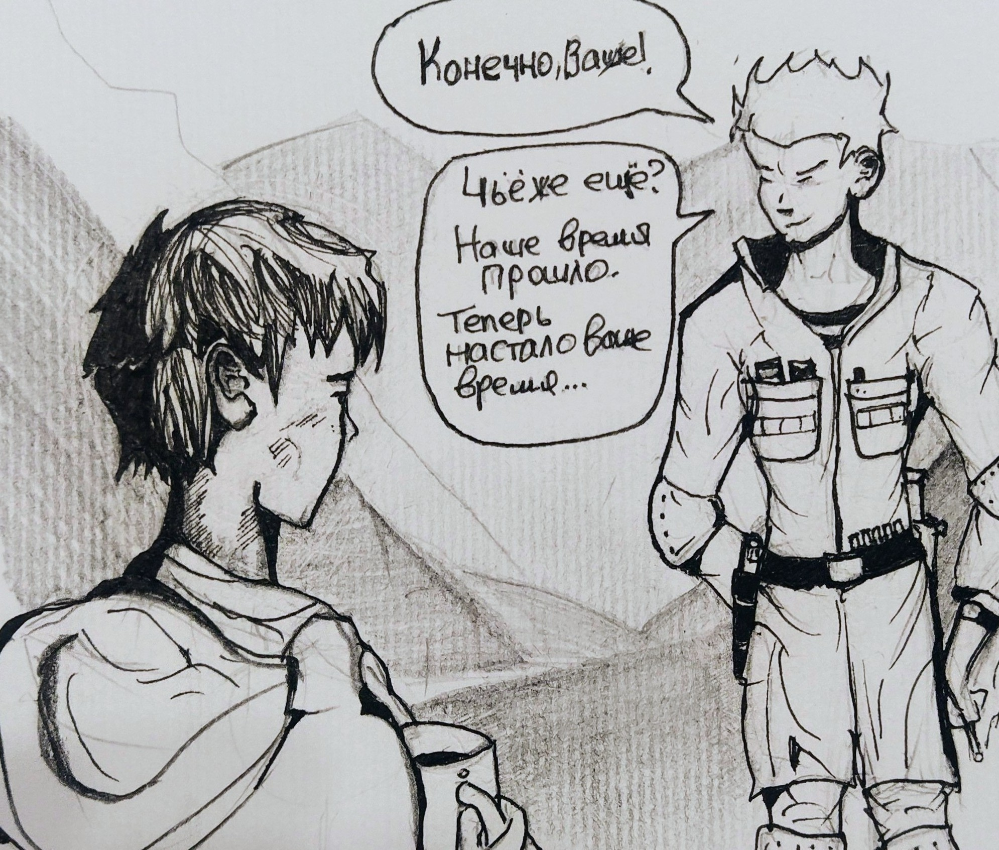

# TIM_OCN_100

**Глава 100. Время подснежников**

*\- Мой вещий сон \- Удар \- В ущелье расцветают подснежники \- О чём я прошу Полковника \- Кровавый взнос*

---

Я видел сон. Мне снятся десятки комет, взлетающих в небо из-за горизонта. Они оставляют за собой белый шлейф, уходят ввысь, озаряя жёлтым светом облака, 
и исчезают в них. И другие люди вокруг меня смотрят вверх. Какое-то обречённое состояние, боль сжимает моё сердце. Я понимаю, что к этому всё идёт. К этому всё и пришло. Эта боль больше походит на грусть, чем на страх. Да, да, именно на грусть. Мне грустно за то, что всё *так* получилось.

Это - моё небо. Я точно знаю, что это - небо Петербурга. Я точно знаю, что это были - именно *мы*.

Комету разгоняют три многотонные ступени, под завязку набитые топливом. Двигатель сжигает гептил с окислителем и выплёвывает вниз струю адского пламени, опустошая  топливный бак разгонной ступени за кратчайшее время. 

Три шага в небо. 

Как в эстафете, разгонные ступени передадут друг другу ускорение. На высоте ста - ста пятидесяти километров отделится последняя, разгонная, и настанет очередь четвёртой - ступени разведения боевых частей. Эта высота - не потолок, но необходимая для того, чтобы работу самой важной ступени не могли засечь системы
слежения с Земли, чтобы они не могли помешать или как-то повлиять на её судьбу. Ступень начнёт свой суборбитальный полёт. Сейчас - время сеанса астронавигации и радионавигации. Ей нужно определить своё местоположение и правильно сориентироваться в пространстве. Здесь будет учитываться всё - разнородности гравитационного поля Земли, неровности рельефа, залегания пород разной плотности, различные гравитационные аномалии. Благодаря карте гравитационного поля Земли и использования дифференциальных уравнений, описывающих точное баллистическое движение, ступень разведения получит координаты с прецизионной точностью. Эта точность необходима ей для самой главной (но не единственной) своей задачи. То, ради чего запускается ракета, скрыто под головным обтекателем. Это - сложный груз, состоящий из боевых частей, платформы размещения боевых частей и вспомогательных средств, топлива, сжатых газов. Боевые части летят в "автобусе", задом наперёд. Десять конусов, сидящих каждый в своём "ложе", вверх "ногами", подобно летучим мышам, и ожидающих своего выхода. 

Вот уже отделяется двигатель третьей ступени. Начинается космический балет.

У каждой боевой части свой путь. Своя траектория, своя судьба. Пока они в одном "автобусе" - они вместе, но, через мгновенье, каждый из них получит своё задание и отправится его выполнять. Для того, чтобы "автобус" мог правильно направить боевую часть, ему нужны сложные математические вычисления. Кватернионные счисления. Бортовая система ориентации обрабатывает измеряемые параметры своего движения с непрерывным построением на борту кватерниона ориентации. Не происходит никакого отстрела боеголовок. Никаких взрывов, никаких рывков. Несясь по своей собственной траектории, ступень плавно поворачивается в нужном для отделения боеголовки направлении. Впереди неё развернулись четыре крестообразно расставленные "клешни", которые тащат её вперёд при помощи тяговых сопел. Размыкаются безынерционные замки, держащие боеголовку. Ничем не удерживаемая, она продолжает висеть неподвижно, в полной невесомости. Её движение совпадает с движением "автобуса". Но полёт уже начался, её уже ничто не связывает со ступенью. Задача же ступени теперь - отойти от боевой части, не нарушив её точно выставленного движения газовыми струями своих сопел. Любое попадание газа, любое касание передаст паразитный вектор боевой части, способный отклонить её точно выставленную траекторию на несколько километров. Чтобы этого избежать, ступень подтягивается вперёд за счёт тех самых крестообразных клешней с соплами. Струи газа идут по сторонам и не цепляют боеголовку. А если возникает риск попадания боеголовки под реактивную струю, ступень временно выключит её. И включит снова, когда угрозы для боеголовки уже не будет. Ступень, на малой тяге, медленно, на "цыпочках", отходит от боевой части, как мать неслышно отходит от колыбели со спящим младенцем. И только когда боевая часть удалилась на значительное расстояние, без риска оказаться под действием реактивной струи, ступень включит основную тягу и выведет себя на траекторию следующей боевой части. Десять боевых частей - десять перемещений. Десять расставаний. Десять путей.

Отправив своих "деток" к целям, ступень продолжит свой полёт. Теперь задача ступени разведения - оберегать своих "деток" до самого своего конца их полёта. Она летит с той же скоростью, что и боевые части, в ту же зону поражения, и даже немного опережает их, не создавая им помех. В её полезной нагрузке остались ещё сюрпризы. От неё в разные стороны начинают отделяться разные штуковины причудливых форм. Подобно фокуснику, выпускает она множество воздушных шариков, а также металлические вещицы, напоминающие раскрытые ножницы, и много чего ещё. Прочные воздушные шарики блестят, как ртуть. Они - самых разнообразных форм, некоторые из них напоминают конусы боеголовок. Некоторые даже излучают какой-то сигнал. Благодаря их алюминиевому напылению, системами слежения они будут восприняты наравне с боевыми частями. Да, они лопнут при входе в атмосферу, но это уже будет не важно - свою задачу по дезориентации систем противника они выполнят, а противник потеряет драгоценное время для перехвата истинных боевых частей. Вычислительные мощности станций дальнего обнаружения и ракетных комплексов будут перегружены: в их зону видимости попадут ложные конусы, отражатели, и всё это облако называется "множественные баллистические цели в осложнённой баллистической обстановке". Металлические ножницы раскроются и станут электрическими дипольными и уголковыми отражателями. Их множество, и они хорошо отразят лучи радаров противоракетного обнаружения. Их задача - чтобы их прекрасно было видно. Устройства всяких форм и размеров отражают разные длины волн. Да ступень и сама умеет посылать радиосигналы, мешающие наводить противоракеты, или может отвлечь их на себя. Радары увидят движущееся облако, и где-то внутри него, но неизвестно где, в этом плотном тумане отражённых радиосигналов скрыты десять смертоносных боевых частей. Сама же ступень разведения продолжит свое движение, войдёт в плотные слои атмосферы, в гиперзвуке разорвётся на части, остатки топлива взорвутся, магниевые сплавы вспыхнут яркими вспышками, все осколки и частицы затормозятся в воздухе и начнут медленно падать на Землю... Это будет красивейшее атмосферное явление, если кому-то посчастливится его наблюдать! 

Система дальнего перехвата GBMD, радиолокационная станция дальнего обнаружения которой развёрнута на Аляске, сразу увидит пуск комет, но успеть перехватить их до этапа разведения практически невозможно - недостаточно высоты, дальности, времени реагирования. Спустя несколько минут, на радаре появится облако ложных целей. Сложнейшая вычислительная машина от Lockheed Martin, безусловно, будет производить свой сложнейший анализ, нейросетевые модели будут подбирать наибольшую вероятность нахождения боевых частей в определённых зонах облака. Часть облака будет исключена из вычислений, но это всё будет уже бессмысленно. Где-то в районе Австралии (кометы летят через Антарктиду), автоматические системы GBI и THAAD запустят свои кинетические противоракеты, которые должны будут попасть точно в цель. Они не несут в себе боезаряда, и не способны создать облако поражающих элементов, как это делает ракета ПВО. Они полагаются лишь на собственную кинетическую энергию. В той среде, где летят боеголовки, поразить цель можно только точным попаданием иглы в боевую часть. Но в какое место всаживать иглу? Какова вероятность того, что среди тысячи объектов, попавших в поле видимости радара или оптической станции слежения, будет настоящая боевая часть?

Во время суборбитального полёта у боевых частей нет врагов, и не будет. Вход в атмосферу начинается на скорости пять - семь километров в секунду. Воздух ещё разрежен, температура ещё невысока. На гиперзвуковой скорости в десятки Махов начинается перегрузка торможения, но коническая форма боеголовки не позволит растерять её скорость вплоть до нижних слоёв атмосферы. За боевыми частями появляется яркий шлейф. Растёт температура, растут перегрузки. Перехват на таких скоростях физически невозможен. Раскаленный воздух шлифует термоизоляционное покрытие из кварца. Пройдя этот ад в пять тысяч градусов, уже в нижних слоях атмосферы, встроенный двигатель боеголовки раскрутит её вокруг своей оси для стабилизации курса. Некоторые из них будут активно маневрировать. Но это уже не важно. Важна цель.

Я - боевая часть. Я - метеорит. Разрывая облака, я лечу к своей цели, и никто не сможет меня остановить. Уже вижу леса, горы, населённые пункты. Я сработаю на высоте в один километр, чтобы обрушить вниз, на город, всю мощь своей взрывной волны!

Это всё происходит в течении нескольких секунд. Я вижу испуганные глаза людей, глядящих в небо. В этих глазах грусть. Грусть за то, что всё *так* получилось.

Я - боевая часть. Я - Демон Смерти.

<!--
    По задумке, это описание работы МБР "Сармат".
    Я благодарен автору статьи https://www.techinsider.ru/weapon/237452-mezhkontinentalnaya-ballisticheskaya-raketa-kak-eto-rabotaet/ за разъяснение процесса
    работы ступени разведения МБР. (КД)
 -->

\- Тим, проснись! - Полковник тряс меня за плечо. Я открыл глаза и потянул носом холодный влажный воздух ущелья. Белоснежные шапки гор уже окрасились в ярко-оранжевые тона восходящего Солнца. Изо рта шёл пар. Я выполз из спальника, сел на него сверху. Ребята молча собирали вещи, упаковывали рюкзаки. 
Костёр успели потушить, но Полковник нашёл тлеющую головешку, и, подцепив её своими пальцами, прикурил от неё. 

\- Только что сообщили: Россия нанесла ракетный удар по США. Межконтинентальной, дальнего действия. - мрачно произнёс он, глядя мне в глаза. Я сидел, спросонок, и не понимал ничего. Мне было зябко и хотелось пить.

\- К... Какой удар? Ракеты? Ядерный? - пробормотал я сухими, растрескавшимися губами.  
\- Слава Богу, не ядерный. Они ограничились карбид-вольфрамовыми сердечниками. Или чем-то вроде этого. Положили все десять штук точно в цель, аккуратно - в десяти районах вокруг Вашингтона. Никто не пострадал. Никто ничего не перехватил.

Полковник замолчал. Потом продолжил:

\- У твоего президента железные яйца. Янки обосрались. Этот их позор мир запомнит надолго!  
\- Ничего себе, - пробормотал я.  
\- Сейчас весь мир ждёт ответный ход США. Ни одна их хвалёная противоракетная система не сработала. Все в шоке. Весь мир. Затих и ждёт.  
\- А до этого не ждали? - отстранённо пробурчал хриплым голосом я, - А ждали то чего?

Я надел холодные, пропитанные влагой ботинки, подошёл к остывшему котелку и открыл крышку. Оттуда робко поднимался пар. Налил в кружку воды, кинул пакетик чая. Плохо, что крепко не заварить, вода остыла. Я ничего не соображал, даже не знал, что именно нужно было соображать. Это происходило не со мной. Как во сне.

\- Не знаю, - покачал он головой, - не знаю.  
\- Я не удивлён.  
\- Ты ничему не удивляешься!  
\- У меня удивлялка сгорела, на том корабле, - мрачно и злобно улыбнулся я, - вместе с маячком. И я научился видеть будущее. Будущее, к... Которое... В котором всё будет по-другому, не как сейчас. Будущее, в котором мы сами решаем свою судьбу. 

Я встал на ноги. Внезапно, от прилива крови, у меня в голове зазвенело. Я яростно, во весь голос закричал:

\- Будущее, в котором на истерзанной Земле растут цветы! Растут цветы... Потому что...  Я этого хочу! 

Мой голос эхом прокатился по ущелью. Фокс и Майк прекратили собирать вещи и удивлённо смотрели на меня. Я испугался своего голоса: хриплый, 
треснутый, ещё мальчишеский, но уже какой-то грубый и страшный, он утратил свою звонкость, которой я когда-то смущался. Это был чужой голос. Голос какого-то демона, сидевшего внутри меня.

\- Будущее, которое сделаем мы, - выдохнул я, опускаясь на колени. Внезапно боль пронзила мой лоб. Перед моими глазами стоял сон, кометы в лазурном небе, уходящие ввысь. Жёлто-оранжевое зарево под облаками. Прям как сейчас, в небе над горами.

\- Будущее, которое сделаем мы. - повторил я, уже тише, - Нам теперь жить здесь. Поэтому это - *наше* будущее!  

Я снова сел на спальник, сжался, обхватил своими тощими замёрзшими пальцами с грязными ногтями кружку и сделал глоток горького чая без сахара. Боль пульсировала над моей правой бровью. 

\- Конечно, ваше! - спокойно, с улыбкой произнёс Полковник. - Чьё же ещё? Наше время уже прошло. Теперь настало ваше время. - он вдруг замолчал, а потом добавил:  

\-Время подснежников.

В ущелье таял снег. На проталинах и вправду пробивались цветы. Белые, голубые... Слеза скатилась по моей щеке. Мне было страшно. Я не знал, что делать. И никто из моих спутников не знал. 

\- Правда, ребята? - весело крикнул Полковник, - Вышло наше время!

Он возился со своим рюкзаком. 

Я тоже молча собирал свои манатки, "шестисотку", закинул на спину этот проклятый АКСУ, долбивший меня весь поход по заднице. В конце концов я приноровился и стал сильнее затягивать ремень, чтоб во время движения он не бил меня надульником.

Фокс и Майк уже спускались в окутанное утренним туманом ущелье. Полковник с рюкзаком шёл следом за ними. Он уже порядком отошёл от меня, но я отчётливо слышал хруст гальки под его ботинками, настолько чистый стоял воздух. Мне нужно было догонять их.

\- Ну, быстрей! - Полковник оглянулся, когда я подбежал к нему. После того диалога он не проронил ни слова. Фокс и Майку, видимо, он тоже что-то сказал: они удалились от нас вперёд шагов на пятьдесят, и он не торопился их догонять. Мы продолжали идти молча. 

\- Знаешь что, Тим? - сказал вдруг Полковник, - Я буду не один раз задавать тебе один и тот же вопрос. Ты уверен, что хочешь
пойти с нами? У тебя есть выбор. Я дам тебе денег, ты доберёшься до Российского посольства, оно здесь есть.

Я молчал и шёл рядом с ним. Уверенно и бодро. Он продолжал:  
\- Всё, что происходит в мире - это не твоя вина. И не твоя война. Не твоя игра. Ты даже не представляешь, как в неё играть. Возвращайся в Россию. По пятам за мной идёт смерть!  
\- Нельзя мне в Россию! - ответил я, глядя под ноги.  
\- Почему?  
\- Ты не единственный, за кем по пятам идёт смерть. Ты знаешь, что за мной охотится ЦРУ. Но не знаешь, почему.  
\- Почему?  
\- Не скажу, - улыбнулся я, всё так же, глядя под ноги. Полковник повернулся ко мне.  
\- В России ты будешь в безопасности!  
\- Что я там буду делать? То, зачем охотится ЦРУ, я должен передать своим властям. Как минимум, контрразведке. Но у меня сейчас нет того самого *этого*. Я знаю где это находится, и никому не скажу. Я знаю цену моим знаниям. За эти знания убивают людей. Они всех убьют: тебя, Фокс, Майка, меня... Кого угодно. Это - страшные люди. Их броня - доллары, их патроны - доллары, их идол - доллары. Весь мир им открыт, они долларами вышибают двери Конгресса, они долларами распахивают границы государств. Ты же работал на них, ведь правда?  
\- Я на многих работал.  
\- Ты знаешь, что я прав.  
\- Куда же ты идёшь, Тим? - вздохнул Полковник, - Если всё так плохо, как говоришь... Тебе нигде не безопасно.  
\- Я должен вернуться в Испанию. А оттуда - уже куда судьба пошлёт.

Полковник снова вздохнул.

\- Чтоб ты знал, - сказал он через спустя пару минут, - я не осуждаю твою страну за этот удар. Мои родители мигрировали в США из СССР, во время "оттепели". Ты думал, я американец? Нет, не совсем. Поэтому русский язык ещё помню. А ещё я помню предательство. Ты не помнишь, тебя тогда ещё и в планах не было, а я помню. И я верил в то, что однажды вся эта машина, которая зовётся США, всё это исчадие предательства и лжи, в ней что-то застрянет. И она сломается. Но я не думал, что это "что-то" будет вольфрамовая болванка. Я думал, что не дойдёт до этого, но, увы! Дошло. Значит, тогда - болванка. Такова судьба.

\- Я должен быть тут, и закончим этот разговор, - резко ответил я, - Такова судьба.

\- Я вынужден буду спрашивать тебя снова и снова, - улыбнулся Полковник.  
\- А я вынужден буду отвечать тебе одинаково, - улыбнулся я, пиная гальку.

Наконец-то солнце заглянуло в наше ущелье. Солнце всегда придавало мне силы, где бы я ни находился. Даже живя в Барселоне, я радовался каждому появлению солнца на небе. В промозглом воздухе ущелья вдруг почувствовалось плотное солнечное тепло, я ощущал его на своём лице и руках. Мы наткнулись на ручей чистейшей ледяной воды, пополнили фляжки и умылись. Дышалось как-то легко и радостно (даже несмотря на то, что "Ксюха" наколотила на моей заднице здоровенный синяк).

Я не знаю, почему легко и радостно. Мне казалось, что это всё нас теперь не касается. Что мы идём куда-то в иной мир, в параллельную реальность, не пересекающуюся с внешним миром. Здесь, кроме спутниковой рации и "старлинка" Полковника, связи не было, а мобилы наши, купленные ещё в Камбоджи, мы выключили за ненадобностью. И это создавало у меня иллюзию, что ущелье в предгорьях Тибета, перевалы, подъёмы и спуски - это всё какой-то затерянный, забытый мир. Это не здесь, а где-то *там*, над моей родиной, повисла смертельная угроза ответного удара, который тоже вряд ли будет перехвачен. Я не ощущал страха. Не потому, что меня *там* не было. А потому, что я вдруг чётко осознал, что должен делать вне зависимости от дальнейших событий. Российское посольство? Теперь я точно знал, что нет. Я должен завершить дело, в которое влип там, в Барселоне. Я должен передать эти данные ГРУ, ФСБ или службе внешней разведки. Но для этого мне нужно было совершить невозможное - выбраться отсюда в Испанию, куда мне ход закрыт, избежав столкновения с иностранными спецслужбами, среди которых, наверняка, будет и проклятый "Феникс". И только когда в моих руках будет SSD, и я смогу с ним покинуть Испанию, или, хотя бы, добраться до Российского консульства - вот тогда моя задача будет завершена. Судьба послала мне этого человека, чтобы я мог хотя бы попытаться это сделать. 

Я посмотрел на идущего рядом Полковника.

Цена его помощи очень высока. Он предлагает самый простой вариант, который бы сразу завершил мою сагу. Я вернусь домой, и продолжится моя прежняя жизнь, как до Барселоны. Вряд ли Кранц перестанет меня искать, но в России ему
до меня добраться будет сложно. Я буду невыездным ещё очень долго, пока данные HEAL не потеряют актуальность. Возможно, до самой моей старости. Но я, по крайней мере, буду жить. Интересно, где там Сэм?

*Знал бы я тогда, что стало с Сэмом в руках латвийских спецслужб...*

Второй вариант - идти с Полковником и учиться у него жить в его подземном мрачном царстве. В царстве, где существует вероятность выйти живым в схватке с элитными подразделениями США. Где существует вероятность противостоять в открытом столкновении с такими боевиками, как Скаут или Моран. Где власть доллара нивелируется боевым опытом и способностью выживания в безумных условиях. Да, это - царство безумия, нелегального оружия, наркотиков, контрабанды, спецслужб и кинжалов за спиной. Это царство, где таким, как я - не место. Засыпая каждую ночь в спальнике, я думал о том, что мог бы сейчас спать в своей кровати, в Питере. Как тысячи школьников. И, всё же, вспоминая работу над HEAL и последующие события, я ни за что бы не променял свой сырой холодный спальник, купленный в Непале у какого-то бомжа, на тёплую постель дома. Наверное, я свихнулся от того безумия, которое закружило меня в последние полгода. Не знаю. Для меня перестали существовать другие варианты. Я шёл с Полковником, и галька шуршала под нашими ботинками.

\- Куда мы идём? - спросил я Полковника.  
\- В Афганистан. Есть там один человек, в Кунаре, он мне крупно должен. Не знаю, пойдут ли со мной Фокс и Майк, но мне лично больше идти некуда. У меня нет ни дома, ни вещей. Там я хоть смогу отдохнуть. Его зовут Закаар, и он не посмеет мне отказать. Мы с ним когда-то работали вместе. Не боишься?  
\- А чего я должен бояться? - спокойно спросил я.  
\- Это не туристическое путешествие. Мы пойдём через границы, нелегально. Через регионы, полные оружия, патронов и подлецов. И я не знаю, что там нас ждёт. Вот я лично, я - боюсь. А ты - нет?  
\- Нет.  
\- Вот это меня и пугает в тебе, Тим.

Я проглотил ком в горле. Было сложно это произнести. Предстояло сделать шаг, отрезающий меня от моего прошлого. Но, если бы не события сегодняшнего утра, я бы, наверное, и не решился.

\- Полковник, можно тебя попросить об одной просьбе?  
\- Хм. Ну?  
\- Я хочу чтобы ты обучил меня.

Он шёл, глядя себе под ноги. Его лицо нахмурилось.  
\- Чему?

Я почувствовал жжение на щеках.

\- Стрелять. Работать с оружием. С экипировкой. Всё, что поможет мне выжить в схватке со спецслужбами.

Полковник усмехнулся:  
\- Ты думаешь, чтобы победить в схватке со спецслужбами нужно метко стрелять? Боже мой, Тим! Чтобы им противостоять, нужно обладать их аналитической мощью! И их подлостью. И их запредельным цинизмом! Иметь извращённое понимание окружающей действительности! Тебе это не нужно, поверь. Ты чище их, и...  
\- Я не хочу быть чище их! Я хочу их уничтожить!  
\- Ты не уничтожишь их, никогда. Тебе придётся сподобиться им, чтобы уничтожить. Упасть на самое дно ада. Сделаться такой же гадиной...  
\- Тогда я стану!  
\- Я не хочу! - он вдруг обернулся ко мне и схватил меня за шиворот, - Беги к чёртовой матери отсюда, мальчик! Ты сам не понимаешь, чего просишь! Я спас твою шкуру! Чего тебе ещё не хватает? Приключений? Проблем? Чтобы тебе башку отрезали, ты этого хочешь?!  
\- Справедливости хочу. Чтобы все знали, хочу!  
\- Мать твою! - выругался Полковник, - Иди к родителям! Уходи!..  
\- Если б ты мог что-то изменить в этом мире, - со слезами, ломающимся голосом крикнул я ему, - Если бы у тебя в руках было то, что может спасти, как минимум, твою страну, а то - и половину человечества на Земле. Вот ты бы, ты! Ты бы - убежал?  

Моя челюсть дрожала. Я понимал, что перехожу какую-то невидимую грань между параллельными мирами. Я хотел, чтобы Полковник не молчал, чтобы он отвечал мне. Мне нужны были его слова. Я хотел услышать от него то, что даст мне силы идти вперёд, вместе с ним.

\- Были у меня ключи от мира, - печально ответил он, - И я думал, что спасу свою страну. Но недооценил я свои силы. В результате... 

Он остановился.

\- Нет, Тим, я думаю, тебе не под силу это сделать.  
\- Поэтому ты не хочешь меня учить? Ты не веришь в мои возможности? Потому что сам не веришь в свои?    
\- Почему? Верю. Но я не хочу тебе такой судьбы, как у меня.  
\- Без твоей помощи я не смогу. Они меня сожрут с потрохами. У меня нет никаких шансов противостоять им.  
\- Тогда поезжай в свою Россию и сиди там! Учись там! Нечего тебе здесь делать!

В этот момент меня как будто переклинило. Я не знаю, что со мной произошло. Какая-то дикая ярость из потаённых глубин вдруг выстрелила в мой мозг. Я стиснул зубы, схватил его за куртку, и резко, со всей силы, дёрнул её на себя так, что он развернулся и остановился.

\- Слушай сюда! - заорал я по-русски, - С тобой или без тебя... Плевать! Я пойду их искать и уничтожу! Всех до единого! У меня нет шансов и я погибну, но у меня нет иного пути. Если Бог дал мне в руки эти... данные, я должен с ними что-то сделать! Или отдать их тому, кто что-то сделает! Но делать! Делать! А не сидеть и ждать чего-то! С тобой или без тебя - мне не важно!

Звонкое эхо прокатилось по ущелью. Какие-то сухие слёзы, вроде плачу - но нет воды. Полковник схватил мою руку, оторвал её от куртки и медленно проговорил.

\- Тогда ты сдохнешь. Могу сейчас тебя пристрелить, чтобы не мучился и не тратил своих сил. И моих тоже. Но ты должен понять, ты - сдохнешь. Ты обречён сдохнуть, потому что из *того* мира, в который ты войдёшь вместе со мной, выход только один. Ты исчезнешь навсегда, твоё имя подвергнется забвению. Ты станешь демоном ада, тебя будут разыскивать всевозможные спецслужбы разных стран, ты будешь в списках, на тебя будет открыта охота, за твою голову назначат награду. Ты больше не вернёшься домой. Ты не вернёшься никуда! Отныне твой дом будет - весь мир!

Улыбаясь, он распростёр руки в стороны. Ущелье зловеще повторило слово "мир".

\- Это не игра, малыш, и не приключение. Здесь нет места соплям! Это твоя новая реальность. С неё нельзя так просто соскочить. Тут нельзя устать. Ты не можешь просто взять, всё бросить и уйти. Тебе не будет никогда покоя, у тебя не будет семьи, не будет детей. Ты должен оплатить вступительный взнос, чтобы я понимал серьёзность твоих намерений. Ибо я думаю, что в тебе играют гормоны, и что ты всё это порешь сгоряча!  
\- Какой взнос?  
\- Кровь.  
\- Сколько литров? - мгновенно, как в бреду, выпалил я.  
\- Пф, - он шумно выдохнул, - столько, сколько вытечет, пока не остановишь.

Полковник отщёлкнул из ножен свой огромный нож "боуи" и протянул мне.

\- Давай, отрежь себе палец. Какой не жалко. Отрезанное уже не вырастет снова. Это - символ твоей решительности. Я, по крайней мере, буду понимать, что ты серьёзно подумал.

У меня кровь отхлынула от головы. Наверное, я побледнел; меня стало вдруг знобить. Я принял у него тяжёлый нож. Лезвие "боуи" оказалось предельно острым, без сколов, частично с серрейтором возле гарды. Красивый нож. Полковник, не оглядываясь, продолжал шагать дальше. Я поглядел на свои руки. Тощие бледные пальцы, в ссадинах и порезах. Какой не жалко?

\- Давай, мизинец! - засмеялся идущий впереди Полковник, - Догонишь, отдашь мне! Как контракт будет, между нами! 

И, спустя мгновенье, громко крикнул:

\- Тим! Я не шучу! Мне деньги не нужны! У меня их полно! Мне нужна твоя кровь! Я должен быть уверен, что могу доверить тебе самое ценное, что у меня есть! Только не вздумай на ноге отрезать, не хочу тебя снова на себе тащить!

Сказать, что я испугался в этот момент - это ничего не сказать. Конечно, хватая его за куртку и крича "Слушай сюда!", я ожидал всего, что угодно. Ну ладно! Я ожидал что он,
самое худшее - просто треснет меня в морду. И всё. Но... Тут я струхнул. Я смотрел на дрожащие пальцы своей левой руки. Какой не жалко? Да... Все жалко! Но никто меня за язык
не тянул! В конце концов, это всего лишь палец. В меня уже всаживали пулю, били током, и вообще... Пора бы уже привыкнуть к потерям и лишениям!

Присев на корточки, я положил левую ладонь на холодный плоский камень. Растопырил пальцы. Поднял нож. Потом поменял хват. Если бы Полковник сам *это* сделал, я бы просто зажмурился или отвернулся. Или просто стиснул зубы. Но самому?

Приложил холодное и острое, как бритва, лезвие к мизинцу. Он лежал на камне, тонкий, как тростинка. Его рубануть проще простого, раз - и всё! Снова поднял нож. Если делать - делать быстро. Я почувствовал, как адреналин разливается по телу, как сердце бешено стучит в груди.

Солнце пробило плотные облака и осветило всю долину. Зелёная трава и мох заиграли магическими изумрудными цветами. Белоснежные, как пломбир, шапки на вершинах горной гряды ярко искрились, как расплавленное золото. Я не мог надышаться воздухом, таким чистым и таким вкусным. Я шёл в неизвестность. В забвение. В подземное царство. Вне всякого сомнения, я там сдохну.  

Мать мне было жалко. Но сейчас я думал об отце. Хотел бы он меня видеть здесь? И что бы он сказал мне в данный момент? Я вспомнил, как он говорил мне, когда я был маленький:

"Не бойся ничего, просто иди вперёд! Есть лишь один способ проверить свою правоту - испытать себя."

Простая формула. Я только и делал в жизни, что испытывал себя. Пришла пора пройти ещё одно испытание. Самое страшное. Ради тебя, отец, и ради остальных! Чтобы все знали, чтобы... Чтобы были готовы!

*В дальнейшем, сталкиваясь с трудностями преодоления самого себя, я вспоминал, ради чего я всё это делаю. Ты можешь, конечно, сказать, что мне, мол, просто нужна была мотивация идти вперёд и подвергать себя какому-то безумию. Что я всё это выдумывал для себя, чтобы как-то объяснить неоднозначные поступки. Нелогичные и бредовые. Но, в своё оправдание, я скажу лишь то, что мной двигал ужас от открытого мне HEAL. Это сложно понять, пока сидишь в мягком кресле и читаешь текст со своего смартфона. Но... Мне снились модели HEAL, которые она мне воспроизводила, и в бесчеловечности этих моделей мог сравниться разве что знаменитый Отряд 731. Вот, что я хотел уничтожить! Тех, кто это всё придумал. Одна эта мысль давала мне энергию и веру в себя. Больше веровать было не во что. В подземном царстве Бога нет. Одни лишь гнусные идеи, рождающиеся в воспалённом сознании Сильных Мира Сего, и обретающие своё воплощение благодаря ИХ неисчерпаемым богатствам.*

---
*Финальная песня*

Подснежник,  
Он вызов бросил ледяному злу.  
Подснежник,  
Его дрожащий стебель слаб и тонок.  
Его обидеть мог любой подонок,  
Но он тянулся к свету и теплу.

Подснежник,  
Он первый был в лесу, но не один.  
Весною  
Лес наполнял он, изгоняя снег.  
Ты помнишь, как стыдились мы за тех,  
Кто продавал державу за алтын,
Стаканом водки запивая благородство?

И как цветы в конце зимы,  
Среди снегов,  
&nbsp;&nbsp;&nbsp;Сквозь вьюгу напролом  
Стремятся к Солнцу -  
В мире тьмы проснёмся мы, и прорастём  
&nbsp;&nbsp;&nbsp;Сквозь прах врагов,  
Ведь правда - красота, а ложь - уродство.  

Подснежник,  
Он, как патрон, обычен и невзрачен.  
Подснежник,  
Он с чистотой нетронутой растёт.  
Ты помнишь, как все ночи напролёт  
Свои подсумки набивал тот мальчик?  

Под снегом  
Он ждал весны, он насыщался ею.  
Под снегом  
Он набирался сил, он ждал и верил.  
Он говорил, что каждому отмерил -  
Предателю, лжецу и лиходею,
Провозгласив над тьмою света превосходство!

И как цветы в конце зимы,  
Среди снегов,  
&nbsp;&nbsp;&nbsp;Сквозь вьюгу напролом  
Стремятся к Солнцу -  
В мире тьмы проснёмся мы, и прорастём  
&nbsp;&nbsp;&nbsp;Сквозь прах врагов,  
Ведь правда - красота, а ложь - уродство.

---

Конец части TIM_OCN.
